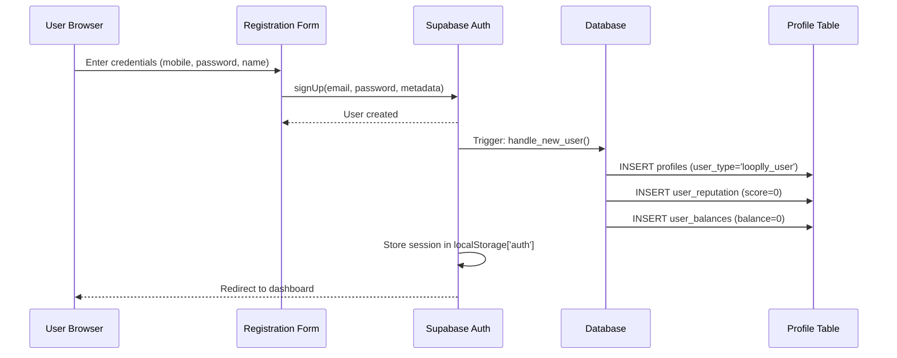
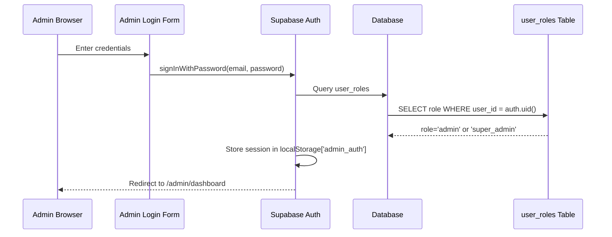
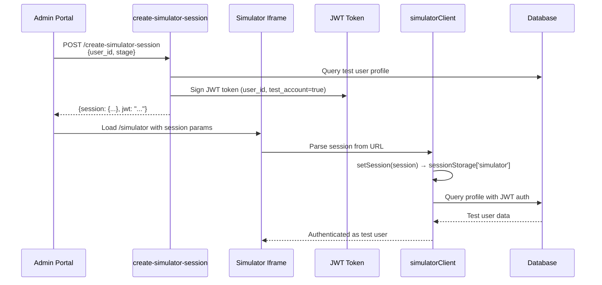
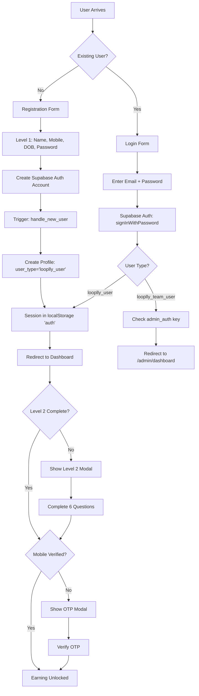
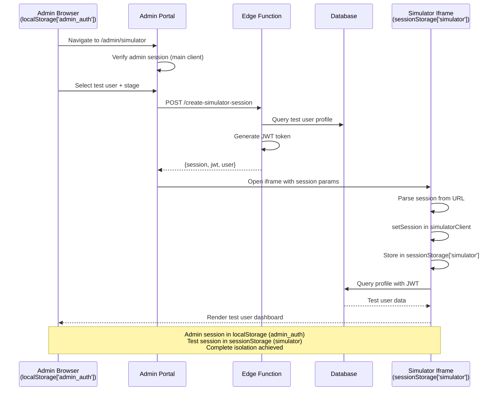

# Authentication Architecture

## Overview

Looplly implements a **dual authentication architecture** to support three distinct user types with complete session isolation. This design ensures admins can test user journeys without disrupting their own sessions, while maintaining security and data integrity across the platform.

## Authentication Systems Comparison

### System Matrix

| Feature | Admin Portal | User Portal | Simulator (Test Users) |
|---------|-------------|-------------|----------------------|
| **Auth Method** | Supabase Auth | Supabase Auth | JWT (Custom) |
| **Storage** | localStorage | localStorage | sessionStorage |
| **Storage Key** | `admin_auth` | `auth` | `simulator` |
| **Persistence** | Multi-tab, survives refresh | Multi-tab, survives refresh | Iframe-only, ephemeral |
| **User Type** | looplly_team_user | looplly_user | looplly_user (test accounts) |
| **Routes** | `/admin/*` | `/`, `/dashboard/*`, `/profile/*` | `/simulator/*` |
| **Client** | Main Client | Main Client | Simulator Client |

### Why Two Authentication Systems?

**The Challenge:**
- Admins need to test user experiences without logging out
- Standard Supabase Auth uses localStorage (shared across windows)
- Single client = session collision

**The Solution:**
- **Dual Supabase clients** with different storage strategies
- **Path-aware client selector** routes requests correctly
- **Complete session isolation** via storage namespace separation

## User Type Authentication Details

### 1. Regular Users (`looplly_user`)

**Authentication Flow:**


**Key Characteristics:**
- Self-registration via `/register`
- Supabase Auth manages authentication
- Session in `localStorage['auth']`
- No admin access
- Profile progresses through Levels 1 → 2
- Must verify mobile to earn

**Implementation:**
```typescript
// Registration
const { data, error } = await supabase.auth.signUp({
  email: formData.mobile + '@looplly-generated.internal',
  password: formData.password,
  options: {
    data: {
      first_name: formData.firstName,
      last_name: formData.lastName,
      mobile: formData.mobile,
      country_code: formData.countryCode
    }
  }
});

// Session stored automatically in localStorage['auth']
```

**RLS Policies:**
```sql
-- Users can only access their own data
CREATE POLICY "looplly_users_select_own"
  ON profiles FOR SELECT
  USING (auth.uid() = user_id AND user_type = 'looplly_user');
```

### 2. Admin Users (`looplly_team_user`)

**Authentication Flow:**


**Key Characteristics:**
- Created by super_admins via "Add Team Member"
- Email must be `@looplly.me` domain
- Temporary password on creation
- Forced password reset on first login
- Session in `localStorage['admin_auth']`
- Access to admin portal only

**Implementation:**
```typescript
// Admin login (uses main client with admin storage key)
const { data, error } = await supabase.auth.signInWithPassword({
  email: formData.email,
  password: formData.password
});

// Client configuration (src/integrations/supabase/client.ts)
const isAdmin = pathname.startsWith('/admin');

export const supabase = createClient(SUPABASE_URL, SUPABASE_KEY, {
  auth: {
    storage: localStorage,
    storageKey: isAdmin ? 'admin_auth' : 'auth',  // Path-aware key
    persistSession: true,
    autoRefreshToken: true,
  }
});
```

**RLS Policies:**
```sql
-- Admin users can view all profiles (based on role)
CREATE POLICY "admins_view_all_profiles"
  ON profiles FOR SELECT
  USING (
    EXISTS (
      SELECT 1 FROM user_roles
      WHERE user_id = auth.uid()
        AND role IN ('admin', 'super_admin')
    )
  );
```

### 3. Test Users (Simulator Accounts)

**Authentication Flow:**


**Key Characteristics:**
- Created via `seed-test-users` edge function
- Flag: `is_test_account = true`
- JWT-based authentication (NOT Supabase Auth)
- Session in `sessionStorage['simulator']`
- Route-restricted to `/simulator/*` only
- Data isolated from production

**Implementation:**
```typescript
// Simulator client configuration (src/integrations/supabase/simulatorClient.ts)
export const simulatorClient = createClient(SUPABASE_URL, SUPABASE_KEY, {
  auth: {
    storage: sessionStorage,       // Ephemeral, iframe-only
    storageKey: 'simulator',       // Unique namespace
    persistSession: true,          // Within session only
    autoRefreshToken: true,
  }
});

// Session handoff via URL params
const sessionData = {
  access_token: jwt,
  refresh_token: jwt,
  user: testUser,
  expires_at: Math.floor(Date.now() / 1000) + 3600
};

// Initialize in iframe
await simulatorClient.auth.setSession(sessionData);
```

**RLS Policies:**
```sql
-- Test users can only access their own test data
CREATE POLICY "test_users_isolated"
  ON profiles FOR ALL
  USING (
    auth.uid() = user_id 
    AND is_test_account = true
  );
```

## Session Isolation Architecture

### Storage Strategy

**Why Different Storage?**

| Storage Type | Scope | Persistence | Use Case |
|-------------|-------|-------------|----------|
| `localStorage` | Domain-wide, all tabs | Survives refresh/restart | Admin & user sessions |
| `sessionStorage` | Single window/iframe | Destroyed on close | Simulator test sessions |

**Storage Keys:**
- `localStorage['admin_auth']` - Admin sessions
- `localStorage['auth']` - User sessions
- `sessionStorage['simulator']` - Test user sessions

**Result:** Three completely isolated session namespaces with zero overlap.

### Active Client Selector

**File:** `src/integrations/supabase/activeClient.ts`

**Purpose:** Dynamically select the correct client based on current path.

**Implementation:**
```typescript
export function getSupabaseClient(): SupabaseClient<Database> {
  if (typeof window === 'undefined') {
    return supabase;  // SSR fallback
  }

  const pathname = window.location.pathname;
  const isSimulator = pathname.startsWith('/simulator');
  
  if (isSimulator) {
    console.info('[activeClient] Using simulator client for:', pathname);
    return simulatorClient;
  }
  
  return supabase;
}

export const activeClient = getSupabaseClient();
```

**Hooks Using activeClient:**
- `useAuth` - Authentication state
- `useRole` - Role checks
- `useProfile` - Profile data
- `useBalance` - Financial data
- `useUserReputation` - Reputation tracking
- All user-facing data hooks

**Pattern:**
```typescript
import { getSupabaseClient } from '@/integrations/supabase/activeClient';

export function useProfile() {
  const supabase = getSupabaseClient();  // Auto-selects correct client
  
  const { data } = useQuery({
    queryKey: ['profile'],
    queryFn: async () => {
      const { data } = await supabase
        .from('profiles')
        .select('*')
        .single();
      return data;
    }
  });
  
  return { profile: data };
}
```

## Token Lifecycle & Expiration

### Supabase Auth Tokens (Admin & Users)

**Access Token:**
- **Lifespan:** 1 hour (default)
- **Storage:** `localStorage` (auto-managed)
- **Auto-refresh:** Yes, via refresh token
- **Format:** JWT with role claims

**Refresh Token:**
- **Lifespan:** 30 days (configurable)
- **Storage:** `localStorage` (auto-managed)
- **Purpose:** Obtain new access tokens
- **Rotation:** Automatic

**Token Structure:**
```json
{
  "aud": "authenticated",
  "exp": 1698765432,
  "sub": "user-uuid",
  "email": "user@example.com",
  "role": "authenticated",
  "user_metadata": {
    "user_type": "looplly_user"
  }
}
```

### JWT Tokens (Test Users)

**Test Session Token:**
- **Lifespan:** 1 hour (session duration)
- **Storage:** `sessionStorage['simulator']`
- **Auto-refresh:** No (re-create session)
- **Format:** Custom JWT

**Token Structure:**
```json
{
  "sub": "test-user-uuid",
  "user_type": "looplly_user",
  "is_test_account": true,
  "stage": "registered_level_1_complete",
  "exp": 1698765432
}
```

**Expiration Handling:**
- Simulator sessions expire after 1 hour
- Admin must restart simulation to continue testing
- Test data persists in database

## Security Model

### Defense in Depth

**Layer 1: Authentication**
- Password requirements (min 8 chars)
- JWT token validation
- Session management

**Layer 2: User Type Isolation**
- `user_type` column in profiles
- Separate authentication paths
- Route-based access control

**Layer 3: Role-Based Access (Admin Only)**
- `user_roles` table
- `has_role()` security definer function
- RLS policy enforcement

**Layer 4: Data Isolation**
- Test accounts flagged (`is_test_account = true`)
- RLS policies prevent cross-contamination
- Separate session storage namespaces

### RLS Policy Architecture

**Pattern: User Type Separation**
```sql
-- Policy for regular users
CREATE POLICY "looplly_users_select"
  ON profiles FOR SELECT
  USING (
    auth.uid() = user_id 
    AND user_type = 'looplly_user'
  );

-- Policy for admin users
CREATE POLICY "admin_users_view_all"
  ON profiles FOR SELECT
  USING (
    EXISTS (
      SELECT 1 FROM user_roles
      WHERE user_id = auth.uid()
        AND role IN ('admin', 'super_admin')
    )
  );

-- Policy for test users (simulator)
CREATE POLICY "test_users_isolated"
  ON profiles FOR ALL
  USING (
    auth.uid() = user_id 
    AND is_test_account = true
  );
```

### Attack Surface Mitigation

**Session Hijacking Prevention:**
- HTTPOnly cookies (Supabase Auth)
- Secure flag (HTTPS only)
- SameSite=Lax
- Short token lifespan

**Cross-User Data Access:**
- RLS policies enforce `auth.uid()` checks
- `user_type` validation
- Test account isolation

**Privilege Escalation:**
- Role checks via security definer functions
- Immutable role assignments
- Admin creation restricted to super_admins

**Simulator Security:**
- Test accounts cannot access `/admin/*` or `/dashboard/*`
- Session isolated in `sessionStorage`
- JWT tokens signed with server secret
- Test data flagged and filtered

## Authentication Flow Diagrams

### Full Registration & Login Flow



### Admin Creates Test Session



## Troubleshooting Authentication Issues

### Admin Gets Logged Out During Simulation

**Symptoms:**
- Admin portal shows "Authentication Required"
- Admin session disappears from localStorage

**Diagnosis:**
1. Check browser console for path detection logs
2. Verify `activeClient.ts` returns correct client
3. Confirm simulator uses `simulatorClient`, not `supabase`

**Fix:**
1. Ensure all hooks in simulator path use `activeClient`
2. Verify storage keys are separate
3. Confirm iframe loads `/simulator/*` routes

### Test User Session Doesn't Persist

**Symptoms:**
- Hard refresh logs out test user
- Session appears then disappears

**Diagnosis:**
1. Check `sessionStorage['simulator']` in iframe DevTools
2. Verify `persistSession: true` in simulatorClient
3. Check session initialization polling

**Fix:**
1. Ensure `SimulatorSession` polls and sets session correctly
2. Verify URL params contain complete session data
3. Confirm edge function returns valid JWT

### User Can't Login After Registration

**Symptoms:**
- Registration succeeds but login fails
- "Invalid credentials" error

**Diagnosis:**
1. Check if email confirmation is required (should be disabled)
2. Verify `profiles` record created
3. Confirm password meets requirements

**Fix:**
1. Disable email confirmation in Supabase Auth settings
2. Check `handle_new_user()` trigger executed
3. Verify RLS policies don't block profile access

## Related Documentation

- [User Classification](USER_CLASSIFICATION.md) - User types and data separation
- [User Type Management](USER_TYPE_MANAGEMENT.md) - Managing user types and roles
- [Simulator Architecture](SIMULATOR_ARCHITECTURE.md) - Technical details of simulator system
- [Role Architecture](ROLE_ARCHITECTURE.md) - Role-based access control
- [Testing Simulator Guide](TESTING_SIMULATOR_GUIDE.md) - How to use the simulator for testing
