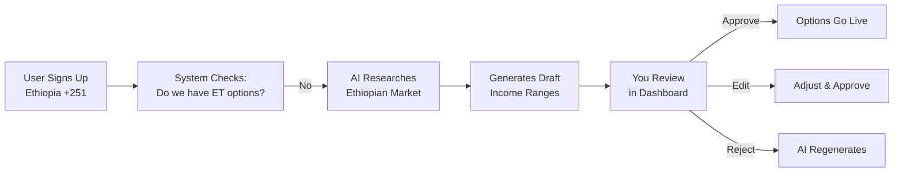

# Admin Guide: Auto-Generation System

## 🎯 What Is This?

When a new user signs up from a country we haven't configured yet (e.g., Ethiopia, Bangladesh, Vietnam), the system **automatically researches** that country's:
- Household income ranges (with local currency)
- Popular beverage brands sold locally
- Automotive preferences and popular vehicle types

**You don't need to manually Google "Ethiopian household income ranges"**—the AI does it for you and presents draft options for review.

---

## 🧠 How It Works (Simple Explanation)



**Key Point**: AI generates **draft options only**. Nothing goes live until you approve it.

---

## 📍 Where to Find It

### Dashboard Location
Navigate to: **`/admin/country-gaps`**

You'll see a table with:

| Country | Question Type | Status | Confidence | Actions |
|---------|---------------|--------|------------|---------|
| 🇪🇹 Ethiopia | Household Income | Pending | 85% | [Review] |
| 🇧🇩 Bangladesh | Beverage Brands | Pending | 78% | [Review] |
| 🇻🇳 Vietnam | Automotive | Approved | 92% | [View] |

### Notification Badge
When new drafts are ready, you'll see a notification badge on the **Country Gaps** menu item showing the count of pending reviews.

---

## ✅ Approval Workflow

### Step 1: Open Pending Draft

Click **[Review]** next to any pending item. You'll see:

```
Country: 🇪🇹 Ethiopia (+251)
Question: Household Income
Generated: 2 hours ago
Confidence: 85%

Draft Options:
✓ Under 50,000 Br
✓ 50,000 - 100,000 Br
✓ 100,000 - 200,000 Br
✓ 200,000 - 500,000 Br
✓ 500,000 - 1,000,000 Br
✓ Over 1,000,000 Br

AI Research Notes:
- Currency: Ethiopian Birr (Br)
- Source: World Bank 2024 GDP per capita data
- Median household income: ~150,000 Br/year
- Income distribution: 65% below 200,000 Br

[Approve] [Edit & Approve] [Reject & Regenerate]
```

### Step 2: Review Checklist

Before approving, verify:

#### ✅ **Income Ranges**
- [ ] Currency symbol correct? (Br for Birr, R for Rand, ₦ for Naira, etc.)
- [ ] Currency name matches country? (Not using USD for Ethiopia)
- [ ] Ranges realistic for that country's economy?
- [ ] Covers low, middle, and high-income groups?
- [ ] Format consistent? (e.g., "50,000 - 100,000 Br" not "50k-100k")

#### ✅ **Beverage Brands**
- [ ] Brands actually sold in that country? (Not Nigerian brands for Kenya)
- [ ] Mix of local and international brands?
- [ ] Top brands by market share included?
- [ ] No duplicate brands?
- [ ] Brand names spelled correctly?

#### ✅ **Automotive Questions**
- [ ] Vehicle types match local market? (Rickshaws in India, Bakkies in South Africa)
- [ ] Popular makes/models included?
- [ ] Used vs. new car preferences reflected?

### Step 3: Make a Decision

You have three options:

---

#### **Option A: Approve Immediately** ✅

**When to use**:
- AI confidence score > 80%
- All checklist items verified
- Options look professionally researched

**Action**:
1. Click **[Approve]** button
2. Options immediately inserted into `country_question_options` table
3. Future users from that country see these options
4. Gap record marked as `status: approved`

**Example**: AI generated Nigerian beverage brands with 92% confidence, includes Coca-Cola, Pepsi, Bigi, Chivita, Chi—all correct. ✅ **Approve**

---

#### **Option B: Edit & Approve** ✏️

**When to use**:
- AI confidence 60-80%
- Options mostly correct but need minor tweaks
- Currency format needs adjustment
- Missing 1-2 important brands

**Action**:
1. Click **[Edit]** button
2. Inline editor opens showing all options
3. Adjust labels, add/remove options
4. Click **[Save & Approve]**

**Example**: AI generated Ethiopian income ranges but used "$" instead of "Br". 

**Before**:
```json
[
  {"value": "under-50k", "label": "Under $50,000"},
  {"value": "50k-100k", "label": "$50,000 - $100,000"}
]
```

**After** (your edit):
```json
[
  {"value": "under-50k", "label": "Under 50,000 Br"},
  {"value": "50k-100k", "label": "50,000 - 100,000 Br"}
]
```

**Then**: Click **[Save & Approve]** → Options go live with your corrections.

---

#### **Option C: Reject & Regenerate** ❌

**When to use**:
- AI confidence < 60%
- Options clearly incorrect (wrong country's data)
- Currency completely wrong
- Missing critical context

**Action**:
1. Click **[Reject]** button
2. Modal opens: "Why are you rejecting this draft?"
3. Add specific feedback:
   ```
   "Currency should be Ethiopian Birr (Br), not Kenyan Shilling (KSh).
   Also, income ranges seem too high—Ethiopia's GDP per capita is
   much lower than Kenya's. Please research Ethiopian market specifically."
   ```
4. Click **[Submit & Regenerate]**
5. AI receives your feedback and generates new draft with refined prompt

**What happens next**:
- Gap record marked `status: rejected`
- Edge function re-invokes AI with your feedback included in prompt
- New draft appears in your dashboard within 1-2 minutes
- You receive notification to review the updated draft

---

## 🚦 Understanding Confidence Scores

The AI self-assesses the quality of its research:

| Score Range | Meaning | Recommendation |
|-------------|---------|----------------|
| **90-100%** | Official sources (World Bank, government stats, Nielsen) | Safe to approve immediately |
| **80-89%** | Reputable sources (IMF, OECD, industry reports) | Review carefully, likely approve |
| **70-79%** | Mixed sources, some estimation | Edit & approve, verify critical details |
| **60-69%** | Regional estimates, comparable markets | Requires manual approval, research recommended |
| **<60%** | Insufficient data, mostly guesswork | Auto-rejected, manual creation recommended |

### What Influences Confidence?

- **Data Availability**: More official sources = higher confidence
- **Recency**: 2024 data > 2018 data
- **Specificity**: Country-specific data > regional averages
- **Source Quality**: World Bank > random blog post

### Example Scenarios

**Scenario 1: High Confidence (92%)**
```
Question: Household Income - South Africa
Sources: Statistics South Africa (official), World Bank, IMF
Currency: South African Rand (R)
Data Year: 2024
→ Safe to approve immediately ✅
```

**Scenario 2: Medium Confidence (73%)**
```
Question: Beverage Brands - Vietnam
Sources: Euromonitor (reputable), Wikipedia (less reliable), regional estimates
Brands: Mix of international + local (Vinamilk, TH True Milk)
→ Review carefully, verify local brands exist ⚠️
```

**Scenario 3: Low Confidence (58%)**
```
Question: Household Income - Bhutan
Sources: Regional estimates (Nepal + India averages), outdated IMF data (2019)
Currency: Ngultrum (correct)
→ Reject, recommend manual research ❌
```

---

## 🛠️ Troubleshooting Common Issues

### Issue 1: AI Generated Wrong Brands

**Symptom**: AI included Nigerian brands for a Kenyan income question.

**Diagnosis**: AI confused regional data or used outdated sources.

**Fix**:
1. Click **[Edit]**
2. Remove incorrect brands (e.g., delete "Bigi Cola" which is Nigerian)
3. Add correct Kenyan brands (e.g., "Tusker", "Safaricom")
4. Click **[Save & Approve]**
5. In feedback box, note: "AI confused Nigerian brands with Kenyan brands. Verify country-specific market data."

---

### Issue 2: Income Ranges Don't Make Sense

**Symptom**: Ethiopia income ranges are 500,000 - 1,000,000 Br, but Ethiopia's GDP per capita is much lower.

**Diagnosis**: AI might have used annual vs. monthly income incorrectly, or confused with another country.

**Fix**:
1. Click **[Reject & Regenerate]**
2. Add feedback:
   ```
   "Income ranges are too high. Ethiopia's median household income
   is approximately 150,000 Br per year (not per month). Please
   research World Bank data for Ethiopia specifically, not East
   African regional averages."
   ```
3. Wait 1-2 minutes for regeneration
4. Review new draft—should show correct ranges like "Under 50,000 Br", "50,000 - 150,000 Br", etc.

---

### Issue 3: AI Hasn't Generated Options Yet

**Symptom**: User signed up from Mozambique 3 hours ago, but no draft in dashboard.

**Diagnosis**: 
- Edge function might be disabled
- Rate limit hit (10 generations/hour max)
- Database trigger didn't fire

**Fix**:
1. Check `/admin/agents` dashboard
2. Look for `country-profiler` agent status
3. If **Status: Disabled**, click **[Enable]**
4. If **Status: Rate Limited**, wait 1 hour or contact dev team to increase limit
5. If **Status: Active** but no draft, manually trigger:
   - Go to `/admin/country-gaps`
   - Click **[Manual Trigger]** button
   - Select country: Mozambique (+258)
   - Select questions: Household Income, Beverage Brands
   - Click **[Generate]**

---

### Issue 4: Options Approved But Users Don't See Them

**Symptom**: You approved Ethiopian income options, but Ethiopian users still see generic GLOBAL fallback.

**Diagnosis**: Caching issue or RLS policy blocking access.

**Fix**:
1. Verify approval succeeded:
   - Go to `/admin/questions`
   - Click "Household Income" question
   - Click **[Manage Countries]**
   - Check if Ethiopia (+251) is listed with options
2. If not listed, approval might have failed:
   - Check browser console for errors
   - Check `/admin/country-gaps` → find Ethiopia record → check status
   - If status still "pending", click **[Approve]** again
3. If listed but users don't see it:
   - Clear frontend cache (Dev Tools → Application → Clear Storage)
   - Ask user to log out and log back in
   - Check RLS policies on `country_question_options` table

---

## ⏸️ Emergency Procedures

### Pause All Auto-Generation

**When to use**:
- System generating too many low-quality drafts
- Need to pause while investigating issue
- Temporary freeze during system maintenance

**How**:
1. Go to `/admin/country-gaps`
2. Top-right corner: **[Pause Auto-Generation]** button
3. Confirmation modal: "This will stop all new AI generations. Existing drafts will remain for review. Continue?"
4. Click **[Confirm]**

**What happens**:
- Database trigger `detect_country_gap_trigger` disabled
- No new drafts created for new countries
- Existing drafts still visible for review
- Users from unconfigured countries see GLOBAL fallback options

**To resume**:
1. Same location: **[Resume Auto-Generation]** button (now visible)
2. Click to re-enable trigger

---

### Rollback Bad Approval

**When to use**:
- You approved options that turned out to be wrong
- Users reporting seeing incorrect data
- Need to revert to previous state

**How**:
1. Go to `/admin/questions`
2. Find affected question (e.g., "Household Income")
3. Click **[Manage Countries]**
4. Find problematic country (e.g., Ethiopia)
5. Two options:
   - **Edit Options**: Click **[Edit]** → Correct options → **[Save]**
   - **Delete & Regenerate**: Click **[Delete]** → Confirm → Go to `/admin/country-gaps` → **[Manual Trigger]** → Select Ethiopia → **[Generate]**

**Audit Trail**:
- All approvals/rejections logged in `audit_logs` table
- Can view history: `/admin/analytics` → "AI Generation History"
- Shows: Who approved, when, what was changed

---

## 📊 Monitoring & Analytics

### Daily Checks (Recommended)

**Dashboard**: `/admin/country-gaps`

Check these metrics daily:

1. **Pending Reviews**: Should be < 5 at any time
   - If > 10, prioritize reviewing
   - If > 20, consider pausing new generations until cleared

2. **Average Confidence Score**: Should be > 75%
   - If < 70%, investigate AI prompt quality
   - Check recent low-confidence drafts for patterns

3. **Approval Rate**: Should be > 70% (approved without edits)
   - If < 50%, AI needs prompt refinement
   - Review rejection reasons for common issues

### Weekly Reports

**Dashboard**: `/admin/analytics` → "AI Generation Performance"

Review these weekly:

| Metric | Target | Action If Below Target |
|--------|--------|------------------------|
| Approval Rate (no edits) | >70% | Refine AI prompts |
| Average Confidence | >80% | Check data sources |
| Time to Approval | <24 hours | Clear backlog faster |
| Rejection Rate | <15% | Investigate rejection reasons |
| Regeneration Success Rate | >80% | Improve feedback quality |

### Red Flags 🚩

**Contact Dev Team Immediately If**:
- Confidence scores suddenly drop below 60% for all generations
- Same country fails 3+ regeneration attempts
- Edge function timeout errors (check logs)
- AI returns non-JSON or malformed data
- Duplicate options appearing for same country

---

## 🎓 Best Practices

### 1. Review Within 24 Hours

**Why**: Users from new countries see generic GLOBAL fallback until you approve. Quick approvals improve user experience.

**How**: Set aside 15-30 minutes daily to clear pending drafts.

---

### 2. Add Detailed Feedback on Rejections

**Good Feedback** ✅:
```
"Currency should be Ethiopian Birr (Br), not USD. Income ranges
seem based on US data, not Ethiopian market. Research World Bank
data for Ethiopia's median household income (~150,000 Br/year)
and adjust ranges accordingly."
```

**Bad Feedback** ❌:
```
"Wrong"
```

**Why**: AI learns from your feedback. Specific feedback = better regeneration.

---

### 3. Test Before Approving Critical Markets

**For high-priority countries** (large user base, key markets):

1. Approve draft in **staging environment** first
2. Create test user from that country
3. Verify options display correctly
4. Check currency symbols, formatting
5. Then approve in production

---

### 4. Document Recurring Issues

**Keep a log** (in Notion, Google Docs, etc.) of common AI mistakes:

```
Ethiopia - AI used "$" instead of "Br" (fixed 2024-10-15)
Nigeria - AI confused with Ghana brands (fixed 2024-10-18)
Vietnam - AI estimated income too high (added feedback about PPP adjustment)
```

**Why**: Helps dev team refine AI prompts over time. Share this log with dev team monthly.

---

### 5. Use Manual Trigger for Critical Countries

**For markets you're actively expanding into**:

Don't wait for a user to sign up. Proactively generate options:

1. Go to `/admin/country-gaps`
2. Click **[Manual Trigger]**
3. Select target country (e.g., Indonesia)
4. Select all relevant questions (income, brands, automotive)
5. Click **[Generate]**
6. Review and approve before launch

**Benefit**: No delay for first users from that country.

---

## 📋 Quick Reference

### Common Tasks

| Task | Steps |
|------|-------|
| **Approve a draft** | `/admin/country-gaps` → Find pending item → [Review] → [Approve] |
| **Edit before approving** | [Review] → [Edit] → Make changes → [Save & Approve] |
| **Reject and regenerate** | [Review] → [Reject] → Add feedback → [Submit] |
| **Manually trigger generation** | `/admin/country-gaps` → [Manual Trigger] → Select country & questions → [Generate] |
| **Pause all generation** | `/admin/country-gaps` → [Pause Auto-Generation] |
| **View approval history** | `/admin/analytics` → "AI Generation History" |
| **Rollback bad approval** | `/admin/questions` → Find question → [Manage Countries] → [Edit] or [Delete] |

---

## 📞 Contact & Support

### When to Contact Dev Team

- AI confidence scores consistently < 60% for multiple countries
- Edge function errors (check browser console)
- Database errors during approval
- Performance issues (slow dashboard loading)
- Need to increase rate limits (>10 generations/hour)

### How to Report Issues

**Email**: dev-team@looplly.com  
**Subject**: `[Country Gaps] Issue: [Brief Description]`

**Include**:
1. Country code & name (e.g., "+251 Ethiopia")
2. Question type (e.g., "Household Income")
3. Screenshot of draft or error
4. Steps to reproduce
5. Expected vs. actual behavior

**Example Report**:
```
Subject: [Country Gaps] Issue: AI Generated Wrong Currency for Ethiopia

Country: Ethiopia (+251)
Question: Household Income
Issue: AI used "$" instead of "Br" (Ethiopian Birr)
Confidence: 78%

Steps:
1. User signed up from Ethiopia
2. AI generated draft
3. Reviewed draft - currency incorrect

Expected: "Under 50,000 Br"
Actual: "Under $50,000"

Screenshot: [attached]

Note: This is the 3rd time AI used wrong currency for Ethiopia.
Might need prompt refinement for currency detection.
```

---

## 🎯 Success Metrics

**You're doing great if**:
- ✅ Pending reviews cleared within 24 hours
- ✅ Approval rate > 70% (most drafts approved without edits)
- ✅ Users from new countries see localized options within 1-2 days
- ✅ No major rollbacks (< 1 per month)
- ✅ Average confidence score > 80%

**Areas for improvement if**:
- ⚠️ Backlog > 10 pending drafts
- ⚠️ Rejection rate > 30%
- ⚠️ Frequent regenerations (same country 3+ times)
- ⚠️ Users reporting wrong data

---

**Questions?** Check [AI_GENERATION_PROMPTS.md](./AI_GENERATION_PROMPTS.md) for technical details or contact the dev team.
