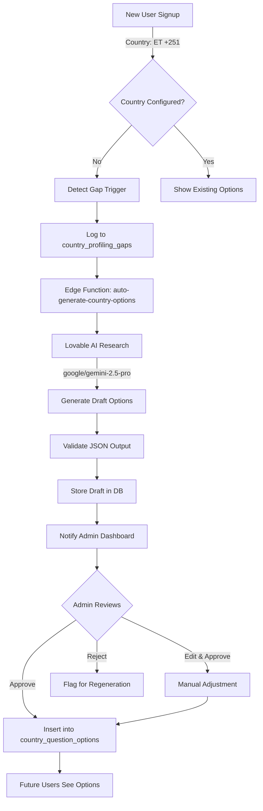

# Self-Learning Auto-Scaling Profiling System

## 🎯 Vision

Eliminate manual work for adding new countries to the Looplly platform. When a verified user signs up from Ethiopia, the system automatically researches Ethiopian household income ranges, local beverage brands, and automotive preferences—then presents admins with draft options to approve in minutes, not days.

**Problem Solved**: Currently, adding a new country requires manual research, data entry, and testing. This creates a bottleneck that limits geographic expansion and delays time-to-market.

**Solution**: AI-powered autonomous research and draft generation with human-in-the-loop approval for quality control.

---

## 🏗️ System Architecture

### High-Level Flow



---

## 🗄️ Database Schema

### Table: `country_profiling_gaps`

Tracks detected gaps where a country needs question options but doesn't have them yet.

```sql
CREATE TABLE country_profiling_gaps (
  id UUID PRIMARY KEY DEFAULT gen_random_uuid(),
  country_code TEXT NOT NULL,
  country_iso TEXT NOT NULL,
  country_name TEXT NOT NULL,
  question_id UUID NOT NULL REFERENCES profile_questions(id),
  question_key TEXT NOT NULL,
  question_text TEXT NOT NULL,
  
  -- AI-Generated Draft
  draft_options JSONB, -- AI-generated options in format: [{value, label}]
  confidence_score INTEGER CHECK (confidence_score BETWEEN 0 AND 100),
  ai_metadata JSONB, -- {model, prompt_version, source, research_notes}
  
  -- Review Status
  status TEXT DEFAULT 'pending' CHECK (status IN ('pending', 'approved', 'rejected', 'processing')),
  reviewed_by UUID REFERENCES auth.users(id),
  reviewed_at TIMESTAMPTZ,
  admin_feedback TEXT,
  
  -- Audit
  detected_at TIMESTAMPTZ DEFAULT NOW(),
  generated_at TIMESTAMPTZ,
  tenant_id UUID REFERENCES tenants(id),
  
  created_at TIMESTAMPTZ DEFAULT NOW(),
  updated_at TIMESTAMPTZ DEFAULT NOW(),
  
  UNIQUE(country_code, question_id)
);

CREATE INDEX idx_gaps_status ON country_profiling_gaps(status);
CREATE INDEX idx_gaps_country ON country_profiling_gaps(country_code);
CREATE INDEX idx_gaps_confidence ON country_profiling_gaps(confidence_score);
```

### Table: `auto_approval_config`

Controls which question types can be auto-approved based on confidence scores.

```sql
CREATE TABLE auto_approval_config (
  id UUID PRIMARY KEY DEFAULT gen_random_uuid(),
  question_key TEXT UNIQUE NOT NULL,
  auto_approve_enabled BOOLEAN DEFAULT false,
  confidence_threshold INTEGER DEFAULT 90 CHECK (confidence_threshold BETWEEN 0 AND 100),
  require_manual_review BOOLEAN DEFAULT true,
  tenant_id UUID REFERENCES tenants(id),
  created_at TIMESTAMPTZ DEFAULT NOW(),
  updated_at TIMESTAMPTZ DEFAULT NOW()
);

-- Default config for household_income
INSERT INTO auto_approval_config (question_key, auto_approve_enabled, confidence_threshold, require_manual_review)
VALUES ('household_income', false, 85, true);
```

### Updates to `country_question_options`

Add fallback support for unconfigured countries:

```sql
-- Add is_fallback column
ALTER TABLE country_question_options 
ADD COLUMN is_fallback BOOLEAN DEFAULT false;

-- Insert GLOBAL fallback for household_income
INSERT INTO country_question_options (question_id, country_code, options, is_fallback)
SELECT 
  id,
  'GLOBAL',
  '[
    {"value": "under-20k", "label": "Under 20,000"},
    {"value": "20k-50k", "label": "20,000 - 50,000"},
    {"value": "50k-100k", "label": "50,000 - 100,000"},
    {"value": "100k-200k", "label": "100,000 - 200,000"},
    {"value": "200k-plus", "label": "200,000+"}
  ]'::jsonb,
  true
FROM profile_questions
WHERE question_key = 'household_income';
```

---

## ⚡ Edge Function: `auto-generate-country-options`

### Location
`supabase/functions/auto-generate-country-options/index.ts`

### Trigger Events
1. **New User Signup**: Detected via database trigger on `profiles` table
2. **Manual Trigger**: Admin clicks "Generate Options" button in dashboard
3. **Scheduled Job**: Daily scan for gaps (future enhancement)

### Input Schema

```typescript
interface GenerateOptionsRequest {
  country_code: string;      // e.g., "+251"
  country_iso?: string;       // e.g., "ET"
  question_keys: string[];    // e.g., ["household_income", "beverage_brands"]
  user_id?: string;           // Optional: for audit logging
  force_regenerate?: boolean; // Override existing drafts
}
```

### Processing Logic

```typescript
async function generateCountryOptions(req: GenerateOptionsRequest) {
  // 1. Validate input
  const { country_code, question_keys } = req;
  
  // 2. Get country metadata
  const countryData = await getCountryMetadata(country_code); // Name, currency, etc.
  
  // 3. Check for existing gaps
  const existingGaps = await supabase
    .from('country_profiling_gaps')
    .select('*')
    .eq('country_code', country_code)
    .in('question_key', question_keys);
  
  // 4. For each question, generate options
  const results = [];
  for (const questionKey of question_keys) {
    // Skip if already processed (unless force_regenerate)
    if (existingGaps.some(g => g.question_key === questionKey && !req.force_regenerate)) {
      continue;
    }
    
    // 5. Build AI prompt
    const prompt = buildPrompt(questionKey, countryData);
    
    // 6. Call Lovable AI
    const aiResponse = await fetch('https://ai.gateway.lovable.dev/v1/chat/completions', {
      method: 'POST',
      headers: {
        'Authorization': `Bearer ${Deno.env.get('LOVABLE_API_KEY')}`,
        'Content-Type': 'application/json',
      },
      body: JSON.stringify({
        model: 'google/gemini-2.5-pro', // Best for research tasks
        messages: [
          { role: 'system', content: SYSTEM_PROMPT },
          { role: 'user', content: prompt }
        ],
        temperature: 0.3, // Lower temperature for factual accuracy
      }),
    });
    
    // 7. Parse and validate response
    const aiData = await aiResponse.json();
    const generatedOptions = JSON.parse(aiData.choices[0].message.content);
    
    // 8. Validate structure
    if (!validateOptionsSchema(generatedOptions)) {
      throw new Error('AI output does not match expected schema');
    }
    
    // 9. Insert draft into country_profiling_gaps
    const { data: gap } = await supabase
      .from('country_profiling_gaps')
      .upsert({
        country_code,
        country_iso: countryData.iso,
        country_name: countryData.name,
        question_id: generatedOptions.question_id,
        question_key: questionKey,
        question_text: generatedOptions.question_text,
        draft_options: generatedOptions.options,
        confidence_score: generatedOptions.confidence,
        ai_metadata: {
          model: 'google/gemini-2.5-pro',
          prompt_version: '1.0',
          source: generatedOptions.metadata.source,
          research_notes: generatedOptions.metadata.notes
        },
        status: 'pending',
        generated_at: new Date().toISOString()
      })
      .select()
      .single();
    
    results.push(gap);
  }
  
  return results;
}
```

### AI Model Selection

**Primary Model**: `google/gemini-2.5-pro`
- **Why**: Best at research tasks, understands context, generates structured outputs
- **Strengths**: Handles complex prompts, multi-step reasoning, international data
- **Cost**: Higher than Flash but worth it for quality

**Fallback Model**: `google/gemini-2.5-flash`
- **When**: If Pro is rate-limited or unavailable
- **Trade-off**: Slightly lower accuracy but still acceptable for draft generation

---

## 🔒 Security & Quality Assurance

### Security Model

1. **Admin-Only Approval**: All AI-generated options require admin approval before activation
2. **RLS Policies**: Ensure only admins can view/approve gaps
   ```sql
   CREATE POLICY "Admins can manage country gaps"
   ON country_profiling_gaps
   FOR ALL
   USING (public.has_role(auth.uid(), 'admin'));
   ```

3. **Audit Logging**: Every generation, approval, rejection logged to `audit_logs`
4. **Rate Limiting**: Prevent abuse of AI generation endpoint (max 10 requests/hour per tenant)

### Quality Assurance

**Validation Layers**:

1. **JSON Schema Validation**: AI output must match expected structure
2. **Confidence Thresholds**: 
   - <60%: Auto-reject, flag for manual creation
   - 60-79%: Require manual review
   - 80-89%: Recommend manual review
   - 90-100%: Eligible for auto-approval (if enabled)

3. **Human Review**: Admin reviews all options before activation
4. **A/B Testing**: Compare AI-generated vs. manually created options for known countries

**Quality Metrics** (tracked in `/admin/analytics`):
- Average confidence score
- Approval rate (% approved without edits)
- Rejection reasons (categorized)
- Time to approval (how long drafts sit in queue)

---

## 🔄 Data Flow Examples

### Example 1: Ethiopian User Signup

```
1. User signs up: +251 912345678 (Ethiopia)
2. Profile created with country_code="+251", country_iso="ET"
3. Trigger fires: detect_country_gap_trigger
4. Check: Does ET have household_income options?
   → No: Insert gap record
5. Edge function invoked: auto-generate-country-options
6. AI prompt: "Research household income ranges in Ethiopia..."
7. AI returns:
   {
     "options": [
       {"value": "under-50k", "label": "Under 50,000 Br"},
       {"value": "50k-100k", "label": "50,000 - 100,000 Br"},
       ...
     ],
     "metadata": {
       "currency": "ETB",
       "symbol": "Br",
       "source": "World Bank 2024"
     },
     "confidence": 85
   }
8. Draft stored in country_profiling_gaps (status: pending)
9. Admin sees notification in /admin/country-gaps
10. Admin reviews: ✓ Looks good, currency correct, ranges realistic
11. Admin clicks "Approve"
12. Options inserted into country_question_options for ET
13. Future Ethiopian users see localized income dropdown
```

### Example 2: Fallback Usage

```
1. User signs up: +61 412345678 (Australia)
2. Profile created with country_code="+61", country_iso="AU"
3. useProfileQuestions hook runs:
   a. Query country_question_options WHERE country_code = "+61"
   b. No results found
   c. Fallback query: WHERE country_code = "GLOBAL" AND is_fallback = true
   d. Return generic income ranges with note: "These are generic ranges. Country-specific options pending."
4. Trigger also fires to generate AU-specific options
5. Admin approves AU options next day
6. User's next session: sees AU-specific options
```

---

## 🧪 Testing Strategy

### Stage 1: Known Countries (Validation)

Test AI generation against countries we already have manual data for:

```typescript
// Test: Generate options for South Africa
const testResult = await generateCountryOptions({
  country_code: '+27',
  country_iso: 'ZA',
  question_keys: ['household_income']
});

// Compare AI output to existing manual data
const manualOptions = await supabase
  .from('country_question_options')
  .select('options')
  .eq('country_code', '+27')
  .eq('question_id', householdIncomeQuestionId)
  .single();

// Calculate alignment score (should be >80%)
const alignmentScore = compareOptions(testResult.draft_options, manualOptions.options);
expect(alignmentScore).toBeGreaterThan(80);
```

### Stage 2: New Countries (Live Testing)

```typescript
// Test countries without existing data
const testCountries = [
  { code: '+251', iso: 'ET', name: 'Ethiopia' },
  { code: '+234', iso: 'NG', name: 'Nigeria' },
  { code: '+880', iso: 'BD', name: 'Bangladesh' }
];

for (const country of testCountries) {
  const result = await generateCountryOptions({
    country_code: country.code,
    country_iso: country.iso,
    question_keys: ['household_income', 'beverage_brands']
  });
  
  // Validate
  expect(result.confidence_score).toBeGreaterThan(60);
  expect(result.draft_options.length).toBeGreaterThan(5);
  expect(result.ai_metadata.source).toBeDefined();
}
```

### Stage 3: Load Testing

```typescript
// Simulate 10 simultaneous new countries
const promises = testCountries.map(country => 
  generateCountryOptions({ country_code: country.code, question_keys: ['household_income'] })
);

const results = await Promise.all(promises);
expect(results.every(r => r.status === 'pending')).toBe(true);
```

---

## 📈 Scalability Benefits

### Before Auto-Scaling
- **Time to add new country**: 2-4 days (research + data entry + testing)
- **Developer involvement**: Required for each country
- **Countries supported**: Limited by team capacity
- **Quality consistency**: Varies by researcher

### After Auto-Scaling
- **Time to add new country**: 10-30 minutes (AI generation + admin review)
- **Developer involvement**: Zero (after initial setup)
- **Countries supported**: Unlimited (scales with AI capacity)
- **Quality consistency**: High (standardized AI prompts + validation)

### Metrics to Track

| Metric | Target | Current | Trend |
|--------|--------|---------|-------|
| Avg. Time to Approval | <2 hours | TBD | - |
| AI Confidence Score | >80% | TBD | - |
| Approval Rate (no edits) | >70% | TBD | - |
| New Countries/Month | 10+ | TBD | - |

---

## 🔧 Configuration & Management

### Enable/Disable Auto-Generation

```sql
-- Disable for specific question type
UPDATE auto_approval_config
SET require_manual_review = true, auto_approve_enabled = false
WHERE question_key = 'household_income';

-- Enable auto-approval (high confidence only)
UPDATE auto_approval_config
SET auto_approve_enabled = true, confidence_threshold = 90
WHERE question_key = 'beverage_brands';
```

### Emergency Pause

Admin UI includes "Pause All Auto-Generation" button:

```sql
-- Global pause (all tenants)
UPDATE auto_approval_config
SET require_manual_review = true;

-- Tenant-specific pause
UPDATE auto_approval_config
SET require_manual_review = true
WHERE tenant_id = 'specific-tenant-id';
```

---

## 🔗 Integration Points

### With Existing Systems

1. **`useProfileQuestions` Hook**: Updated to include fallback logic
2. **`/admin/questions` Page**: Shows warnings if options missing for country-specific questions
3. **RLS Policies**: Leverages existing `has_role()` function for admin access
4. **Audit Logs**: Uses existing `log_audit_event()` function
5. **Analytics Dashboard**: New section for AI generation performance

### Future Enhancements

- **Regional Fallbacks**: Use Nigerian options as fallback for other West African countries
- **Multi-Language Support**: Generate options in local languages (e.g., Amharic for Ethiopia)
- **Historical Tracking**: Track how options change over time (inflation, new brands)
- **Automated A/B Testing**: Compare AI-generated vs. manually created options in production

---

## 📚 Related Documentation

- [Admin Auto-Generation Guide](./ADMIN_AUTO_GENERATION_GUIDE.md) - Admin operational guide
- [AI Generation Prompts](./AI_GENERATION_PROMPTS.md) - Prompt engineering library
- [Country Question Management](./COUNTRY_QUESTION_MANAGEMENT.md) - Managing country-specific questions
- [Question Builder Guide](./QUESTION_BUILDER_GUIDE.md) - Creating new profile questions

---

## 📞 Support & Troubleshooting

### Common Issues

**Issue**: AI generates options with wrong currency
- **Cause**: Country metadata lookup failed
- **Fix**: Add country to `countries.ts` data file with correct currency info

**Issue**: Confidence score consistently low (<60%)
- **Cause**: Insufficient data sources for that country
- **Fix**: Add manual options for that country, or refine AI prompt with more specific sources

**Issue**: Edge function times out
- **Cause**: Too many questions being generated simultaneously
- **Fix**: Batch processing - limit to 3 questions per invocation

### Contact

- **Dev Team**: For technical issues with edge function or database
- **Admin Team**: For questions about approval workflow or quality standards
- **AI Prompt Issues**: See [AI_GENERATION_PROMPTS.md](./AI_GENERATION_PROMPTS.md) for refinement guidelines
