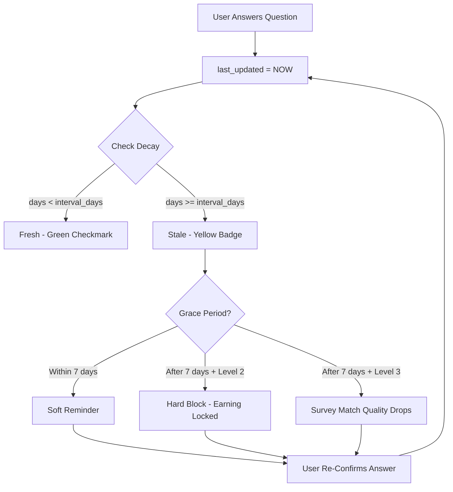
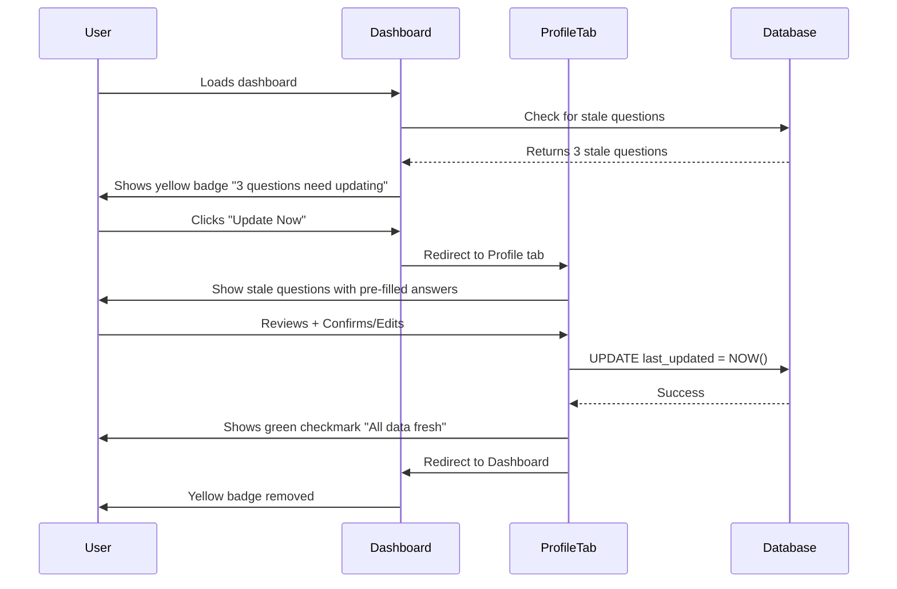

# Profile Decay System

## Overview

The **Profile Decay System** ensures that user profile data stays **fresh and accurate** by enforcing periodic re-confirmation of answers. This improves survey targeting accuracy, increases completion rates, and meets advertiser requirements for data recency.

---

## Why Data Decays

### 1. Life Changes Are Inevitable
- **Income changes**: New job, raise, promotion, job loss
- **Lifestyle shifts**: New car, moved house, got married, had kids
- **Technology updates**: Upgraded devices, switched phones
- **Shopping habits**: New brands, preferences evolve

### 2. Survey Targeting Requires Fresh Data
- Surveys match users based on demographics, income, lifestyle
- Stale data = wrong matches = users screen out = frustration + wasted time
- Fresh data = accurate matches = higher completion = more earnings

### 3. Advertiser Requirements
- Survey clients pay **50-70% more** for users with data refreshed within 90 days
- Stale data reduces survey CPM (cost per thousand)
- Platform reputation depends on data quality

### 4. GDPR & Data Minimization
- Storing old, irrelevant data violates GDPR principles
- Periodic refresh = data minimization + compliance

---

## Decay Intervals

### Default Configuration

| Config Key | Interval Type | Days | Description | Example Questions |
|-----------|---------------|------|-------------|-------------------|
| `immutable` | Immutable | NULL | Never expires | Date of Birth, Gender, Address (fraud prevention) |
| `rare` | Rare | 365 | Annually | Lifestyle, hobbies, interests, family status |
| `occasional` | Occasional | 180 | Biannually | Income, job title, housing, education |
| `frequent` | Frequent | 90 | Quarterly | Brands, shopping habits, device ownership, banks |

### Category Defaults

| Category | Default Decay | Rationale |
|----------|---------------|-----------|
| Identity & Security | Immutable | Names, contact, address rarely change |
| Demographics | Immutable | Age, gender, ethnicity stable |
| Financial Profile | Occasional (180d) | Income fluctuates with job changes |
| Employment & Career | Occasional (180d) | Job titles, industries change |
| Lifestyle & Housing | Occasional (180d) | Moderate change frequency |
| Automotive | Frequent (90d) | Car ownership updates regularly |
| Technology | Frequent (90d) | Devices change frequently |
| Shopping & Brands | Frequent (90d) | Brand preferences shift |
| Health & Wellness | Occasional (180d) | Moderate health status changes |

---

## How Decay Works

### 1. Decay Calculation

When a user answers a question:
```
answer_submitted → last_updated = NOW() → decay_interval_days applied
```

Every time a user loads their profile:
```
days_since_update = (NOW() - last_updated) / (1000 * 60 * 60 * 24)
is_stale = days_since_update > decay_interval_days
```

**Example**:
- User answers "Household Income" on **January 1, 2025**
- `last_updated` = **2025-01-01**
- Decay interval = **180 days** (occasional)
- **July 1, 2025**: `(NOW() - 2025-01-01)` = 181 days → **Stale**
- Yellow badge appears: _"180 days old - Needs update"_

---

### 2. Decay Status Lifecycle



---

### 3. Enforcement Levels

#### Soft Enforcement (All Questions)
**Visual Indicators**:
- 🟡 Yellow badge next to stale questions
- Dashboard banner: _"3 profile answers need updating"_
- Profile completion score affected

**User Action**: Optional (but recommended)

**Impact**: Survey matching less accurate, fewer specialized surveys

---

#### Hard Enforcement (Level 2 Only)
**What Happens**:
- 🔴 Red banner: _"Your profile needs updating before you can access new surveys"_
- Earn tab locked with progress bar
- User **cannot access new surveys** until stale Level 2 questions are refreshed

**Why**: Level 2 questions (gender, DOB, income, SEC) are **critical** for survey targeting—surveys REQUIRE this data to be fresh.

**Grace Period**: 7 days after data expires before hard block kicks in

---

### 4. Re-Confirm UX Flow



---

## Database Schema

### profile_decay_config Table

Defines global decay intervals:

```sql
CREATE TABLE profile_decay_config (
  id UUID PRIMARY KEY DEFAULT gen_random_uuid(),
  config_key TEXT NOT NULL UNIQUE, -- 'immutable', 'rare', 'occasional', 'frequent'
  interval_type TEXT NOT NULL, -- 'immutable', 'rare', 'occasional', 'frequent'
  interval_days INTEGER, -- NULL for immutable
  description TEXT,
  is_active BOOLEAN DEFAULT true,
  created_at TIMESTAMPTZ DEFAULT NOW(),
  updated_at TIMESTAMPTZ DEFAULT NOW()
);

-- Seed default decay configs
INSERT INTO profile_decay_config (config_key, interval_type, interval_days, description)
VALUES 
  ('immutable', 'immutable', NULL, 'Never expires (DOB, gender, address)'),
  ('rare', 'rare', 365, 'Annually (lifestyle, hobbies)'),
  ('occasional', 'occasional', 180, 'Biannually (income, job title)'),
  ('frequent', 'frequent', 90, 'Quarterly (brands, shopping habits)');
```

---

### profile_questions.decay_config_key Column

Each question references a decay config:

```sql
ALTER TABLE profile_questions
ADD COLUMN decay_config_key TEXT REFERENCES profile_decay_config(config_key);

-- Example: Household income decays biannually
UPDATE profile_questions
SET decay_config_key = 'occasional'
WHERE question_key = 'household_income';

-- Example: Date of birth never expires
UPDATE profile_questions
SET decay_config_key = 'immutable'
WHERE question_key = 'date_of_birth';
```

---

### profile_answers.last_updated Column

Tracks when answer was last confirmed:

```sql
ALTER TABLE profile_answers
ADD COLUMN last_updated TIMESTAMPTZ DEFAULT NOW();

-- Trigger: Auto-update last_updated on INSERT/UPDATE
CREATE OR REPLACE FUNCTION update_profile_answer_timestamp()
RETURNS TRIGGER AS $$
BEGIN
  NEW.last_updated = NOW();
  RETURN NEW;
END;
$$ LANGUAGE plpgsql;

CREATE TRIGGER profile_answer_timestamp_trigger
BEFORE INSERT OR UPDATE ON profile_answers
FOR EACH ROW
EXECUTE FUNCTION update_profile_answer_timestamp();
```

---

### Computed Column: is_stale

Calculate staleness on-the-fly:

```sql
-- Add computed column to profile_answers view
CREATE OR REPLACE VIEW profile_answers_with_staleness AS
SELECT 
  pa.*,
  pq.decay_config_key,
  pdc.interval_days AS decay_interval_days,
  EXTRACT(EPOCH FROM (NOW() - pa.last_updated)) / 86400 AS days_since_update,
  CASE 
    WHEN pdc.interval_days IS NULL THEN false -- Immutable
    WHEN EXTRACT(EPOCH FROM (NOW() - pa.last_updated)) / 86400 > pdc.interval_days THEN true
    ELSE false
  END AS is_stale
FROM profile_answers pa
JOIN profile_questions pq ON pq.id = pa.question_id
LEFT JOIN profile_decay_config pdc ON pdc.config_key = pq.decay_config_key;
```

---

## SQL Patterns

### 1. Get All Stale Answers for a User

```sql
SELECT 
  pq.question_key,
  pq.question_text,
  pa.answer_value,
  pa.last_updated,
  EXTRACT(EPOCH FROM (NOW() - pa.last_updated)) / 86400 AS days_old,
  pdc.interval_days AS expires_after_days,
  EXTRACT(EPOCH FROM (NOW() - pa.last_updated)) / 86400 - pdc.interval_days AS days_overdue
FROM profile_answers pa
JOIN profile_questions pq ON pq.id = pa.question_id
JOIN profile_decay_config pdc ON pdc.config_key = pq.decay_config_key
WHERE pa.user_id = 'USER_ID'
  AND pdc.interval_days IS NOT NULL -- Exclude immutable
  AND EXTRACT(EPOCH FROM (NOW() - pa.last_updated)) / 86400 > pdc.interval_days
ORDER BY days_overdue DESC;
```

**Output**:
```
question_key         | question_text              | days_old | expires_after | days_overdue
household_income     | What is your household... | 195      | 180           | 15
car_brand            | What car brand do you...  | 105      | 90            | 15
device_ownership     | Which devices do you...   | 93       | 90            | 3
```

---

### 2. Get Staleness Rate by Category

```sql
SELECT 
  pc.display_name AS category,
  COUNT(*) AS total_answers,
  SUM(CASE WHEN pdc.interval_days IS NOT NULL 
    AND EXTRACT(EPOCH FROM (NOW() - pa.last_updated)) / 86400 > pdc.interval_days 
    THEN 1 ELSE 0 END) AS stale_answers,
  ROUND(100.0 * SUM(CASE WHEN pdc.interval_days IS NOT NULL 
    AND EXTRACT(EPOCH FROM (NOW() - pa.last_updated)) / 86400 > pdc.interval_days 
    THEN 1 ELSE 0 END) / COUNT(*), 2) AS staleness_rate_pct
FROM profile_answers pa
JOIN profile_questions pq ON pq.id = pa.question_id
JOIN profile_categories pc ON pc.id = pq.category_id
LEFT JOIN profile_decay_config pdc ON pdc.config_key = pq.decay_config_key
GROUP BY pc.display_name
ORDER BY staleness_rate_pct DESC;
```

**Output**:
```
category      | total_answers | stale_answers | staleness_rate_pct
Automotive    | 1234          | 345           | 27.96%
Technology    | 2100          | 420           | 20.00%
Financial     | 1850          | 278           | 15.03%
Demographics  | 3000          | 0             | 0.00% (immutable)
```

---

### 3. Find Users with Stale Level 2 Data (Earning Blocked)

```sql
SELECT 
  p.user_id,
  p.first_name,
  p.last_name,
  p.email,
  COUNT(*) AS stale_l2_questions
FROM profile_answers pa
JOIN profile_questions pq ON pq.id = pa.question_id
JOIN profiles p ON p.user_id = pa.user_id
JOIN profile_decay_config pdc ON pdc.config_key = pq.decay_config_key
WHERE pq.level = 2
  AND pdc.interval_days IS NOT NULL
  AND EXTRACT(EPOCH FROM (NOW() - pa.last_updated)) / 86400 > pdc.interval_days
GROUP BY p.user_id, p.first_name, p.last_name, p.email
HAVING COUNT(*) > 0
ORDER BY stale_l2_questions DESC;
```

**Action**: These users are **blocked from earning**—send email reminders.

---

### 4. Calculate Days Until Next Decay

```sql
SELECT 
  pq.question_key,
  pq.question_text,
  pa.last_updated,
  pdc.interval_days,
  pdc.interval_days - EXTRACT(EPOCH FROM (NOW() - pa.last_updated)) / 86400 AS days_until_stale
FROM profile_answers pa
JOIN profile_questions pq ON pq.id = pa.question_id
JOIN profile_decay_config pdc ON pdc.config_key = pq.decay_config_key
WHERE pa.user_id = 'USER_ID'
  AND pdc.interval_days IS NOT NULL
ORDER BY days_until_stale ASC;
```

**Use Case**: Proactive reminders—send email 7 days before data expires.

---

## Frontend Integration

### TypeScript Interface

```typescript
interface DecayStatus {
  isStale: boolean;
  daysRemaining: number;
  daysOverdue: number;
  expiresAt: Date;
  severity: 'fresh' | 'expiring_soon' | 'stale' | 'overdue';
}

const calculateDecayStatus = (
  answeredAt: Date,
  decayDays: number | null
): DecayStatus => {
  if (decayDays === null) {
    // Immutable - never expires
    return {
      isStale: false,
      daysRemaining: Infinity,
      daysOverdue: 0,
      expiresAt: new Date('9999-12-31'),
      severity: 'fresh'
    };
  }

  const expiresAt = new Date(answeredAt);
  expiresAt.setDate(expiresAt.getDate() + decayDays);

  const now = new Date();
  const diffMs = expiresAt.getTime() - now.getTime();
  const diffDays = Math.ceil(diffMs / (1000 * 60 * 60 * 24));

  const isStale = diffDays <= 0;
  const daysRemaining = Math.max(0, diffDays);
  const daysOverdue = Math.abs(Math.min(0, diffDays));

  let severity: DecayStatus['severity'];
  if (daysOverdue > 0) {
    severity = 'overdue';
  } else if (daysRemaining <= 7) {
    severity = 'expiring_soon';
  } else if (isStale) {
    severity = 'stale';
  } else {
    severity = 'fresh';
  }

  return {
    isStale,
    daysRemaining,
    daysOverdue,
    expiresAt,
    severity
  };
};
```

---

### React Hook: useStaleProfileCheck

```typescript
// src/hooks/useStaleProfileCheck.ts
import { useProfileQuestions } from './useProfileQuestions';

export const useStaleProfileCheck = () => {
  const { level2Categories, level3Categories, isLoading } = useProfileQuestions();
  
  const allQuestions = [
    ...level2Categories.flatMap(c => c.questions),
    ...level3Categories.flatMap(c => c.questions)
  ];
  
  const staleQuestions = allQuestions.filter(q => {
    // Skip immutable fields
    if (q.is_immutable || !q.decay_interval_days) return false;
    
    // Skip unanswered questions
    if (!q.user_answer?.answer_value && !q.user_answer?.answer_json) return false;
    
    // Calculate staleness
    const lastUpdated = new Date(q.user_answer.last_updated);
    const daysSinceUpdate = (Date.now() - lastUpdated.getTime()) / (1000 * 60 * 60 * 24);
    return daysSinceUpdate > q.decay_interval_days;
  });
  
  return {
    hasStaleData: staleQuestions.length > 0,
    staleQuestions,
    staleCount: staleQuestions.length,
    isLoading
  };
};
```

---

### UI Components

#### Stale Badge Component

```tsx
// src/components/ui/stale-badge.tsx
import { AlertCircle } from 'lucide-react';
import { Badge } from '@/components/ui/badge';
import { DecayStatus } from '@/types/profile';

interface StaleBadgeProps {
  decayStatus: DecayStatus;
}

export const StaleBadge = ({ decayStatus }: StaleBadgeProps) => {
  if (!decayStatus.isStale) {
    return <Badge variant="success">✓ Fresh</Badge>;
  }

  if (decayStatus.severity === 'expiring_soon') {
    return (
      <Badge variant="warning">
        <AlertCircle className="w-3 h-3 mr-1" />
        Expires in {decayStatus.daysRemaining} days
      </Badge>
    );
  }

  return (
    <Badge variant="destructive">
      <AlertCircle className="w-3 h-3 mr-1" />
      {decayStatus.daysOverdue} days overdue
    </Badge>
  );
};
```

---

#### Re-Confirm Modal

```tsx
// src/components/dashboard/ReConfirmModal.tsx
import { useState } from 'react';
import { Dialog, DialogContent, DialogHeader, DialogTitle } from '@/components/ui/dialog';
import { Button } from '@/components/ui/button';
import { useStaleProfileCheck } from '@/hooks/useStaleProfileCheck';
import { QuestionRenderer } from './profile/QuestionRenderer';

export const ReConfirmModal = () => {
  const { staleQuestions, hasStaleData } = useStaleProfileCheck();
  const [isOpen, setIsOpen] = useState(hasStaleData);

  const handleConfirm = async () => {
    // Refresh last_updated timestamps
    await Promise.all(
      staleQuestions.map(q => 
        supabase
          .from('profile_answers')
          .update({ last_updated: new Date().toISOString() })
          .eq('question_id', q.id)
          .eq('user_id', user.id)
      )
    );
    setIsOpen(false);
  };

  return (
    <Dialog open={isOpen} onOpenChange={setIsOpen}>
      <DialogContent>
        <DialogHeader>
          <DialogTitle>Update Your Profile</DialogTitle>
        </DialogHeader>
        <p>These answers need updating (takes ~2 minutes):</p>
        {staleQuestions.map(q => (
          <QuestionRenderer key={q.id} question={q} />
        ))}
        <Button onClick={handleConfirm}>Confirm & Save</Button>
      </DialogContent>
    </Dialog>
  );
};
```

---

## Admin Portal Integration

### Decay Configuration Page (`/admin/profile-decay`)

**Features**:
1. **Global Interval Management**
   - View all decay configs (immutable, rare, occasional, frequent)
   - Edit interval_days (e.g., change occasional from 180→150 days)
   - Activate/deactivate decay configs

2. **Category Defaults**
   - Assign default decay configs to categories
   - Override per question

3. **Platform Health Metrics**
   - Staleness rate by category (chart)
   - Top 10 stale questions (table)
   - Users with stale Level 2 data (count)

4. **Bulk Actions**
   - Reset staleness for test users
   - Batch send reminder emails

---

### Monitoring Dashboard

**Key Metrics**:

| Metric | Target | Red Flag | Action |
|--------|--------|----------|--------|
| **Overall Staleness Rate** | <10% | >20% | Send reminder campaign |
| **Level 2 Staleness** | <5% | >10% | Block earning until refreshed |
| **Days Overdue (Avg)** | <7 days | >14 days | Increase reminder frequency |
| **Re-Confirm Completion Rate** | >80% | <70% | Simplify UX, pre-fill answers |

---

### Health Check Query

```sql
-- Platform Health Check
SELECT 
  'Overall Staleness Rate' AS metric,
  CONCAT(ROUND(100.0 * SUM(CASE WHEN pdc.interval_days IS NOT NULL 
    AND EXTRACT(EPOCH FROM (NOW() - pa.last_updated)) / 86400 > pdc.interval_days 
    THEN 1 ELSE 0 END) / COUNT(*), 2), '%') AS value,
  CASE 
    WHEN ROUND(100.0 * SUM(CASE WHEN pdc.interval_days IS NOT NULL 
      AND EXTRACT(EPOCH FROM (NOW() - pa.last_updated)) / 86400 > pdc.interval_days 
      THEN 1 ELSE 0 END) / COUNT(*), 2) > 20 THEN '🔴 Red Flag'
    WHEN ROUND(100.0 * SUM(CASE WHEN pdc.interval_days IS NOT NULL 
      AND EXTRACT(EPOCH FROM (NOW() - pa.last_updated)) / 86400 > pdc.interval_days 
      THEN 1 ELSE 0 END) / COUNT(*), 2) > 10 THEN '🟡 Warning'
    ELSE '✅ Healthy'
  END AS status
FROM profile_answers pa
JOIN profile_questions pq ON pq.id = pa.question_id
LEFT JOIN profile_decay_config pdc ON pdc.config_key = pq.decay_config_key;
```

---

## Best Practices

### 1. **Choose Appropriate Intervals**
- Don't make intervals too short (user fatigue)
- Don't make intervals too long (data becomes stale)
- Follow category defaults unless specific reason to override

### 2. **Grace Periods Are Essential**
- 7-day grace period after expiry
- Prevents immediate blocking on day 181 (user frustration)

### 3. **Pre-Fill Old Answers**
- When showing re-confirm modal, pre-fill old answer
- If answer hasn't changed, user just clicks "Confirm"
- Reduces friction (1 click vs re-typing)

### 4. **Proactive Reminders**
- Send email 7 days before data expires
- Send dashboard banner when expiry is imminent
- Don't wait until data is overdue

### 5. **Monitor Skip Rates**
- If users skip re-confirm prompts >30% of the time, simplify UX
- If skip rate is high for specific question, review question wording

---

## Troubleshooting

### Issue: High Staleness Rate (>20%)

**Diagnosis**:
```sql
SELECT 
  pq.question_key,
  COUNT(*) AS stale_count
FROM profile_answers pa
JOIN profile_questions pq ON pq.id = pa.question_id
JOIN profile_decay_config pdc ON pdc.config_key = pq.decay_config_key
WHERE pdc.interval_days IS NOT NULL
  AND EXTRACT(EPOCH FROM (NOW() - pa.last_updated)) / 86400 > pdc.interval_days
GROUP BY pq.question_key
ORDER BY stale_count DESC
LIMIT 10;
```

**Actions**:
1. Identify top stale questions
2. Send targeted reminder emails
3. Simplify re-confirm UX for those questions
4. Consider extending decay interval if users ignore reminders

---

### Issue: Users Not Refreshing Level 2 Data

**Diagnosis**: Check how many users are blocked from earning
```sql
SELECT COUNT(DISTINCT pa.user_id) AS blocked_users
FROM profile_answers pa
JOIN profile_questions pq ON pq.id = pa.question_id
JOIN profile_decay_config pdc ON pdc.config_key = pq.decay_config_key
WHERE pq.level = 2
  AND pdc.interval_days IS NOT NULL
  AND EXTRACT(EPOCH FROM (NOW() - pa.last_updated)) / 86400 > pdc.interval_days + 7; -- After grace period
```

**Actions**:
1. Send urgent email: _"Update your profile to regain access to surveys"_
2. Show prominent red banner on dashboard
3. Block access to Earn tab (hard enforcement)

---

### Issue: Low Re-Confirm Completion Rate (<70%)

**Diagnosis**: Users see re-confirm modal but don't complete it

**Actions**:
1. Pre-fill old answers (reduce friction)
2. Show only 3-5 questions at a time (don't overwhelm)
3. Add progress bar: _"2/5 questions refreshed"_
4. Explain benefit: _"Keep data fresh = higher earnings"_

---

## Related Documentation

- [User Guide](USER_GUIDE.md): End-user explanation of decay system
- [Admin Guide](ADMIN_GUIDE.md): Managing decay configs in admin portal
- [Integration Guide](INTEGRATION_GUIDE.md): Integrating decay with surveys, streaks, reputation
- [Architecture](ARCHITECTURE.md): Database schema and technical details

---

**Remember**: Fresh data = Better matches = Higher earnings 🎯
