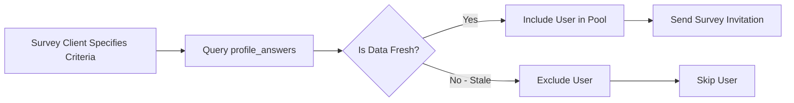
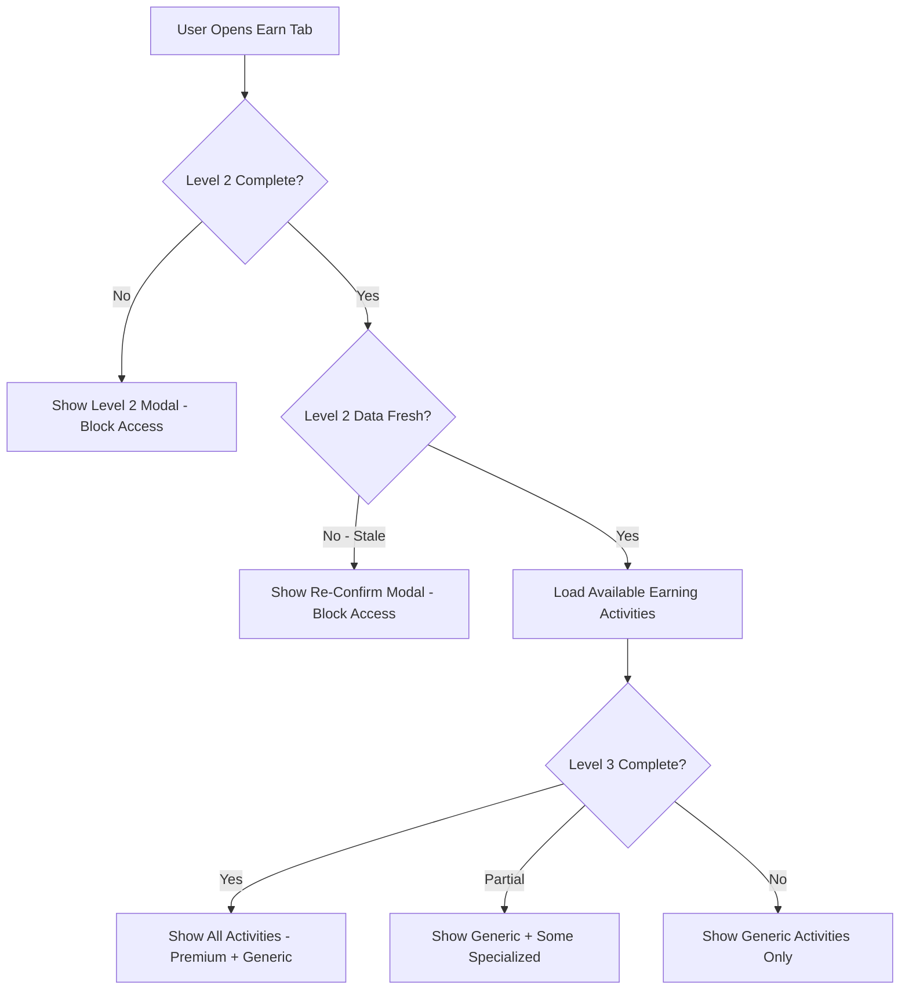
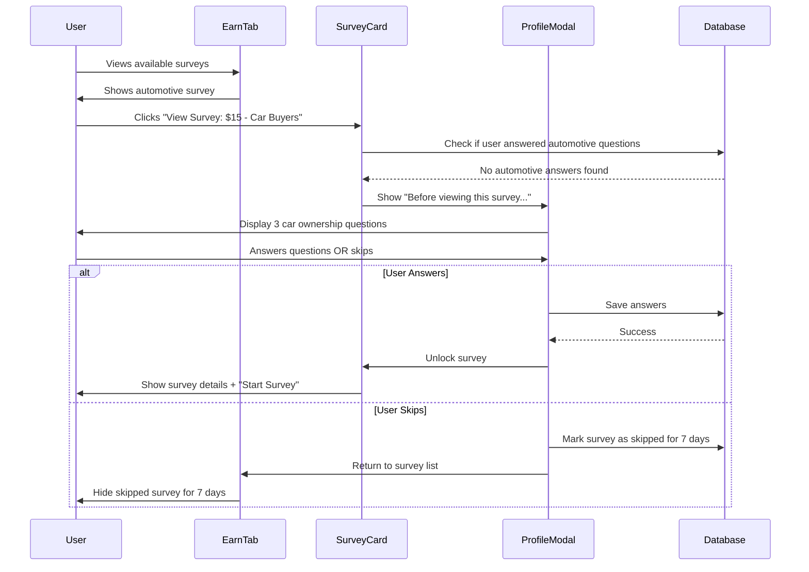

# Profile System Integration Guide

## Overview

This guide explains how to integrate the Looplly Profiling System with other platform features including **Streaks**, **Reputation**, **Surveys**, **Badges**, and **Earning Activities**.

---

## Core Integration Points

### 1. Streaks System

**Relationship**: **Decoupled** - Profile completion does NOT affect streaks

**Rationale**:
- Streaks reward daily engagement (logging in, completing surveys)
- Profile completion is a one-time/periodic task (not daily)
- Mixing streaks with profile would punish users who complete their profile quickly

**Integration**:
- ✅ Users can maintain streaks while having incomplete Level 3 profiles
- ✅ Profile staleness does NOT break streaks
- ❌ Profile completion does NOT award streak bonuses

**Code Example**:
```typescript
// Streak calculation ignores profile status
const updateStreak = async (userId: string) => {
  const { data: streak } = await supabase
    .from('user_streaks')
    .select('*')
    .eq('user_id', userId)
    .single();

  const lastActivity = new Date(streak.last_activity_date);
  const today = new Date();
  const daysSinceActivity = daysBetween(lastActivity, today);

  if (daysSinceActivity === 1) {
    // Continue streak - profile status irrelevant
    await supabase
      .from('user_streaks')
      .update({ current_streak: streak.current_streak + 1 })
      .eq('user_id', userId);
  }
};
```

---

### 2. Reputation System

**Relationship**: **Soft Coupling** - Rep-gated surveys require Level 2 completion + fresh data

**Rationale**:
- High-rep users unlock premium surveys (higher CPM)
- Premium surveys require fresh demographic data for targeting
- Reputation rewards survey completion, not profile completion (currently)

**Integration**:
- ✅ Users can earn rep with incomplete Level 3 profiles
- ✅ Level 2 must be complete + fresh to access rep-gated surveys
- ❌ Profile completion does NOT award rep points (reserved for future enhancement)

**Rep-Gated Survey Check**:
```typescript
const canAccessRepGatedSurvey = async (userId: string, requiredRep: number) => {
  // Check 1: User has sufficient reputation
  const { data: reputation } = await supabase
    .from('user_reputation')
    .select('score')
    .eq('user_id', userId)
    .single();

  if (reputation.score < requiredRep) return false;

  // Check 2: Level 2 complete
  const { data: profile } = await supabase
    .from('profiles')
    .select('profile_level')
    .eq('user_id', userId)
    .single();

  if (profile.profile_level < 2) return false;

  // Check 3: Level 2 data is fresh (not stale)
  const { data: staleQuestions } = await supabase
    .from('profile_answers')
    .select(`
      id,
      last_updated,
      profile_questions!inner(level, decay_config_key),
      profile_decay_config!inner(interval_days)
    `)
    .eq('user_id', userId)
    .eq('profile_questions.level', 2);

  const hasStaleL2Data = staleQuestions.some(q => {
    if (!q.profile_decay_config.interval_days) return false; // Immutable
    const daysSinceUpdate = daysBetween(new Date(q.last_updated), new Date());
    return daysSinceUpdate > q.profile_decay_config.interval_days;
  });

  return !hasStaleL2Data;
};
```

**Future Enhancement**:
- +5 rep per Level 3 category completion (8 categories × 5 rep = 40 rep total)
- "Data Guardian" badge for refreshing stale data within 7 days (+10 rep)

---

### 3. Survey Matching

**Relationship**: **Tight Coupling** - Surveys use profile data for targeting

**Rationale**:
- Survey clients specify criteria (e.g., "Males, 25-34, earning ₦3M+")
- Profile data is the single source of truth for matching
- Stale data = inaccurate matches = users screen out

**Integration Flow**:


**SQL Pattern - Survey Targeting**:
```sql
-- Find Nigerian males aged 25-34 earning ₦3M+ with FRESH data only
WITH fresh_answers AS (
  SELECT 
    pa.user_id,
    pa.question_id,
    pa.answer_normalized
  FROM profile_answers pa
  JOIN profile_questions pq ON pq.id = pa.question_id
  LEFT JOIN profile_decay_config pdc ON pdc.config_key = pq.decay_config_key
  WHERE pa.user_id IN (
      SELECT user_id FROM profiles WHERE country_code = 'NG'
    )
    AND (
      pdc.interval_days IS NULL -- Immutable (always fresh)
      OR EXTRACT(EPOCH FROM (NOW() - pa.last_updated)) / 86400 <= pdc.interval_days
    )
),
gender_match AS (
  SELECT user_id FROM fresh_answers
  WHERE question_id = (SELECT id FROM profile_questions WHERE question_key = 'gender')
    AND answer_normalized = 'male'
),
age_match AS (
  SELECT user_id FROM fresh_answers
  WHERE question_id = (SELECT id FROM profile_questions WHERE question_key = 'age_bracket')
    AND answer_normalized = '25-34'
),
income_match AS (
  SELECT user_id FROM fresh_answers
  WHERE question_id = (SELECT id FROM profile_questions WHERE question_key = 'household_income')
    AND answer_normalized IN ('3000001-6000000', '6000001-12000000', '12000001+')
)
SELECT 
  p.user_id,
  p.first_name,
  p.email
FROM profiles p
WHERE p.user_id IN (SELECT user_id FROM gender_match)
  AND p.user_id IN (SELECT user_id FROM age_match)
  AND p.user_id IN (SELECT user_id FROM income_match);
```

**Stale Data Handling**:
- **Level 2 stale**: Exclude user from ALL surveys (earning blocked)
- **Level 3 stale**: Exclude user from specialized surveys (e.g., automotive surveys if car ownership data is stale)
- **Result**: User sees fewer survey opportunities until data is refreshed

---

### 4. Earning Activities

**Relationship**: **Gated by Level 2 Completion**

**Rationale**:
- Earning activities (surveys, offers, tasks) require demographic targeting
- Without Level 2 data, we can't match users with appropriate activities
- Level 3 data is optional but improves match quality

**Integration Flow**:


**Code Example - Earn Tab Gate**:
```typescript
const EarnTab = () => {
  const { user } = useAuth();
  const { profile, isLoading: profileLoading } = useProfile();
  const { hasStaleData, staleQuestions } = useStaleProfileCheck();

  // Block 1: Level 2 incomplete
  if (!profileLoading && profile.profile_level < 2) {
    return (
      <Alert variant="destructive">
        <AlertTitle>Complete Your Profile to Start Earning</AlertTitle>
        <AlertDescription>
          Answer 10 essential questions to unlock earning opportunities.
        </AlertDescription>
        <Button onClick={() => navigate('/profile')}>Complete Profile</Button>
      </Alert>
    );
  }

  // Block 2: Level 2 data stale
  const staleL2Questions = staleQuestions.filter(q => q.level === 2);
  if (staleL2Questions.length > 0) {
    return (
      <Alert variant="destructive">
        <AlertTitle>Update Required Before Earning</AlertTitle>
        <AlertDescription>
          {staleL2Questions.length} questions need updating (takes 2 minutes).
        </AlertDescription>
        <Button onClick={() => setShowReConfirmModal(true)}>Update Now</Button>
      </Alert>
    );
  }

  // Proceed to load activities
  return <EarningActivitiesList />;
};
```

---

### 5. Badges System

**Relationship**: **Profile Milestones Award Badges**

**Rationale**:
- Badges reward user behaviors (surveys completed, referrals, profile completion)
- Profile badges are cosmetic only (no rep points currently)

**Profile-Related Badges**:

| Badge | Requirement | Reward |
|-------|-------------|--------|
| **Profile Pro** | Complete all 8 Level 3 categories | Visual badge (no rep) |
| **Data Guardian** | Refresh stale data within 7 days of expiry alert | +10 rep (future) |
| **Quick Starter** | Complete Level 2 within 24 hours of signup | Visual badge |
| **Perfect Profile** | 100% profile completion for 90+ consecutive days | Visual badge |

**Integration Code**:
```typescript
// Award "Profile Pro" badge when all L3 categories complete
const checkProfileProBadge = async (userId: string) => {
  const { data: level3Answers } = await supabase
    .from('profile_answers')
    .select(`
      profile_questions!inner(category_id, level)
    `)
    .eq('user_id', userId)
    .eq('profile_questions.level', 3);

  const { data: level3Categories } = await supabase
    .from('profile_categories')
    .select('id')
    .eq('level', 3);

  const answeredCategoryIds = new Set(
    level3Answers.map(a => a.profile_questions.category_id)
  );

  const allCategoriesComplete = level3Categories.every(
    cat => answeredCategoryIds.has(cat.id)
  );

  if (allCategoriesComplete) {
    await awardBadge(userId, 'profile_pro');
  }
};
```

---

### 6. Level 3 Contextual Triggers

**Relationship**: **Survey Category Blocking**

**Rationale**:
- Specialized surveys (automotive, tech, healthcare) require specific profile data
- Users must answer relevant Level 3 questions before viewing those surveys
- Prevents survey screening out (wasted time)

**Integration Flow**:


**Code Example - Survey Category Gate**:
```typescript
const SurveyCard = ({ survey }: { survey: Survey }) => {
  const { user } = useAuth();
  const [showProfileModal, setShowProfileModal] = useState(false);

  const checkCategoryQuestions = async () => {
    // Get required questions for this survey category
    const { data: requiredQuestions } = await supabase
      .from('profile_questions')
      .select('id')
      .eq('question_group', survey.category) // e.g., 'automotive'
      .eq('level', 3);

    // Check if user has answered these questions
    const { data: userAnswers } = await supabase
      .from('profile_answers')
      .select('question_id')
      .eq('user_id', user.id)
      .in('question_id', requiredQuestions.map(q => q.id));

    const hasAnswered = userAnswers.length === requiredQuestions.length;

    if (!hasAnswered) {
      setShowProfileModal(true);
      return false;
    }

    return true;
  };

  const handleViewSurvey = async () => {
    const canView = await checkCategoryQuestions();
    if (canView) {
      navigate(`/earn/survey/${survey.id}`);
    }
  };

  return (
    <>
      <Card onClick={handleViewSurvey}>
        <h3>{survey.title}</h3>
        <p>${survey.reward}</p>
      </Card>

      <ProfileCategoryModal
        isOpen={showProfileModal}
        category={survey.category}
        onComplete={() => {
          setShowProfileModal(false);
          navigate(`/earn/survey/${survey.id}`);
        }}
        onSkip={() => {
          setShowProfileModal(false);
          // Mark survey as skipped for 7 days
        }}
      />
    </>
  );
};
```

---

## Database Hooks

### useProfileQuestions

Fetch all questions with decay status calculated:

```typescript
export const useProfileQuestions = () => {
  const { user } = useAuth();

  return useQuery({
    queryKey: ['profile-questions', user?.id],
    queryFn: async () => {
      const { data, error } = await supabase
        .from('profile_questions')
        .select(`
          *,
          profile_categories(name, display_name, level),
          profile_decay_config(interval_days, interval_type),
          profile_answers(answer_value, answer_json, last_updated)
        `)
        .eq('is_active', true)
        .eq('profile_answers.user_id', user.id);

      if (error) throw error;

      // Calculate decay status for each question
      return data.map(q => ({
        ...q,
        decay_status: calculateDecayStatus(
          q.profile_answers[0]?.last_updated,
          q.profile_decay_config?.interval_days
        ),
        user_answer: q.profile_answers[0]
      }));
    },
    enabled: !!user
  });
};
```

---

### useStaleProfileCheck

Get count and list of stale questions:

```typescript
export const useStaleProfileCheck = () => {
  const { level2Categories, level3Categories, isLoading } = useProfileQuestions();
  
  const allQuestions = [
    ...level2Categories.flatMap(c => c.questions),
    ...level3Categories.flatMap(c => c.questions)
  ];
  
  const staleQuestions = allQuestions.filter(q => {
    if (q.is_immutable || !q.decay_interval_days) return false;
    if (!q.user_answer?.answer_value && !q.user_answer?.answer_json) return false;
    
    const lastUpdated = new Date(q.user_answer.last_updated);
    const daysSinceUpdate = (Date.now() - lastUpdated.getTime()) / (1000 * 60 * 60 * 24);
    return daysSinceUpdate > q.decay_interval_days;
  });
  
  return {
    hasStaleData: staleQuestions.length > 0,
    staleQuestions,
    staleCount: staleQuestions.length,
    level2Stale: staleQuestions.filter(q => q.level === 2).length,
    level3Stale: staleQuestions.filter(q => q.level === 3).length,
    isLoading
  };
};
```

---

### useProfileCompleteness

Calculate profile completion score:

```typescript
export const useProfileCompleteness = () => {
  const { user } = useAuth();

  return useQuery({
    queryKey: ['profile-completeness', user?.id],
    queryFn: async () => {
      // Get total questions per level
      const { data: questions } = await supabase
        .from('profile_questions')
        .select('id, level, is_required')
        .eq('is_active', true);

      const level1Total = questions.filter(q => q.level === 1).length;
      const level2Total = questions.filter(q => q.level === 2).length;
      const level3Total = questions.filter(q => q.level === 3).length;

      // Get user answers
      const { data: answers } = await supabase
        .from('profile_answers')
        .select('question_id, profile_questions!inner(level)')
        .eq('user_id', user.id);

      const level1Answered = answers.filter(a => a.profile_questions.level === 1).length;
      const level2Answered = answers.filter(a => a.profile_questions.level === 2).length;
      const level3Answered = answers.filter(a => a.profile_questions.level === 3).length;

      // Calculate weighted score
      const level1Score = (level1Answered / level1Total) * 20; // 20% weight
      const level2Score = (level2Answered / level2Total) * 40; // 40% weight
      const level3Score = (level3Answered / level3Total) * 40; // 40% weight

      const totalScore = Math.round(level1Score + level2Score + level3Score);

      return {
        totalScore,
        level1: { answered: level1Answered, total: level1Total, percentage: Math.round((level1Answered / level1Total) * 100) },
        level2: { answered: level2Answered, total: level2Total, percentage: Math.round((level2Answered / level2Total) * 100) },
        level3: { answered: level3Answered, total: level3Total, percentage: Math.round((level3Answered / level3Total) * 100) }
      };
    },
    enabled: !!user
  });
};
```

---

## API Patterns

### Check Profile Completeness (Edge Function)

```typescript
// supabase/functions/check-profile-completeness/index.ts
import { serve } from 'https://deno.land/std@0.168.0/http/server.ts';
import { createClient } from 'https://esm.sh/@supabase/supabase-js@2';

serve(async (req) => {
  const { userId } = await req.json();
  const supabaseClient = createClient(
    Deno.env.get('SUPABASE_URL') ?? '',
    Deno.env.get('SUPABASE_ANON_KEY') ?? ''
  );

  // Level 2 completion check
  const { data: level2Questions } = await supabaseClient
    .from('profile_questions')
    .select('id')
    .eq('level', 2)
    .eq('is_active', true);

  const { data: level2Answers } = await supabaseClient
    .from('profile_answers')
    .select('question_id')
    .eq('user_id', userId)
    .in('question_id', level2Questions.map(q => q.id));

  const level2Complete = level2Answers.length === level2Questions.length;

  return new Response(
    JSON.stringify({
      level2Complete,
      canEarn: level2Complete,
      missingQuestions: level2Questions.length - level2Answers.length
    }),
    { headers: { 'Content-Type': 'application/json' } }
  );
});
```

---

### Get Stale Questions (Edge Function)

```typescript
// supabase/functions/get-stale-questions/index.ts
serve(async (req) => {
  const { userId } = await req.json();
  const supabaseClient = createClient(/* ... */);

  const { data: answers } = await supabaseClient
    .from('profile_answers')
    .select(`
      id,
      last_updated,
      profile_questions!inner(
        id,
        question_text,
        level,
        decay_config_key
      ),
      profile_decay_config!inner(interval_days)
    `)
    .eq('user_id', userId);

  const staleQuestions = answers.filter(a => {
    if (!a.profile_decay_config.interval_days) return false; // Immutable
    const daysSinceUpdate = daysBetween(new Date(a.last_updated), new Date());
    return daysSinceUpdate > a.profile_decay_config.interval_days;
  });

  return new Response(
    JSON.stringify({
      staleCount: staleQuestions.length,
      level2Stale: staleQuestions.filter(q => q.profile_questions.level === 2).length,
      questions: staleQuestions.map(q => ({
        questionId: q.profile_questions.id,
        questionText: q.profile_questions.question_text,
        daysOverdue: daysBetween(new Date(a.last_updated), new Date()) - q.profile_decay_config.interval_days
      }))
    }),
    { headers: { 'Content-Type': 'application/json' } }
  );
});
```

---

## Event Tracking

Track profiling events for analytics:

```typescript
// utils/profileAnalytics.ts
export const trackProfileEvent = async (
  userId: string,
  event: string,
  metadata: Record<string, any>
) => {
  await supabase.from('audit_logs').insert({
    user_id: userId,
    action: event,
    resource_type: 'profile',
    metadata
  });
};

// Usage examples:
trackProfileEvent(user.id, 'profile_level_2_complete', {
  time_taken_minutes: 4.5,
  skip_rate: 0.1
});

trackProfileEvent(user.id, 'profile_data_refreshed', {
  question_ids: ['q1', 'q2', 'q3'],
  days_overdue: [15, 8, 3]
});

trackProfileEvent(user.id, 'survey_category_blocked', {
  category: 'automotive',
  missing_questions: 3
});
```

---

## Performance Optimization

### 1. Cache Profile Completion Status

```typescript
// Cache for 5 minutes to avoid repeated DB calls
export const getCachedProfileStatus = async (userId: string) => {
  const cacheKey = `profile_status_${userId}`;
  const cached = localStorage.getItem(cacheKey);

  if (cached) {
    const { status, timestamp } = JSON.parse(cached);
    const ageMinutes = (Date.now() - timestamp) / 60000;
    if (ageMinutes < 5) return status;
  }

  const status = await fetchProfileStatus(userId);
  localStorage.setItem(cacheKey, JSON.stringify({ status, timestamp: Date.now() }));
  return status;
};
```

---

### 2. Batch Staleness Checks

```sql
-- Single query to check all staleness at once (instead of per-question)
CREATE OR REPLACE FUNCTION check_profile_staleness(p_user_id UUID)
RETURNS TABLE(question_id UUID, is_stale BOOLEAN, days_overdue INTEGER) AS $$
BEGIN
  RETURN QUERY
  SELECT 
    pa.question_id,
    CASE 
      WHEN pdc.interval_days IS NULL THEN false
      WHEN EXTRACT(EPOCH FROM (NOW() - pa.last_updated)) / 86400 > pdc.interval_days THEN true
      ELSE false
    END AS is_stale,
    CASE 
      WHEN pdc.interval_days IS NULL THEN 0
      ELSE GREATEST(0, FLOOR(EXTRACT(EPOCH FROM (NOW() - pa.last_updated)) / 86400 - pdc.interval_days))
    END AS days_overdue
  FROM profile_answers pa
  JOIN profile_questions pq ON pq.id = pa.question_id
  LEFT JOIN profile_decay_config pdc ON pdc.config_key = pq.decay_config_key
  WHERE pa.user_id = p_user_id;
END;
$$ LANGUAGE plpgsql;
```

---

## Testing

### Integration Test: Level 2 Gating

```typescript
describe('Earn Tab - Level 2 Gating', () => {
  it('should block earning if Level 2 incomplete', async () => {
    const user = await createTestUser({ profile_level: 1 });
    const { getByText } = render(<EarnTab />, { user });
    expect(getByText(/Complete Your Profile to Start Earning/i)).toBeInTheDocument();
  });

  it('should allow earning if Level 2 complete', async () => {
    const user = await createTestUser({ profile_level: 2 });
    await seedLevel2Answers(user.id);
    const { queryByText } = render(<EarnTab />, { user });
    expect(queryByText(/Complete Your Profile/i)).not.toBeInTheDocument();
  });

  it('should block earning if Level 2 data stale', async () => {
    const user = await createTestUser({ profile_level: 2 });
    await seedStaleLevel2Answers(user.id, { daysOld: 200 }); // 200 days > 180 day decay
    const { getByText } = render(<EarnTab />, { user });
    expect(getByText(/Update Required Before Earning/i)).toBeInTheDocument();
  });
});
```

---

## Troubleshooting

### Issue: User completed Level 2 but still blocked from earning

**Diagnosis**:
```sql
-- Check if Level 2 answers exist
SELECT pq.question_key, pa.answer_value, pa.last_updated
FROM profile_questions pq
LEFT JOIN profile_answers pa ON pq.id = pa.question_id AND pa.user_id = 'USER_ID'
WHERE pq.level = 2
  AND pq.is_active = true;
```

**Common Causes**:
1. Not all Level 2 questions answered
2. Level 2 data is stale (check `last_updated`)
3. `profile_level` in `profiles` table not updated

**Fix**:
```sql
-- Manually update profile_level if answers exist
UPDATE profiles
SET profile_level = 2
WHERE user_id = 'USER_ID';
```

---

### Issue: Stale data not showing yellow badges

**Diagnosis**:
```typescript
// Check decay calculation
const testDecay = (lastUpdated: string, intervalDays: number) => {
  const daysSinceUpdate = (Date.now() - new Date(lastUpdated).getTime()) / (1000 * 60 * 60 * 24);
  console.log(`Days since update: ${daysSinceUpdate}`);
  console.log(`Interval days: ${intervalDays}`);
  console.log(`Is stale: ${daysSinceUpdate > intervalDays}`);
};
```

**Common Causes**:
1. `decay_config_key` not set on question
2. `profile_decay_config` table missing interval_days
3. Frontend decay calculation logic incorrect

---

## Related Documentation

- [Architecture](ARCHITECTURE.md): Database schema details
- [Decay System](DECAY_SYSTEM.md): Comprehensive decay guide
- [Admin Guide](ADMIN_GUIDE.md): Managing integrations in admin portal

---

**Remember**: Tight integration = Seamless user experience 🎯
