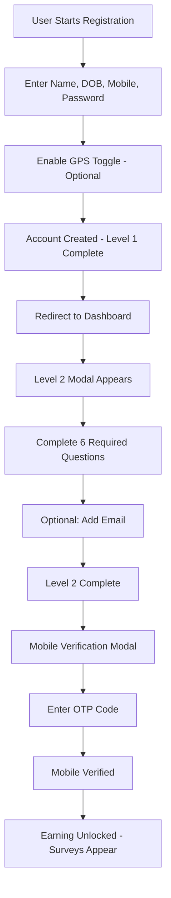
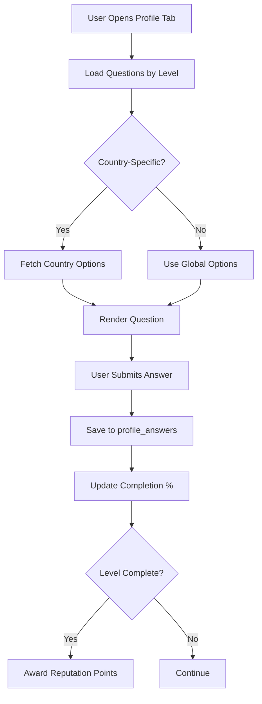
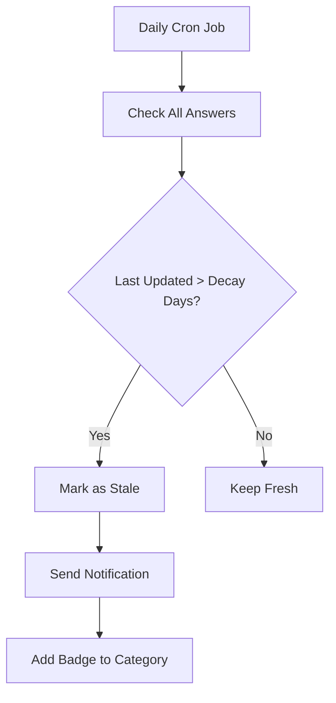

# Profile System Architecture

## Overview

The Looplly Profile System is a progressive, multi-level data collection engine that enables targeted survey distribution while maintaining user privacy and data security.

## System Components

### 1. Profile Data Storage

#### Profiles Table (Core)

```sql
CREATE TABLE profiles (
  user_id UUID PRIMARY KEY REFERENCES auth.users(id),
  email TEXT UNIQUE NOT NULL,
  full_name TEXT,
  mobile TEXT,
  country_code TEXT, -- ISO 3166-1 alpha-2
  country_dial_code TEXT,
  date_of_birth DATE,
  gender TEXT,
  profile_completion_level INTEGER DEFAULT 0,
  reputation_points INTEGER DEFAULT 0,
  created_at TIMESTAMP DEFAULT NOW(),
  updated_at TIMESTAMP DEFAULT NOW()
);
```

#### Profile Answers Table (Questions & Responses)

```sql
CREATE TABLE profile_answers (
  id UUID PRIMARY KEY DEFAULT gen_random_uuid(),
  user_id UUID REFERENCES profiles(user_id),
  question_id UUID REFERENCES profile_questions(id),
  answer_value TEXT NOT NULL,
  answered_at TIMESTAMP DEFAULT NOW(),
  last_updated TIMESTAMP DEFAULT NOW(),
  is_stale BOOLEAN DEFAULT false,
  UNIQUE(user_id, question_id)
);
```

#### Profile Questions Table (Question Definitions)

```sql
CREATE TABLE profile_questions (
  id UUID PRIMARY KEY DEFAULT gen_random_uuid(),
  question_key TEXT UNIQUE NOT NULL,
  question_text TEXT NOT NULL,
  category_id UUID REFERENCES profile_categories(id),
  question_type TEXT, -- 'select', 'multi_select', 'text', 'number', 'date'
  global_options TEXT[], -- Default answer options
  is_required BOOLEAN DEFAULT false,
  level INTEGER, -- 1, 2, or 3
  decay_config_key TEXT, -- Links to decay configuration
  display_order INTEGER,
  is_active BOOLEAN DEFAULT true,
  created_at TIMESTAMP DEFAULT NOW()
);
```

#### Country-Specific Options

```sql
CREATE TABLE country_question_options (
  id UUID PRIMARY KEY DEFAULT gen_random_uuid(),
  question_id UUID REFERENCES profile_questions(id),
  country_code TEXT, -- ISO alpha-2
  options TEXT[], -- Country-specific options
  UNIQUE(question_id, country_code)
);
```

### 2. Progressive Profiling Levels

#### Level 1: Essential Profile (Required)
- **Purpose**: Account creation and identity verification
- **Captured**: During registration form
- **Questions**: 6 identity fields
- **Time**: 2-3 minutes
- **Completion Required**: Yes (registration cannot proceed without)

**Fields Captured:**
- First Name
- Last Name
- Date of Birth (18+ validation)
- Mobile Number (E.164 normalized)
- Password
- GPS Toggle (optional)

**Reputation Reward**: 0 points (no reward for registration)

**Note:** Email and Gender removed from Level 1 and moved to Level 2

#### Level 2: Standard Profile (Required for Earning)
- **Purpose**: Demographic profiling for survey targeting
- **Captured**: Via dashboard modal after registration
- **Questions**: 6 required + 1 optional
- **Time**: 5-7 minutes
- **Completion Required**: Yes (gates access to earning opportunities)

**Required Questions:**
- Gender (moved from Level 1)
- Address (location targeting)
- Ethnicity (demographics)
- Household Income (HHI - total household)
- Personal Income (PHI - individual income, separate from HHI)
- Socioeconomic Classification (SEC)

**Optional Questions:**
- Email Address (for newsletters/updates only, NOT account recovery)

**Reputation Reward**: +150 points

**Unlocks (after mobile verification):**
- Access to surveys
- Earning opportunities
- Referral program
- Community features

**Important Notes:**
- Mobile verification required AFTER Level 2 completion
- Email is optional (mobile is primary recovery method)
- PHI captures individual income separately from household income

#### Level 3: Premium Profile (Optional)
- **Purpose**: High-value survey targeting
- **Questions**: 30-50 detailed questions
- **Time**: 10-15 minutes
- **Completion Required**: No

**Categories:**
- Technology Usage
- Media Consumption
- Health & Wellness
- Financial Products
- Travel & Leisure
- Automotive

**Reputation Reward**: +300 points

**Unlocks:**
- Access to 100% of surveys
- Premium survey invitations
- Priority support
- Exclusive badges

### 3. Category Organization

```sql
CREATE TABLE profile_categories (
  id UUID PRIMARY KEY DEFAULT gen_random_uuid(),
  category_key TEXT UNIQUE NOT NULL,
  category_name TEXT NOT NULL,
  category_description TEXT,
  level INTEGER, -- 1, 2, or 3
  display_order INTEGER,
  icon TEXT, -- Icon identifier
  is_active BOOLEAN DEFAULT true
);
```

**Example Categories:**

| Level | Category | Questions |
|-------|----------|-----------|
| 1 | Demographics | 5 |
| 1 | Location | 3 |
| 2 | Employment | 4 |
| 2 | Education | 3 |
| 2 | Lifestyle | 6 |
| 2 | Brands | 8 |
| 3 | Technology | 7 |
| 3 | Media | 6 |
| 3 | Health | 5 |
| 3 | Finance | 6 |

### 4. Data Decay System

#### Decay Configuration

```sql
CREATE TABLE profile_decay_config (
  config_key TEXT PRIMARY KEY,
  staleness_days INTEGER NOT NULL,
  description TEXT,
  auto_notify BOOLEAN DEFAULT true
);

-- Example configurations
INSERT INTO profile_decay_config VALUES
  ('immutable', 999999, 'Never expires', false),
  ('short_term', 30, 'Current status (e.g., employment)', true),
  ('medium_term', 180, 'Preferences that change seasonally', true),
  ('long_term', 365, 'Stable preferences', true);
```

#### Staleness Detection

Automated trigger updates `is_stale` flag:

```sql
CREATE FUNCTION check_profile_staleness() RETURNS TRIGGER AS $$
DECLARE
  decay_days INTEGER;
BEGIN
  SELECT staleness_days INTO decay_days
  FROM profile_decay_config dc
  JOIN profile_questions pq ON pq.decay_config_key = dc.config_key
  WHERE pq.id = NEW.question_id;
  
  IF (NOW() - NEW.last_updated) > (decay_days || ' days')::INTERVAL THEN
    NEW.is_stale := true;
  END IF;
  
  RETURN NEW;
END;
$$ LANGUAGE plpgsql;

CREATE TRIGGER check_staleness_trigger
  BEFORE INSERT OR UPDATE ON profile_answers
  FOR EACH ROW EXECUTE FUNCTION check_profile_staleness();
```

### 5. Answer Resolution Logic

Frontend logic resolves country-specific options:

```typescript
async function getQuestionOptions(
  questionId: string,
  userCountryCode: string
): Promise<string[]> {
  // 1. Try to get country-specific options
  const { data: countryOptions } = await supabase
    .from('country_question_options')
    .select('options')
    .eq('question_id', questionId)
    .eq('country_code', userCountryCode)
    .single();
  
  if (countryOptions?.options?.length > 0) {
    return countryOptions.options;
  }
  
  // 2. Fallback to global options
  const { data: question } = await supabase
    .from('profile_questions')
    .select('global_options')
    .eq('id', questionId)
    .single();
  
  return question?.global_options || [];
}
```

## Data Flow

### 1. User Registration & Onboarding



### 2. Profile Completion



### 3. Staleness Detection



## API Endpoints

### Get User Profile Questions

```typescript
// Frontend: src/hooks/useProfileQuestions.ts
export function useProfileQuestions(level?: number) {
  return useQuery({
    queryKey: ['profile-questions', level],
    queryFn: async () => {
      const query = supabase
        .from('profile_questions')
        .select('*, profile_categories(*)')
        .eq('is_active', true)
        .order('display_order');
      
      if (level) {
        query.eq('level', level);
      }
      
      const { data, error } = await query;
      if (error) throw error;
      return data;
    }
  });
}
```

### Save Profile Answer

```typescript
// Frontend: src/hooks/useProfileAnswers.ts
export function useSaveAnswer() {
  const queryClient = useQueryClient();
  
  return useMutation({
    mutationFn: async ({ 
      questionId, 
      answerValue 
    }: { 
      questionId: string; 
      answerValue: string 
    }) => {
      const { data, error } = await supabase
        .from('profile_answers')
        .upsert({
          question_id: questionId,
          answer_value: answerValue,
          last_updated: new Date().toISOString(),
          is_stale: false
        });
      
      if (error) throw error;
      return data;
    },
    onSuccess: () => {
      queryClient.invalidateQueries({ queryKey: ['profile-answers'] });
      queryClient.invalidateQueries({ queryKey: ['profile-completion'] });
    }
  });
}
```

### Check Profile Completion

```typescript
export function useProfileCompletion() {
  return useQuery({
    queryKey: ['profile-completion'],
    queryFn: async () => {
      const { data: user } = await supabase.auth.getUser();
      if (!user.user) throw new Error('Not authenticated');
      
      // Get total questions per level
      const { data: questions } = await supabase
        .from('profile_questions')
        .select('id, level')
        .eq('is_active', true);
      
      // Get answered questions
      const { data: answers } = await supabase
        .from('profile_answers')
        .select('question_id')
        .eq('user_id', user.user.id);
      
      const answeredIds = new Set(answers?.map(a => a.question_id));
      
      // Calculate per-level completion
      const completion = {
        level1: 0,
        level2: 0,
        level3: 0
      };
      
      [1, 2, 3].forEach(level => {
        const levelQuestions = questions?.filter(q => q.level === level);
        const answeredCount = levelQuestions?.filter(q => 
          answeredIds.has(q.id)
        ).length || 0;
        
        completion[`level${level}`] = levelQuestions?.length 
          ? (answeredCount / levelQuestions.length) * 100 
          : 0;
      });
      
      return completion;
    }
  });
}
```

## Security & Privacy

### Row Level Security (RLS)

```sql
-- Users can only view their own profile data
CREATE POLICY "Users can view own profile"
  ON profiles FOR SELECT
  USING (auth.uid() = user_id);

-- Users can update their own profile
CREATE POLICY "Users can update own profile"
  ON profiles FOR UPDATE
  USING (auth.uid() = user_id);

-- Users can view their own answers
CREATE POLICY "Users can view own answers"
  ON profile_answers FOR SELECT
  USING (auth.uid() = user_id);

-- Users can insert/update their own answers
CREATE POLICY "Users can manage own answers"
  ON profile_answers FOR ALL
  USING (auth.uid() = user_id);

-- Everyone can view active questions
CREATE POLICY "Anyone can view active questions"
  ON profile_questions FOR SELECT
  USING (is_active = true);
```

### Data Encryption

- Passwords: bcrypt hashed (handled by Supabase Auth)
- Sensitive answers: Can be encrypted at application level if needed
- PII: Stored securely with RLS enforcement

### GDPR Compliance

- **Right to Access**: Users can view all their data via Profile tab
- **Right to Rectification**: Users can update any answer anytime
- **Right to Erasure**: Account deletion removes all profile data
- **Data Portability**: Export functionality planned

## Performance Optimization

### Database Indexes

```sql
CREATE INDEX idx_profile_answers_user ON profile_answers(user_id);
CREATE INDEX idx_profile_answers_question ON profile_answers(question_id);
CREATE INDEX idx_profile_answers_stale ON profile_answers(is_stale) WHERE is_stale = true;
CREATE INDEX idx_profile_questions_level ON profile_questions(level);
CREATE INDEX idx_profile_questions_category ON profile_questions(category_id);
```

### Caching Strategy

- **Question Definitions**: Cache for 1 hour (rarely change)
- **Country Options**: Cache for 1 day (static data)
- **User Answers**: No cache (real-time updates needed)
- **Completion Stats**: Cache for 5 minutes

## Monitoring & Analytics

### Key Metrics

```sql
-- Profile completion rates
SELECT 
  level,
  COUNT(DISTINCT user_id) as users,
  AVG(completion_percentage) as avg_completion
FROM (
  SELECT 
    pq.level,
    pa.user_id,
    100.0 * COUNT(pa.id) / COUNT(pq.id) as completion_percentage
  FROM profile_questions pq
  LEFT JOIN profile_answers pa ON pa.question_id = pq.id
  WHERE pq.is_active = true
  GROUP BY pq.level, pa.user_id
) sub
GROUP BY level;

-- Stale data by category
SELECT 
  pc.category_name,
  COUNT(*) as stale_count
FROM profile_answers pa
JOIN profile_questions pq ON pq.id = pa.question_id
JOIN profile_categories pc ON pc.id = pq.category_id
WHERE pa.is_stale = true
GROUP BY pc.category_name
ORDER BY stale_count DESC;
```

## Related Documentation

- [User Guide](PROFILING/USER_GUIDE.md)
- [Admin Guide](PROFILING/ADMIN_GUIDE.md)
- [Level Strategy](PROFILING/LEVEL_STRATEGY.md)
- [Decay System](PROFILING/DECAY_SYSTEM.md)
- [Country Question Management](PROFILING/COUNTRY_QUESTION_MANAGEMENT.md)
