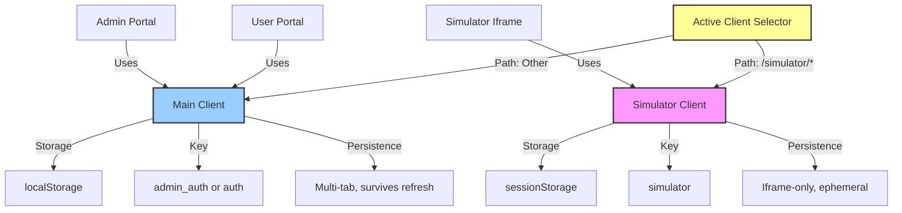
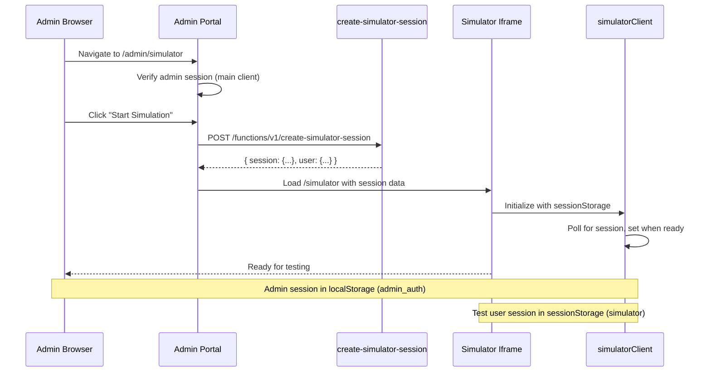
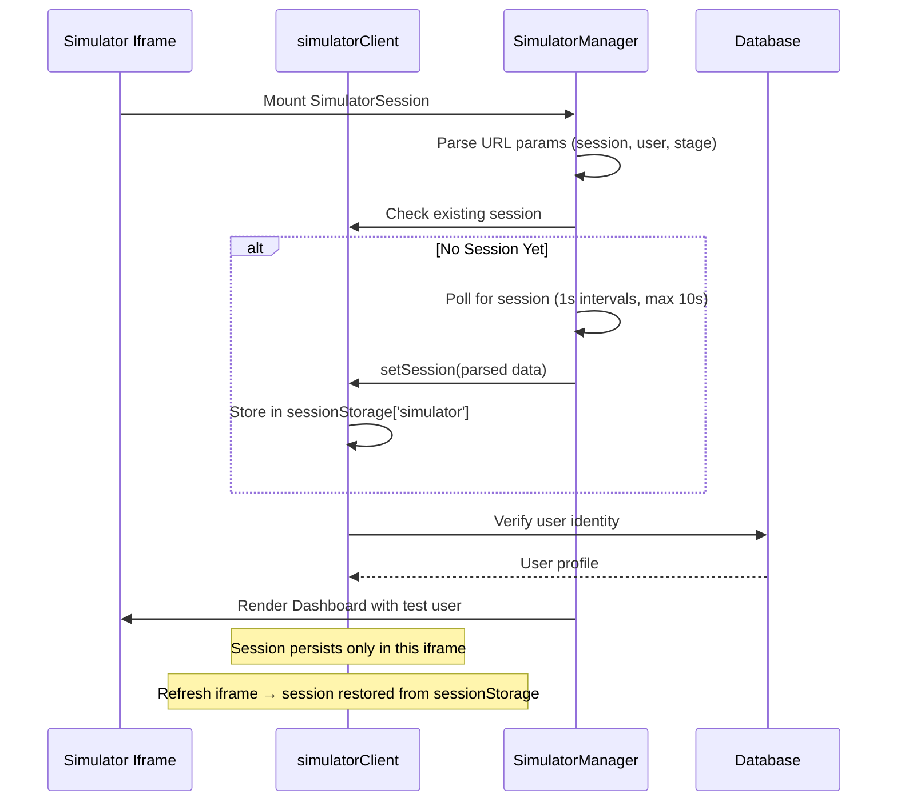
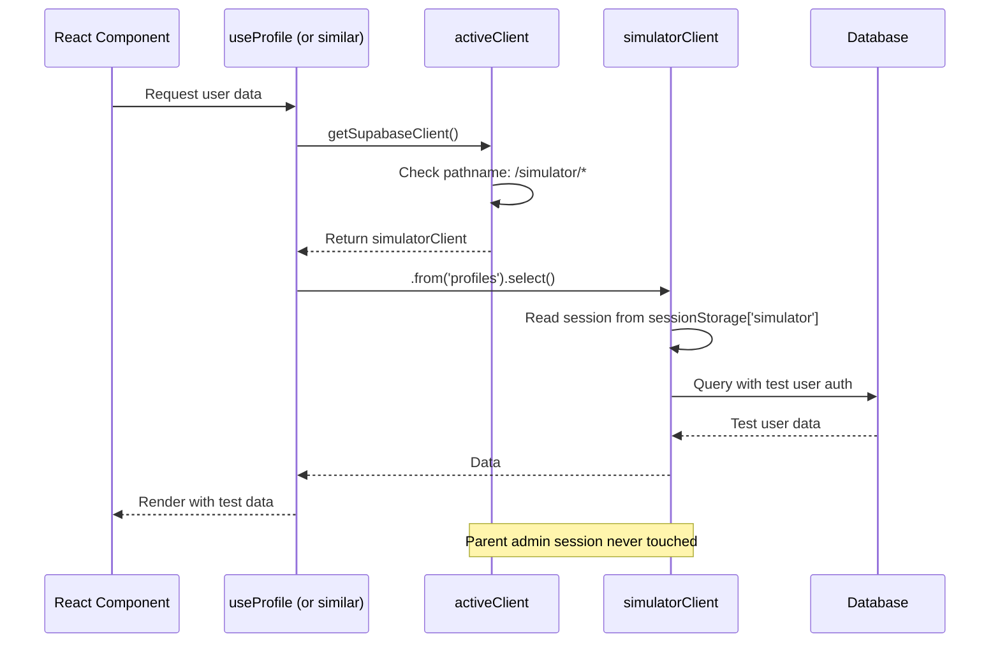

# Simulator Architecture

## Overview

The Simulator provides a safe, isolated testing environment for admin users to test user journeys, profile questions, and earning activities without affecting production data or their own admin session.

**Key Benefits:**
- **Session Isolation** - Admin stays logged in while testing
- **Data Separation** - Test data doesn't mix with real users
- **Journey Testing** - Reset users to any stage
- **Real-time Debugging** - See exactly what users experience

## Access Control

**Who Can Access the Simulator?**
- ✅ **Super Admin** - Full access (Level 3)
- ✅ **Admin** - Full access (Level 2)
- ✅ **Tester** - Full access (Level 1.5)
- ❌ Regular users - No access

**Security Model:**
- **Frontend Check:** `hasRole('tester')` controls sidebar visibility (UI only)
- **Route Protection:** `ProtectedRoute requiredRole="tester"` blocks direct navigation
- **Backend Enforcement:** Edge function validates role via database query
- **RLS Policies:** Test account data isolated via `is_test_account` flag

**⚠️ Security Principle:**
Frontend role checks are for **UI display only**. The actual security enforcement happens server-side:
1. Edge function `create-simulator-session` validates tester-or-higher role via database
2. RLS policies on test account data check `is_test_account = true`
3. Even if user bypasses frontend checks, backend blocks unauthorized access

**Role-Based Routing:**
The simulator uses **hierarchical role checking**:
- Minimum role required: `tester`
- Higher roles (`admin`, `super_admin`) automatically inherit access
- Implemented via `hasRole('tester')` in `useRole` hook (UI) + RLS policies (security)

**Visibility Control:**
- Sidebar item "Journey Simulator" appears for tester-or-higher roles
- Direct navigation to `/admin/simulator` allowed for tester-or-higher
- Route protection via `ProtectedRoute` with `requiredRole="tester"` (hierarchical)
- Edge function auth validates role via `has_role()` database function

### The Problem

Without session isolation, when the simulator iframe logs in as a test user, it would:
1. Overwrite the admin's authentication session
2. Log out the admin from the parent portal
3. Cause navigation issues and authentication errors

### The Solution: Dual Supabase Client Architecture

The platform uses **two separate Supabase clients** with different storage strategies to ensure complete session isolation:



## File Structure & Responsibilities

### 1. Main Client (`src/integrations/supabase/client.ts`)

**Purpose:** Primary authentication client for admin and user portals

**Configuration:**
```typescript
const isAdmin = pathname.startsWith('/admin');

export const supabase = createClient(SUPABASE_URL, SUPABASE_KEY, {
  auth: {
    storage: localStorage,          // Persists across tabs/refreshes
    storageKey: isAdmin ? 'admin_auth' : 'auth',  // Path-aware key
    persistSession: true,
    autoRefreshToken: true,
  }
});
```

**Storage Strategy:**
- **localStorage** - Shared across tabs, survives refresh
- **admin_auth** key - Isolated admin sessions
- **auth** key - Regular user sessions

**Used By:**
- Admin portal (`/admin/*`)
- User portal (`/`)
- Dashboard routes

### 2. Simulator Client (`src/integrations/supabase/simulatorClient.ts`)

**Purpose:** Isolated authentication client for simulator testing only

**Configuration:**
```typescript
export const simulatorClient = createClient(SUPABASE_URL, SUPABASE_KEY, {
  auth: {
    storage: sessionStorage,       // Ephemeral, iframe-only
    storageKey: 'simulator',       // Unique key
    persistSession: true,          // Within session only
    autoRefreshToken: true,
  }
});
```

**Storage Strategy:**
- **sessionStorage** - NOT shared across tabs
- **simulator** key - Completely separate namespace
- Destroyed when iframe closes

**Used By:**
- Simulator iframe routes (`/simulator/*`)
- SimulatorSession component
- Test user journeys

### 3. Active Client Selector (`src/integrations/supabase/activeClient.ts`)

**Purpose:** Path-aware client selector for shared code

**Logic:**
```typescript
export function getSupabaseClient(): SupabaseClient<Database> {
  if (typeof window === 'undefined') {
    return supabase;  // SSR fallback
  }

  const pathname = window.location.pathname;
  const isSimulator = pathname.startsWith('/simulator');
  
  if (isSimulator) {
    console.info('[activeClient] Using simulator client for:', pathname);
    return simulatorClient;
  }
  
  return supabase;
}

export const activeClient = getSupabaseClient();
```

**Used By:**
- `useAuth` hook
- `useRole` hook
- `useUserType` hook
- Most data-fetching hooks
- Utility functions

## Data Flow Diagrams

### Admin Starts Simulation



### Simulator Iframe Initialization



### Data Fetch Within Simulator



## Storage Strategy Deep Dive

### Why sessionStorage for Simulator?

**Benefits:**
1. **Iframe Isolation** - Not shared with parent window
2. **Tab Isolation** - Each simulator tab is independent
3. **Ephemeral** - Cleaned up automatically when tab closes
4. **No Cross-Contamination** - Cannot interfere with localStorage sessions

**Tradeoffs:**
- Does not persist across full page refresh (acceptable for testing)
- Requires session handoff via URL params on initialization
- Must be re-established if iframe src changes

### Why localStorage for Main Client?

**Benefits:**
1. **Multi-Tab Sync** - Admin can open multiple tabs
2. **Persistence** - Survives refresh, browser restart
3. **Shared State** - Consistent session across app
4. **Standard Pattern** - Expected auth behavior

### Path-Aware Storage Keys

**Main Client Keys:**
```typescript
// Admin routes: /admin/*
storageKey: 'admin_auth'

// User routes: /, /dashboard, /profile, etc.
storageKey: 'auth'
```

**Simulator Client Key:**
```typescript
// Simulator routes: /simulator/*
storageKey: 'simulator'
```

**Result:** Three completely separate session namespaces with zero overlap.

## Hook Integration

### Hooks Using activeClient

These hooks dynamically select the correct client:

- `useAuth.ts` - Authentication state and methods
- `useRole.ts` - User role checks
- `useUserType.ts` - User type classification
- `useProfile.ts` - Profile data fetching
- `useBalance.ts` - Financial data
- `useTransactions.ts` - Transaction history
- `useUserReputation.ts` - Reputation points
- `useUserStreaks.ts` - Streak tracking
- `useReferralCodes.ts` - Referral management
- `useReferrals.ts` - Referral tracking
- `useProfileAnswers.ts` - Profile answers
- `useProfileQuestions.ts` - Profile questions
- `useEarningActivities.ts` - Earning activities

**Pattern:**
```typescript
import { getSupabaseClient } from '@/integrations/supabase/activeClient';

export function useProfile() {
  const supabase = getSupabaseClient();  // Auto-selects correct client
  
  const { data } = useQuery({
    queryKey: ['profile'],
    queryFn: async () => {
      const { data } = await supabase
        .from('profiles')
        .select('*')
        .single();
      return data;
    }
  });
  
  return { profile: data };
}
```

### Hooks Using Direct Client Import

Some admin-specific hooks use the main client directly:

- `useAdminUsers.ts` - Admin user management
- `useAdminTeam.ts` - Team member management
- Admin-specific utilities

**Pattern:**
```typescript
import { supabase } from '@/integrations/supabase/client';  // Direct import

export function useAdminUsers() {
  // Always uses main client (admin_auth)
  const { data } = useQuery({
    queryKey: ['admin-users'],
    queryFn: async () => {
      const { data } = await supabase
        .from('profiles')
        .select('*');
      return data;
    }
  });
}
```

## Testing & Validation

### Manual Verification Steps

**Test Session Isolation:**
1. Log in to admin portal (`/admin/login`)
2. Navigate to Simulator (`/admin/simulator`)
3. Start simulation with test user
4. Open browser DevTools → Application → Storage
5. Verify:
   - `localStorage['admin_auth']` contains admin session
   - `sessionStorage['simulator']` (in iframe context) contains test user session
   - Keys are completely separate

**Test Data Isolation:**
1. Start simulation
2. Complete profile questions as test user
3. Check database: answers saved to test user
4. Stop simulation
5. Check admin profile: no contamination

**Test Session Persistence:**
1. Start simulation
2. Hard refresh simulator iframe (right-click → Reload Frame)
3. Verify test user session persists (sessionStorage maintained)
4. Verify admin session still active in parent

**Test Multi-Tab Behavior:**
1. Open admin portal in Tab A
2. Open admin portal in Tab B
3. Start simulation in Tab A
4. Verify Tab B admin session unaffected

### Automated Tests

**Unit Tests (`useAuth.test.ts`):**
```typescript
describe('useAuth with activeClient', () => {
  it('uses simulatorClient for /simulator routes', () => {
    window.history.pushState({}, '', '/simulator/dashboard');
    const client = getSupabaseClient();
    expect(client).toBe(simulatorClient);
  });
  
  it('uses main client for /admin routes', () => {
    window.history.pushState({}, '', '/admin/users');
    const client = getSupabaseClient();
    expect(client).toBe(supabase);
  });
});
```

**Integration Tests (`SimulatorSession.test.tsx`):**
- Test session handoff from admin to simulator
- Verify data fetching uses correct client
- Ensure no admin logout on simulation start

## Troubleshooting

### Admin Gets Logged Out During Simulation

**Symptoms:**
- Admin portal shows "Authentication Required" when starting simulation
- Admin session disappears from localStorage

**Diagnosis:**
1. Check browser console for path detection logs:
   ```
   [activeClient] Using simulator client for: /simulator/dashboard
   ```
2. Verify `activeClient.ts` logic is returning correct client
3. Check if simulator pages are importing `supabase` directly instead of `activeClient`

**Fix:**
1. Ensure all simulator-accessed hooks use `activeClient`
2. Verify `storageKey` separation in both clients
3. Confirm iframe is loading `/simulator/*` routes, not `/dashboard`

### Simulator Session Doesn't Persist

**Symptoms:**
- Hard refresh of iframe logs out test user
- Session appears then disappears

**Diagnosis:**
1. Check if `sessionStorage['simulator']` exists in iframe context
2. Verify `persistSession: true` in simulatorClient config
3. Check for race conditions in session initialization

**Fix:**
1. Ensure `SimulatorSession` properly polls and sets session
2. Verify URL params contain session data
3. Check edge function returns complete session object

### Data Shows Wrong User

**Symptoms:**
- Simulator shows admin data instead of test user
- Profile answers save to wrong user

**Diagnosis:**
1. Check which client hook is using: `console.log(getSupabaseClient())`
2. Verify session user ID in both clients
3. Check RLS policies aren't bypassing auth

**Fix:**
1. Ensure hook imports `activeClient`, not `supabase`
2. Verify `.auth.getUser()` returns correct user
3. Check database queries use `auth.uid()` correctly

### Performance Issues

**Symptoms:**
- Slow simulator initialization
- Delayed data loading

**Diagnosis:**
1. Check session polling duration (should be <2s)
2. Monitor network tab for repeated auth calls
3. Verify no circular auth state changes

**Fix:**
1. Reduce polling interval or max attempts
2. Add loading states to prevent render thrashing
3. Memoize client selection in hooks

## Migration Considerations

### When Migrating or Updating Supabase

**CRITICAL: Preserve These Files**

1. **`src/integrations/supabase/client.ts`**
   - Do NOT remove `isAdmin` path detection
   - Do NOT change `storageKey` logic
   - Maintain `localStorage` storage

2. **`src/integrations/supabase/simulatorClient.ts`**
   - Do NOT change to `localStorage`
   - Do NOT modify `storageKey: 'simulator'`
   - Keep `sessionStorage` storage

3. **`src/integrations/supabase/activeClient.ts`**
   - Do NOT consolidate to single client
   - Maintain path detection: `/simulator` vs others
   - Preserve logging for debugging

**Migration Checklist:**
- [ ] Verify all three client files exist
- [ ] Test admin login persists during simulation
- [ ] Confirm data isolation between admin and test user
- [ ] Validate session keys in browser DevTools
- [ ] Run automated test suite
- [ ] Manual smoke test of simulator workflow

### Environment Variables

Required variables (managed automatically by Lovable Cloud):
```env
VITE_SUPABASE_URL=https://[project].supabase.co
VITE_SUPABASE_PUBLISHABLE_KEY=[anon-key]
VITE_SUPABASE_PROJECT_ID=[project-id]
```

Both clients use the same backend, only session management differs.

## Data Seeding Strategy

The simulator pre-populates test user data to match each journey stage. This section explains **what data exists at each checkpoint** and how the `reset_user_journey` RPC function orchestrates the data flow.

---

### Updated Journey Stages (Post-Registration Flow Refactor)

**Stage 1: Fresh Signup**
- User lands on `/register` page
- **Profile Data:** ALL fields NULL (first_name, last_name, mobile, DOB, etc.)
- **State:** `level_2_complete = false`, `is_verified = false`, `profile_level = 1`
- **Purpose:** Test the registration form with no pre-filled data

**Stage 2: Registered (Level 1 Complete)**
- User lands on `/dashboard`
- **Profile Data:** First Name, Last Name, DOB, Mobile, GPS enabled
- **Missing:** All Level 2 questions (Gender, Address, Ethnicity, HHI, PHI, SEC)
- **State:** `level_2_complete = false`, `is_verified = false`, `profile_level = 1`
- **Alert:** "Complete Your Profile" prompt visible
- **Purpose:** Test Level 2 modal (dashboard popup)

**Stage 3: Level 2 Complete**
- User lands on `/dashboard`
- **Profile Data:** All Level 1 + All 6 required Level 2 questions answered
  - Gender, Address, Ethnicity, HHI, PHI, SEC
- **State:** `level_2_complete = true`, `is_verified = false`, `profile_level = 2`
- **Alert:** "One Last Step! Verify your mobile" visible
- **Purpose:** Test OTP verification flow

**Stage 4: Mobile Verified (First Survey)**
- User lands on `/dashboard`
- **Profile Data:** All Level 1 + Level 2 complete
- **State:** `level_2_complete = true`, `is_verified = true`
- **Earning Data:** 1 completed survey, $5 balance
- **Reputation:** 150 points, Bronze Elite
- **Purpose:** Test earning tab and first survey experience

**Stage 5: Established User**
- User lands on `/dashboard`
- **Profile Data:** Fully complete
- **State:** `level_2_complete = true`, `is_verified = true`
- **Earning Data:** 5 completed surveys, $50 balance
- **Reputation:** 850 points, Silver Elite tier
- **Badges:** Multiple reputation badges
- **Purpose:** Test advanced features and experienced user flow

---

### Stage-by-Stage Data Flow

The simulator properly seeds data to match the current system architecture:

| Stage | Control Fields (profiles) | User Data (profile_answers) | Activities | Reputation |
|-------|---------------------------|------------------------------|-----------|------------|
| 1: Fresh Signup | `is_verified=false`, `profile_level=1`, ALL fields NULL | ❌ None | ❌ None | 0 (Bronze Novice) |
| 2: Registered | `profile_level=1`, Name/DOB/Mobile set | ❌ None | ❌ None | 0 (Bronze Novice) |
| 3: Level 2 Complete | `profile_complete=true`, `level_2_complete=true`, `profile_level=2` | ✅ All 6 Level 2 questions | ❌ None | 0 (Bronze Novice) |
| 4: Mobile Verified | `is_verified=true` | (same) | ✅ 1 survey | 150 (Bronze Elite) |
| 5: Established | (same) | (same) | ✅ 5 surveys | 850 (Silver Elite) |

### Pre-Population Behavior

The simulator pre-fills forms to allow admins to see the actual UX without re-entering data:

- **Stage 1 (Fresh Signup)**: All fields empty (new user experience, lands on `/register`)
- **Stage 2 (Registered)**: Name, DOB, Mobile pre-populated, user lands on `/dashboard` with "Complete Profile" alert
- **Stage 3+ (Level 2 Complete)**: All profile questions pre-populated from `profile_answers` table
- Fields remain **editable** to test validation and submission flows
- This mirrors the real user experience (returning users see their data)

### Data Architecture

**Control Fields (profiles table):**
- `is_verified` - OTP verification status
- `profile_complete` - Whether user finished Level 2
- `profile_level` - Current profile level (1 or 2)
- `profile_completeness_score` - Percentage completion (0-100)

**Identity Fields (profiles table):**
- `email`, `mobile`, `first_name`, `last_name`, `country_code`
- Pre-populated during test user creation
- Persist across all stages

**Profile Answers (profile_answers table):**
- All Level 1 questions (gender, date_of_birth, etc.)
- All Level 2 questions (SEC, address, household_income, etc.)
- Dynamically queried by `question_key` during reset
- Properly indexed with `answer_normalized` for targeting

**Legacy Columns (profiles table - DEPRECATED):**
- `date_of_birth`, `gender`, `sec`, `address`, `household_income`, `ethnicity`
- **NOT used by simulator** - cleared during fresh_signup reset
- Maintained for backward compatibility only

### Reset Function Behavior

When you select a stage in the simulator:

**Stage 1 (Fresh Signup):**
```sql
-- Clears everything
DELETE FROM profile_answers WHERE user_id = test_user_id;
DELETE FROM earning_activities WHERE user_id = test_user_id;
DELETE FROM user_badges WHERE user_id = test_user_id;
UPDATE profiles SET profile_complete = false, is_verified = false WHERE user_id = test_user_id;
UPDATE user_reputation SET score = 0 WHERE user_id = test_user_id;
```

**Stage 3 (Basic Profile):**
```sql
-- Seeds to profile_answers, NOT profiles columns
INSERT INTO profile_answers (user_id, question_id, answer_value)
SELECT test_user_id, id, 'male'
FROM profile_questions WHERE question_key = 'gender';

INSERT INTO profile_answers (user_id, question_id, answer_value)
SELECT test_user_id, id, '1990-01-15'
FROM profile_questions WHERE question_key = 'date_of_birth';

-- Only updates control fields in profiles
UPDATE profiles SET profile_level = 1, profile_completeness_score = 40
WHERE user_id = test_user_id;
```

**Stage 4 (Full Profile):**
```sql
-- Adds Level 2 answers to profile_answers
INSERT INTO profile_answers (user_id, question_id, answer_value)
SELECT test_user_id, id, 'C1'
FROM profile_questions WHERE question_key = 'sec';
-- (plus address, household_income)

-- Updates control fields
UPDATE profiles SET profile_complete = true, profile_level = 2
WHERE user_id = test_user_id;
```

### Form Pre-Population Implementation

**Registration Form (Stage 2):**
```typescript
// src/components/auth/Register.tsx
useEffect(() => {
  const { data: profile } = await supabase
    .from('profiles')
    .select('mobile, country_code, first_name, last_name')
    .eq('user_id', authState.user.id)
    .single();
  
  if (profile?.mobile) {
    setFormData({ 
      mobile: profile.mobile.replace(profile.country_code, ''),
      firstName: profile.first_name,
      lastName: profile.last_name,
      countryCode: profile.country_code 
    });
  }
}, [authState.user?.id]);
```

**Profile Questions (Stages 3-4):**
```typescript
// src/components/dashboard/profile/QuestionRenderer.tsx
const [value, setValue] = useState<any>(
  question.user_answer?.answer_json || 
  question.user_answer?.answer_value || 
  ''
);
// Automatically pre-fills from profile_answers via useProfileQuestions hook
```

## Security Considerations

### Session Isolation Security

**Benefits:**
- Admin cannot accidentally operate as test user
- Test user cannot access admin functions
- RLS policies work correctly for both contexts
- Audit logs properly attribute actions

**Limitations:**
- Test users must have appropriate database records
- Pre-population only works for simulator sessions (requires auth context)
- RLS policies must account for test user IDs
- Simulator should not expose sensitive admin data

### Data Isolation

**Profile Answers:**
- Saved to test user's `user_id`
- Not visible to admin or other users
- Properly scoped by RLS policies

**Transactions:**
- Test user transactions isolated
- Admin cannot accidentally modify test balances
- Financial operations properly attributed

**Audit Logs:**
- Test user actions logged separately
- Admin actions on simulator logged as admin
- Clear attribution in audit trail

## Best Practices

### For Developers

1. **Always Use activeClient in Shared Code**
   - Hooks that could be called from simulator
   - Utilities that fetch user data
   - Components used in multiple contexts

2. **Use Direct Imports Sparingly**
   - Only in admin-exclusive features
   - Never in user-facing components
   - Document why direct import is needed

3. **Test in Both Contexts**
   - Verify hooks work in admin portal
   - Verify hooks work in simulator
   - Check session isolation is maintained

4. **Log Client Selection**
   - Use `console.info` in development
   - Include pathname in logs
   - Remove or disable in production

### For Admins Using Simulator

1. **Always Start Fresh Session**
   - Don't reuse stale test users
   - Reset journey to desired stage
   - Verify test user state before testing

2. **Monitor Console for Errors**
   - Session issues will log warnings
   - Auth errors indicate client problems
   - Report consistent issues to dev team

3. **Don't Share Simulator Tabs**
   - Each tab has independent session
   - Opening simulator in new tab = new test
   - Closing tab destroys test session

## Related Documentation

- [Admin Portal Guide](../admin/PLATFORM_GUIDE.md) - General admin usage
- [Profiling Admin Guide](PROFILING/ADMIN_GUIDE.md) - Testing profile questions
- [Supabase Migration Guide](SUPABASE_MIGRATION_GUIDE.md) - Migration considerations
- [Supabase Configuration](SUPABASE_CONFIG_MANAGEMENT.md) - Backend setup

## Version History

- **v1.0.0** (2025-01-26) - Initial documentation of session isolation architecture
  - Documented dual-client system
  - Added troubleshooting guide
  - Included migration considerations
