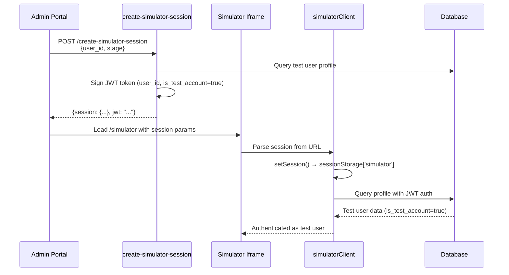
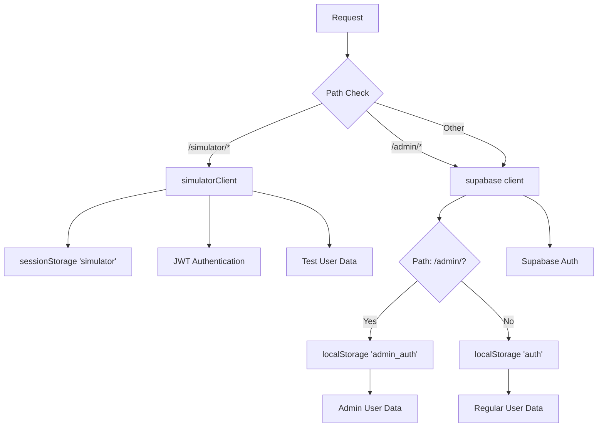

# User Classification System

## Overview

Looplly has 3 distinct user types, each with different authentication methods, purposes, and access levels. This document explains the data architecture, authentication flows, and security model for each user type.

## Quick Reference

| User Type | Authentication | Storage | Routes | Purpose |
|-----------|---------------|---------|--------|---------|
| **looplly_user** | **Custom JWT (Edge Functions)** | `localStorage['looplly_auth_token']` | `/dashboard/*`, `/profile/*` | Regular users earning rewards |
| **looplly_team_user** | Supabase Auth | `localStorage['admin_auth']` | `/admin/*` | Staff managing platform |
| **Test Users** | JWT (Custom) | `sessionStorage['simulator']` | `/simulator/*` | Testing user journeys |

## Database Architecture

### Tables for `looplly_user` ONLY
- `profiles` (with profiling data like gender, DOB, SEC, address)
- `profile_answers`
- `profile_categories`
- `profile_questions`
- `address_components`
- `user_reputation`
- `user_balances`
- `earning_activities`
- `user_badges`
- `transactions`
- `user_referrals`

### Tables for `looplly_team_user` ONLY
- `team_profiles` (email, name, company_name, company_role)
- `user_roles` (role assignments)
- `team_activity_log` (optional activity tracking)

### Shared/System Tables
- `tenants`
- `documentation`
- `ai_agents`
- `audit_logs` (for logging all user actions)
- Configuration tables

**CRITICAL**: Team users and regular users have completely separate data structures. Team users:
- Do NOT complete profiling questionnaires
- Do NOT have reputation scores
- Do NOT earn rewards
- Do NOT have balance/wallet functionality
- Are stored in separate `team_profiles` table

Regular users (`looplly_user`) cannot access admin functionality and have no entries in `user_roles` table.

See [TABLE_ARCHITECTURE.md](./TABLE_ARCHITECTURE.md) for detailed architecture documentation.

---

## Overview
Looplly has 3 distinct user types, each with different purposes and access levels.

## 1. `looplly_user` (Regular Users)
**Purpose:** The main user base - people who use Looplly to earn rewards

**Characteristics:**
- Never see admin portal
- Go through full onboarding: OTP → Profile Questions → Communication Preferences
- Default user type for all signups
- No access to admin features

**Profile Fields:**
- `user_type = 'looplly_user'`
- No entry in `user_roles` table (or role = 'user')
- Complete profile with demographic data

**Flow:**
1. Sign up via mobile/email
2. Verify OTP
3. Complete profile questions (multi-level)
4. Set communication preferences
5. Access dashboard (Earn, Wallet, Profile, etc.)

---

## 2. `looplly_team_user` (Looplly Staff)
**Purpose:** People who manage, build, and operate Looplly

**Characteristics:**
- Access to admin portal
- Assigned staff roles: `super_admin`, `admin`, `tester`
- Created by super admins via "Add Team Member" function
- Receive temporary password that must be changed on first login
- Skip regular user onboarding

**Profile Fields:**
- `user_type = 'looplly_team_user'`
- Entry in `user_roles` table with role
- `company_name` = Team name (e.g., "Looplly Core Team")
- `company_role` = Job title (e.g., "Product Manager")

**Staff Roles:**
- `super_admin`: Full system access, can create other team members
- `admin`: Manage users, content, settings, view analytics
- `tester`: Limited admin access for QA/testing purposes

**Flow:**
1. Super admin creates team member via admin portal
2. Team member receives email + temp password
3. First login → Forced password reset
4. After reset → Access admin portal

**Email Domain Restrictions:**

Staff members with `@looplly.me` email addresses are **blocked from registering** on the User Portal. This ensures proper onboarding flow and prevents user type mismatches.

**Why This Restriction Exists:**

1. **Correct User Type Assignment**
   - Staff members must have `user_type = 'looplly_team_user'`
   - User Portal registration sets `user_type = 'looplly_user'`
   - Incorrect assignment breaks role-based access control

2. **Proper Role Assignment**
   - Staff members need roles in `user_roles` table ('admin', 'super_admin', 'tester')
   - User Portal registration doesn't assign team roles
   - Missing roles prevent Admin Portal access

3. **Team Profile Creation**
   - Staff members need records in `team_profiles` table
   - User Portal registration doesn't create team profiles
   - Missing team profile breaks Admin Portal features

4. **Temporary Password Workflow**
   - Staff onboarding uses temporary passwords via "Add Team Member"
   - User Portal uses permanent passwords
   - Different security workflows

**What Happens If Staff Tries to Register on User Portal:**

**Without Email Validation Block:**
1. Staff member enters `admin@looplly.me` on User Portal registration
2. Two scenarios:
   - **If already onboarded**: Gets "Email already exists" error (confusing)
   - **If not yet onboarded**: Successfully registers with wrong `user_type`
3. Attempts to login on User Portal
4. If login succeeds, immediately redirected: "Please use the admin portal at /admin/login to access your team account"
5. Confused staff member contacts support

**With Email Validation Block:**
1. Staff member enters `admin@looplly.me` on User Portal registration
2. Immediate feedback: "Staff emails must use the Admin Portal"
3. Clear UX guidance before form submission
4. No confusion, proper onboarding flow

**Correct Onboarding Flow for Staff:**
```
Super Admin accesses Admin Portal
          ↓
Navigate to Team Management (/admin/team)
          ↓
Click "Add Team Member" button
          ↓
Fill form: email (@looplly.me), first name, last name, role
          ↓
System creates:
  - auth.users record
  - profiles record (user_type = 'looplly_team_user')
  - user_roles record (role = 'admin' or 'super_admin')
  - team_profiles record
          ↓
Temporary password emailed to staff member
          ↓
Staff member logs in at /admin/login
          ↓
Forced to change password on first login
          ↓
✅ Staff member fully onboarded with correct access
```

**Email Domain Validation:**
- **User Portal Registration**: `@looplly.me` emails blocked (real-time validation)
- **Admin Portal "Add Team Member"**: `@looplly.me` emails required (enforced)
- **Journey Simulator Test Users**: `@looplly-testing.internal` (blocked on User Portal)

---

## 3. `client_user` (B2B Clients - Future)
**Purpose:** Companies/partners using Looplly's services

**Characteristics:**
- NOT YET IMPLEMENTED
- Will have separate onboarding flow
- Access to client-specific features
- May have own mini-admin portal

**Profile Fields:**
- `user_type = 'client_user'`
- Role TBD (may use separate role table)
- `company_name` = Actual company name
- `company_role` = Role at company

**Flow:** TBD

---

## Important: `user_type` vs `role`

### `user_type` (stored in `profiles.user_type`)
**Purpose:** Defines WHICH features a user can access
- Controls portal access (user dashboard vs admin portal vs client portal)
- Determines onboarding flow
- 3 values: `looplly_user`, `looplly_team_user`, `client_user`

### `role` (stored in `user_roles.role`)
**Purpose:** Defines PERMISSION LEVEL within those features
- Controls what actions you can perform
- Only applies to `looplly_team_user` (staff)
- 4 values: `super_admin`, `admin`, `tester`, `user`

**Example:**
- `user_type = 'looplly_team_user'` + `role = 'admin'` = Staff member who can manage users
- `user_type = 'looplly_team_user'` + `role = 'tester'` = Staff member with limited admin access
- `user_type = 'looplly_user'` + `role = 'user'` = Regular user (no admin access at all)

---

## Security Rules

1. **Admin Portal Access:**
   - MUST have `user_type = 'looplly_team_user'`
   - MUST have `role` in `user_roles` table (admin or higher)
   - Both conditions required (defense in depth)

2. **User Creation:**
   - Only `super_admin` can create `looplly_team_user`
   - Anyone can sign up as `looplly_user`
   - `client_user` creation flow TBD

3. **Role Assignment:**
   - Roles stored in separate `user_roles` table (NOT in profiles)
   - Prevents privilege escalation attacks
   - Uses `has_role()` security definer function for checks

---

## 4. Test Users (Simulator Accounts)
**Purpose:** Isolated test accounts for admin users to test user journeys without affecting production data or their own sessions.

**Authentication Method:** JWT (Custom)

**Characteristics:**
- Created via `seed-test-users` edge function
- Flag: `is_test_account = true` in profiles
- JWT-based authentication (NOT standard Supabase Auth)
- Session stored in `sessionStorage['simulator']`
- Route-restricted to `/simulator/*` only
- Cannot access `/admin/*` or regular `/dashboard/*`
- Data completely isolated from production users

**Profile Fields:**
- `user_type = 'looplly_user'` (same type as regular users)
- `is_test_account = true` (critical flag for isolation)
- Pre-populated test data (names like "Test User Bronze", "Test User Silver")
- Email: `@looplly-testing.internal` domain

**Authentication Flow:**


**Session Isolation:**
- **Storage:** `sessionStorage['simulator']` (NOT localStorage)
- **Scope:** Iframe-only, not shared with parent window
- **Persistence:** Destroyed when iframe closes or tab refreshes
- **Client:** Uses `simulatorClient` (separate Supabase client instance)

**Why sessionStorage?**
1. **Iframe Isolation** - Not accessible by parent admin window
2. **Tab Isolation** - Each simulator tab independent
3. **Ephemeral** - Automatically cleaned up on close
4. **No Contamination** - Cannot interfere with admin or user sessions in localStorage

**Journey Stages:**
Test users can be reset to any stage of the user journey:
- `fresh_signup` - Brand new account, no data
- `basic_profile` - Level 1 registration complete
- `full_profile` - Level 2 complete (all demographics)
- `first_survey` - Mobile verified + 1 survey completed
- `established_user` - 5+ surveys completed

**Security Considerations:**
- Test accounts cannot access production routes
- JWT tokens signed with server secret (`LOOPLLY_JWT_SECRET`)
- RLS policies enforce `is_test_account = true` isolation
- Data queries filtered to prevent production contamination
- Admin session completely separate in `localStorage['admin_auth']`

**Implementation Details:**
```typescript
// Simulator client configuration
// File: src/integrations/supabase/simulatorClient.ts
export const simulatorClient = createClient(SUPABASE_URL, SUPABASE_KEY, {
  auth: {
    storage: sessionStorage,       // Ephemeral, iframe-only
    storageKey: 'simulator',       // Unique namespace
    persistSession: true,          // Within session only
    autoRefreshToken: true,
  }
});

// Active client selector
// File: src/integrations/supabase/activeClient.ts
export function getSupabaseClient() {
  const pathname = window.location.pathname;
  const isSimulator = pathname.startsWith('/simulator');
  
  if (isSimulator) {
    return simulatorClient;  // Uses sessionStorage
  }
  
  return supabase;  // Uses localStorage
}
```

**RLS Policies:**
```sql
-- Test users can only access their own test data
CREATE POLICY "test_users_isolated"
  ON profiles FOR ALL
  USING (
    auth.uid() = user_id 
    AND is_test_account = true
  );

-- Ensure test users can't see production data
CREATE POLICY "production_users_hidden_from_tests"
  ON profiles FOR SELECT
  USING (
    CASE 
      WHEN (SELECT is_test_account FROM profiles WHERE user_id = auth.uid())
      THEN is_test_account = true  -- Test users see only test data
      ELSE is_test_account = false -- Production users see only production data
    END
  );
```

**Edge Functions:**
- `create-simulator-session` - Creates test user session with JWT
- `seed-test-users` - Generates test accounts across all journey stages
- `reset-user-journey` - Resets test user to specific stage (RPC function)

**Troubleshooting:**
- If admin gets logged out → Check `activeClient` is routing correctly
- If test session doesn't persist → Verify `sessionStorage['simulator']` exists
- If seeing wrong user data → Ensure hook uses `activeClient`, not `supabase` directly

See [Simulator Architecture](SIMULATOR_ARCHITECTURE.md) for complete technical details.

---

## Authentication Architecture Summary

### Storage Strategy

| User Type | Storage Type | Storage Key | Scope | Persistence |
|-----------|-------------|-------------|-------|-------------|
| looplly_user | localStorage | `auth` | Domain-wide | Survives refresh |
| looplly_team_user | localStorage | `admin_auth` | Domain-wide | Survives refresh |
| Test Users | sessionStorage | `simulator` | Iframe-only | Ephemeral |

**Result:** Three completely isolated authentication namespaces with zero session overlap.

### Client Architecture



---

## Migration History

**Previous Terminology (DEPRECATED):**
- ❌ "B2C users" → Use `looplly_user` instead
- ❌ "B2B users" → Was confusing, referred to staff (now `looplly_team_user`)
- ❌ "office_user" → Renamed to `client_user` (for future B2B clients)

**File Renames:**
- `create-b2b-user` → `create-team-member`
- `AddB2BUserModal` → `AddTeamMemberModal`

**Data Migration:**
- All existing `office_user` records migrated to `looplly_team_user`
- Enum value `office_user` renamed to `client_user`

---

## Related Documentation

- [Authentication Architecture](AUTHENTICATION_ARCHITECTURE.md) - Complete authentication system documentation
- [Simulator Architecture](SIMULATOR_ARCHITECTURE.md) - Technical details of simulator system
- [User Type Management](USER_TYPE_MANAGEMENT.md) - Managing user types and roles
- [Testing Simulator Guide](TESTING_SIMULATOR_GUIDE.md) - How to use the simulator
- [Table Architecture](TABLE_ARCHITECTURE.md) - Database schema details
- Database migration: `supabase/migrations/*_fix_user_type_classification.sql`
- Edge function: `supabase/functions/create-team-member/index.ts`
- Edge function: `supabase/functions/create-simulator-session/index.ts`
- UI component: `src/components/admin/team/AddTeamMemberModal.tsx`
- Hook: `src/hooks/useUserType.ts`
- Type definitions: `src/types/auth.ts`
