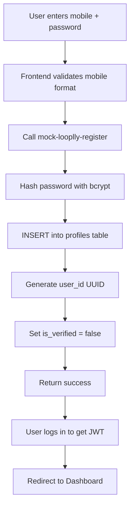
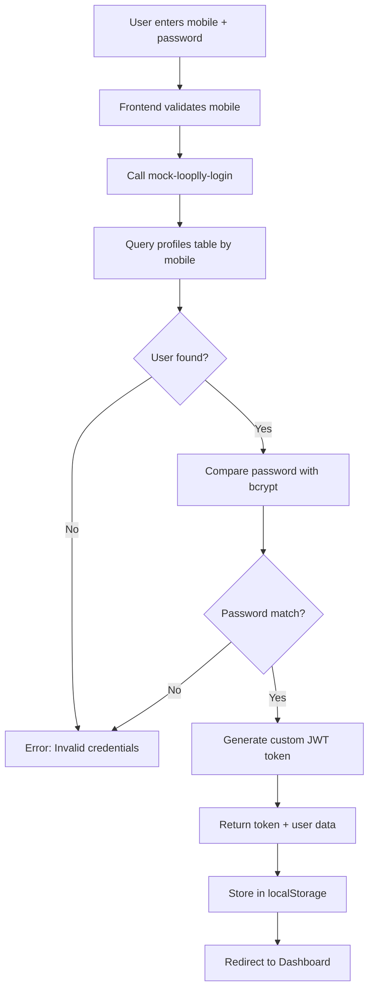
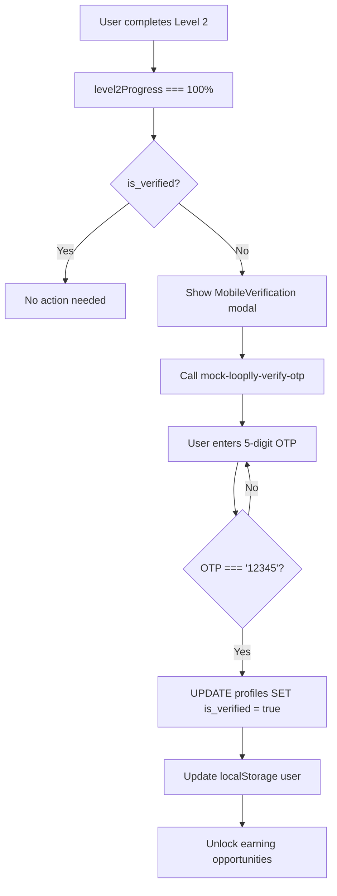
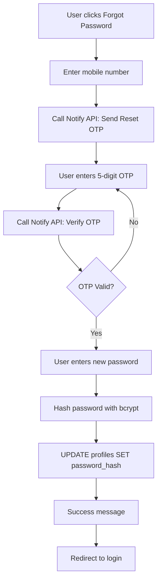

# Mobile Verification System Documentation

## Purpose

This document serves as the **single source of truth** for Looplly's Mobile Verification system using the **Notify microservice**. This documentation prevents future confusion about authentication flows and ensures consistent implementation.

## Core Architecture Principle

**CRITICAL:** Looplly has **TWO SEPARATE AUTHENTICATION SYSTEMS**:

### 1. **Looplly Users** (Mobile-Based via Notify)
- **Primary identifier:** Mobile number
- **Authentication method:** Notify microservice (OTP-based)
- **NOT using:** Supabase Auth at all
- **Storage:** `profiles` table only (NOT in `auth.users`)
- **Password:** Hashed and stored in `profiles.password_hash`
- **Session management:** Custom JWT tokens

### 2. **Admin/Team Users** (Email-Based via Supabase)
- **Primary identifier:** Email address
- **Authentication method:** Supabase Auth (`auth.users`)
- **Storage:** Both `auth.users` AND `team_profiles` tables
- **Session management:** Supabase Auth sessions

## Current State (Development)

### What's Implemented

1. **`MobileVerification.tsx`** - UI component with 5-digit OTP input
2. **Stub OTP flow** - Accepts hardcoded `12345` for testing
3. **Mobile validation** - Uses `libphonenumber-js` for formatting
4. **Database flag** - `profiles.is_verified` marks verification status
5. **Level 2 trigger** - Verification modal appears after Level 2 completion
6. **Mock edge functions** - `mock-looplly-register`, `mock-looplly-login`, `mock-looplly-verify-otp`
7. **Custom JWT auth** - Looplly users get custom tokens (not Supabase sessions)

### What's NOT Implemented Yet

1. **Notify microservice integration** - API endpoints and credentials pending
2. **Real OTP sending** - Currently stubbed with console logs
3. **Real OTP verification** - Currently accepts `12345` hardcode

## The Problem (Solved)

**Previous Issue:** The codebase kept defaulting to Supabase Auth for Looplly users, creating conflicts.

**Solution:** Implemented custom authentication system with:
- Custom JWT tokens for Looplly users
- Separate edge functions for registration/login
- Password hashing with bcrypt
- Direct `profiles` table storage (bypassing `auth.users`)

## Authentication Flows

### Registration Flow (Level 1)



**Key Points:**
- **NOT STORED in `auth.users`** - Only in `profiles`
- **No Supabase Auth involvement**
- User can immediately access dashboard
- `is_verified = false` initially
- Password stored as bcrypt hash

### Login Flow



**Key Points:**
- **No Supabase Auth**
- Direct database lookup
- bcrypt password comparison
- Custom JWT token (24-hour expiry)
- Stored in `localStorage` as `looplly_auth_token`

### Mobile Verification Flow (Level 2 Requirement)



**Key Points:**
- **REQUIRED** before earning
- Happens AFTER Level 2 completion
- Uses stub OTP `12345` (ready for Notify integration)
- 5-digit OTP (not 6-digit like Supabase)
- Updates `profiles.is_verified = true`

### Password Recovery Flow



**Key Points:**
- **Mobile-based** (not email)
- Uses Notify OTP (to be implemented)
- No Supabase Auth involvement
- Updates `profiles.password_hash` directly

## Component: `MobileVerification.tsx`

### Purpose
Modal component for verifying mobile numbers AFTER Level 2 completion using Notify OTP.

### Props
```typescript
interface MobileVerificationProps {
  open: boolean;          // Controls modal visibility
  onClose: () => void;    // Callback when user closes modal
  onSuccess: () => void;  // Callback after successful verification
}
```

### State Management
```typescript
const [otp, setOtp] = useState('');           // 5-digit OTP input
const [isVerifying, setIsVerifying] = useState(false);
const [isSending, setIsSending] = useState(false);
const [error, setError] = useState('');
```

### Key Functions

#### `sendOTP()`
**Current (Stub):**
```typescript
console.log('[NOTIFY STUB] Sending OTP to', countryCode + mobile);
// TODO Phase 2: Replace with actual Notify API call
```

**Future (Production):**
```typescript
const response = await supabase.functions.invoke('notify-send-otp', {
  body: {
    mobile: countryCode + mobile,
    type: 'verification'
  }
});
```

#### `verifyOTP()`
**Current (Mock):**
```typescript
const { data, error } = await supabase.functions.invoke('mock-looplly-verify-otp', {
  body: {
    user_id: user.id,
    otp: otp
  }
});
```

**Future (Production):**
```typescript
const { data, error } = await supabase.functions.invoke('notify-verify-otp', {
  body: {
    mobile: countryCode + mobile,
    otp: otp,
    type: 'verification'
  }
});
```

### Usage in Dashboard

**File:** `src/components/dashboard/Dashboard.tsx`

```typescript
const isVerified = authState.user?.profile?.is_verified ?? false;

// Calculate Level 2 percentage
const level2Questions = level2Categories.flatMap(c => c.questions);
const level2Required = level2Questions.filter(q => q.is_required);
const level2Answered = level2Required.filter(q => q.user_answer?.answer_value);
const level2Percentage = Math.round((level2Answered.length / level2Required.length) * 100);

// Trigger mobile verification AFTER Level 2 complete
const needsVerification = level2Percentage === 100 && !isVerified;
```

### Stub Testing

**Development Mode:**
- OTP code: `12345` (hardcoded)
- No actual SMS sent
- Toast message: "Use code: 12345"
- Database update: `is_verified = true`

**To Test:**
1. Register new Looplly user (mobile + password)
2. Login with mobile + password
3. Complete Level 2 profile questions (6 required)
4. Mobile verification modal appears automatically
5. Click "Resend Code"
6. Enter: `12345`
7. Click "Verify Code"
8. Modal closes, earning unlocked

## Database Schema

### `profiles` Table

**Relevant Columns:**
```sql
CREATE TABLE profiles (
  user_id UUID PRIMARY KEY,           -- NOT a foreign key to auth.users
  mobile TEXT NOT NULL UNIQUE,        -- E.164 format: +27823093959
  country_code TEXT NOT NULL,         -- Dial code: +27
  password_hash TEXT,                 -- bcrypt hashed password (NEW)
  is_verified BOOLEAN DEFAULT false,  -- Mobile verification status
  email TEXT,                         -- Optional email
  first_name TEXT,
  last_name TEXT,
  profile_level INTEGER DEFAULT 1,
  created_at TIMESTAMPTZ DEFAULT NOW()
);
```

**Key Points:**
- `user_id` is **NOT** linked to `auth.users`
- `mobile` is **PRIMARY identifier** (unique)
- `password_hash` stored here (not in Supabase Auth)
- `is_verified` = mobile verification status

## Mock Edge Functions

### 1. `mock-looplly-register`

**Purpose:** Register new Looplly user with mobile + password

**Request:**
```typescript
{
  mobile: "823093959",
  countryCode: "+27",
  password: "SecurePass123!",
  firstName: "John",
  lastName: "Doe",
  dateOfBirth: "1990-01-15",
  gpsEnabled: true
}
```

**Response:**
```typescript
{
  success: true,
  user_id: "uuid-here",
  message: "Registration successful. Use OTP: 12345 to verify (dev stub)"
}
```

**What it does:**
1. Normalizes mobile to E.164 format
2. Checks for duplicate mobile
3. Hashes password with bcrypt
4. Generates UUID for `user_id`
5. Inserts into `profiles` table
6. Logs stub message (ready for Notify)

### 2. `mock-looplly-login`

**Purpose:** Authenticate Looplly user and generate JWT

**Request:**
```typescript
{
  mobile: "823093959",
  countryCode: "+27",
  password: "SecurePass123!"
}
```

**Response:**
```typescript
{
  success: true,
  token: "eyJhbGciOiJIUzI1NiIsInR5cCI6IkpXVCJ9...",
  user: {
    id: "uuid-here",
    mobile: "+27823093959",
    firstName: "John",
    lastName: "Doe",
    email: null,
    countryCode: "+27",
    isVerified: false,
    profileComplete: false
  }
}
```

**JWT Payload:**
```typescript
{
  sub: "user_id",
  mobile: "+27823093959",
  iat: 1234567890,
  exp: 1234654290,  // 24 hours later
  user_type: "looplly_user"
}
```

**What it does:**
1. Normalizes mobile
2. Fetches user from `profiles`
3. Compares password with bcrypt
4. Generates custom JWT (HS256)
5. Returns token + user data

### 3. `mock-looplly-verify-otp`

**Purpose:** Verify mobile OTP and mark user as verified

**Request:**
```typescript
{
  user_id: "uuid-here",
  otp: "12345"
}
```

**Response:**
```typescript
{
  success: true,
  verified: true,
  message: "Mobile number verified successfully"
}
```

**What it does:**
1. Checks OTP === '12345' (stub)
2. Updates `profiles.is_verified = true`
3. Returns success

## Frontend Integration

### `src/utils/auth.ts`

**Modified Functions:**

```typescript
export const registerUser = async (params: RegistrationParams) => {
  const { data, error } = await supabase.functions.invoke('mock-looplly-register', {
    body: {
      mobile: params.mobile,
      countryCode: params.countryCode,
      password: params.password,
      firstName: params.firstName,
      lastName: params.lastName,
      dateOfBirth: params.dateOfBirth,
      gpsEnabled: params.gpsEnabled
    }
  });
  // ... error handling
};

export const loginUser = async (params: LoginParams) => {
  const isMobileLogin = params.email.startsWith('+');
  
  if (isMobileLogin) {
    // Custom Looplly auth
    const { data, error } = await supabase.functions.invoke('mock-looplly-login', {
      body: {
        mobile: params.email.replace(/^\+\d+/, ''),
        countryCode: params.email.match(/^\+\d+/)?.[0] || '+27',
        password: params.password
      }
    });
    
    if (data?.token) {
      localStorage.setItem('looplly_auth_token', data.token);
      localStorage.setItem('looplly_user', JSON.stringify(data.user));
    }
  } else {
    // Email login for admin/team (Supabase Auth)
    const { error } = await supabase.auth.signInWithPassword({
      email: params.email,
      password: params.password
    });
  }
};
```

### `src/hooks/useAuth.ts`

**Custom Auth Detection:**

```typescript
useEffect(() => {
  // Check for custom Looplly token FIRST
  const loopllyToken = localStorage.getItem('looplly_auth_token');
  const loopllyUser = localStorage.getItem('looplly_user');
  
  if (loopllyToken && loopllyUser) {
    const payload = JSON.parse(atob(loopllyToken.split('.')[1]));
    const now = Math.floor(Date.now() / 1000);
    
    if (payload.exp > now) {
      // Valid custom auth session
      const user = JSON.parse(loopllyUser);
      setAuthState({
        user,
        isAuthenticated: true,
        isLoading: false,
        step: 'dashboard'
      });
      return; // Skip Supabase Auth
    }
  }
  
  // Fall through to Supabase Auth for admin/team
  // ... existing code
}, []);
```

## Simulator Integration

### Test User Creation

**File:** `supabase/functions/seed-test-users/index.ts`

Test users are created directly in `profiles` table with:
- Unique mobile numbers: `+2782309395{i}`
- Password: `Test123!` (bcrypt hashed)
- `is_test_account: true`
- `is_verified: false` initially

### Simulator Sessions

**File:** `supabase/functions/create-simulator-session/index.ts`

Returns custom JWT token for test users:
```typescript
{
  custom_token: "eyJhbGciOiJIUzI1NiIsInR5cCI6IkpXVCJ9...",
  test_user: {
    id: "uuid",
    mobile: "+27823093959",
    name: "Test User"
  },
  stage_info: { ... }
}
```

---

## Production Migration Guide

### Current State: Mock Authentication

The system currently uses **mock edge functions** with a hardcoded OTP (`12345`) for development and testing. This allows full end-to-end testing without requiring real SMS delivery.

**Why Mock System?**
- Faster development iteration
- No SMS costs during development
- Easier testing and debugging
- Same authentication flow as production

### Migration to Production

See **`docs/PRODUCTION_READINESS.md`** for the complete production migration checklist.

**Quick Summary**:
1. Add `NOTIFY_API_KEY` and `NOTIFY_BASE_URL` secrets to Supabase
2. Update `mock-looplly-register` to call real Notify API for sending OTP
3. Update `mock-looplly-verify-otp` to call real Notify API for verifying OTP
4. Remove hardcoded `12345` OTP check
5. Test with real mobile numbers in staging environment
6. Deploy to production during low-traffic window
7. Monitor OTP delivery rates and authentication metrics

**Critical**: Do not skip staging testing with real mobile numbers! Test from multiple countries to verify Notify API coverage.

### Simulator Special Case

The simulator will continue to use mock OTP logic even in production:
- Test users should not receive real SMS messages (cost savings)
- Simulator sessions should use a special `is_simulator: true` flag in JWT
- Consider adding a separate `mock-looplly-verify-otp-simulator` edge function if needed
- Or add conditional logic: `if (payload.is_simulator) { accept '12345' }`

### Production Monitoring

Once deployed, monitor these key metrics:
- OTP delivery success rate (target: >95%)
- OTP delivery time (target: <30 seconds)
- Authentication error rate (target: <2%)
- Failed verification attempts per user
- Notify API costs vs. projections

---

## Notify Microservice Integration (Future)

### API Endpoints (Placeholder)

**Send OTP:**
```
POST https://notify-api.example.com/send-otp
Authorization: Bearer {NOTIFY_API_KEY}

{
  "mobile": "+27823093959",
  "type": "verification" | "registration" | "password_reset",
  "channel": "sms"
}

Response:
{
  "success": true,
  "message_id": "msg_abc123",
  "expires_at": "2025-10-26T12:15:00Z"
}
```

**Verify OTP:**
```
POST https://notify-api.example.com/verify-otp
Authorization: Bearer {NOTIFY_API_KEY}

{
  "mobile": "+27823093959",
  "otp": "12345",
  "type": "verification"
}

Response:
{
  "success": true,
  "verified": true
}
```

### Migration to Real Notify

**When Notify credentials are ready:**

1. Add `NOTIFY_API_KEY` secret to Supabase
2. Update `mock-looplly-verify-otp` to call real Notify API
3. Create `notify-send-otp` edge function
4. Update `MobileVerification.tsx` to call `notify-send-otp`
5. Remove hardcoded `12345` check
6. Test with real SMS delivery

**No other changes needed!** The architecture is ready.

## Testing Strategy

### Manual Tests

1. **New User Registration**
   - Go to `/register`
   - Enter mobile (+27823093959), password, name, DOB, GPS
   - Should create in `profiles` only (NOT `auth.users`)
   - Should redirect to login

2. **User Login**
   - Go to `/login`
   - Enter mobile (+27823093959), password
   - Should receive JWT token
   - Should redirect to dashboard

3. **Mobile Verification**
   - Complete Level 2 (6 required questions)
   - Modal should appear automatically
   - Enter OTP: `12345`
   - Should update `is_verified = true`
   - Earning should unlock

4. **Simulator Session**
   - Admin selects test user
   - Simulator loads with custom JWT
   - All actions work identically to production

5. **Test User Seeding**
   - Admin clicks "Seed Test Users"
   - Creates 6 users in `profiles` only
   - Each has bcrypt `password_hash`
   - None appear in `auth.users`

## Troubleshooting

### Issue: "Mobile number already registered"
**Symptom:** Registration fails with 409 error
**Solution:** Use different mobile number or delete existing profile

### Issue: "Invalid mobile number or password"
**Symptom:** Login fails with 401 error
**Solution:** 
- Check mobile number format (+27823093959)
- Verify password is correct
- Ensure user was registered via `mock-looplly-register`

### Issue: OTP Not Working
**Symptom:** Modal doesn't accept `12345`
**Solution:** Check edge function logs for errors

### Issue: Modal Not Appearing
**Symptom:** Level 2 complete but no verification modal
**Solution:** 
- Check `level2Percentage === 100`
- Verify `is_verified === false`
- Check dashboard conditional logic

### Issue: Token Expired
**Symptom:** User logged out automatically
**Solution:** JWT expires after 24 hours, user must login again

## DO NOT

❌ **DO NOT** use Supabase Auth for Looplly users
❌ **DO NOT** call `supabase.auth.signUp({ phone: ... })` for Looplly
❌ **DO NOT** call `supabase.auth.signInWithPassword({ phone: ... })` for Looplly
❌ **DO NOT** store Looplly users in `auth.users` table
❌ **DO NOT** mix Supabase phone auth with Notify OTP
❌ **DO NOT** require OTP at Level 1 registration
❌ **DO NOT** confuse registration with mobile verification

## DO

✅ **DO** use `mock-looplly-*` edge functions for Looplly users
✅ **DO** store Looplly users in `profiles` table only
✅ **DO** use custom JWT tokens for Looplly sessions
✅ **DO** trigger mobile verification AFTER Level 2 completion
✅ **DO** use 5-digit OTP for Notify (not 6-digit Supabase)
✅ **DO** hash passwords with bcrypt
✅ **DO** validate mobile numbers with `libphonenumber-js`
✅ **DO** keep test users in sync with production flow

## Secrets Required

### Current (Development)
- `SUPABASE_URL` ✅
- `SUPABASE_SERVICE_ROLE_KEY` ✅
- `LOOPLLY_JWT_SECRET` - Default: `dev-secret-change-in-production`

### Future (Production)
- `NOTIFY_API_KEY` - To be added when Notify is ready
- `LOOPLLY_JWT_SECRET` - Generate strong random string for production

## Related Documentation

- `docs/MOBILE_VALIDATION.md` - Mobile number formatting rules
- `docs/REGISTRATION_FLOW.md` - Full registration journey
- `docs/PROFILE_SYSTEM_ARCHITECTURE.md` - Level system details
- `docs/PASSWORD_RESET_FLOW.md` - Password recovery specifics
- `docs/SUPABASE_CONFIG_MANAGEMENT.md` - Multi-client architecture

## Version History

- **v1.0** (2025-10-26) - Initial implementation with mock edge functions
- **v2.0** (TBD) - Integration with real Notify microservice
