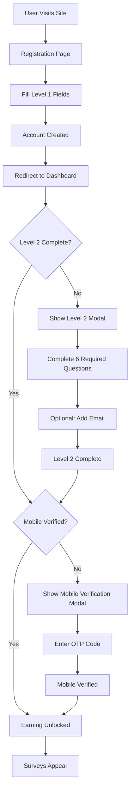

# Registration & Onboarding Flow

## Overview

The Looplly registration and onboarding system uses a progressive, gated approach to collect user data and unlock platform features. This document details the complete journey from initial registration through earning activation.

## Flow Diagram



## Phase 1: Registration (Level 1)

### Fields Captured

Registration collects essential identity information:

| Field | Type | Required | Validation | Purpose |
|-------|------|----------|------------|---------|
| First Name | Text | Yes | 2-50 chars | Identity |
| Last Name | Text | Yes | 2-50 chars | Identity |
| Date of Birth | Date | Yes | 18+ years | Age verification & fraud prevention |
| Mobile Number | Phone | Yes | Country-specific format | Primary account recovery & verification |
| Country Code | Select | Yes | From country list | Determines validation rules |
| Password | Password | Yes | Min 8 chars | Account security |
| GPS Toggle | Checkbox | No | Boolean | Location-based survey matching |

### What's NOT Captured at Registration

**Email is optional and moved to Level 2**
- Email is NOT required for account creation
- Mobile number serves as primary recovery method
- Email can be added later for newsletters/updates (optional in Level 2)

**Gender moved to Level 2**
- Originally in Level 1, now part of Level 2 demographic questions
- Allows faster registration completion

### Validation Rules

**Age Validation:**
- Minimum age varies by country (default: 18 years)
- Calculated from date of birth
- Country-specific rules in `country_legal_age` table

**Mobile Validation:**
- Uses `libphonenumber-js` for 193 countries
- Normalized to E.164 format (e.g., `+27712345678`)
- Country-specific validation patterns
- See [Mobile Validation](MOBILE_VALIDATION.md) for details

**Password Requirements:**
- Minimum 8 characters
- Recommended: Mix of upper/lower case, numbers, symbols

### Technical Implementation

**Frontend Component:**
- `src/components/auth/Register.tsx`
- Uses `react-hook-form` with Zod validation
- Mobile validation via `validateMobileNumber()` utility
- GPS toggle stored in `profiles.gps_enabled`

**Backend:**
- Edge function `mock-looplly-register` handles registration
- Password hashed with bcrypt (12 rounds)
- Profile created directly in `profiles` table
- JWT token generated and returned
- Mobile stored in normalized E.164 format
- Reputation record auto-created with 0 points
- **Note:** `auth.users` bypassed for regular users (Custom JWT auth)

**Database Tables:**
```sql
-- profiles table
INSERT INTO profiles (
  user_id, first_name, last_name, date_of_birth, 
  mobile, country_code, gps_enabled, profile_level
) VALUES (
  auth.uid(), 'John', 'Doe', '1990-01-15',
  '+27712345678', '+27', true, 1
);
```

### After Registration

**User State:**
- Account created and activated
- `profile_level = 1`
- `profile_completeness_score = 40%`
- `level_2_complete = false`
- `is_verified = false` (mobile not yet verified)
- Reputation: 0 points (Bronze Novice)

**Next Step:**
- User redirected to dashboard
- Level 2 modal appears immediately

## Phase 2: Level 2 Profile Completion (Dashboard Modal)

### Modal Behavior

**Persistent Prompt:**
- Modal appears on dashboard load if `level_2_complete = false`
- Can be dismissed but reappears on next login
- Progress bar shows "X of 6 required questions complete"
- Banner notification remains visible until Level 2 complete

### Required Questions (6)

| Question | Type | Options | Purpose |
|----------|------|---------|---------|
| Gender | Select | Male, Female, Non-binary, Prefer not to say | Demographics |
| Address | Text/Autocomplete | Google Places API | Location targeting |
| Ethnicity | Select | Country-specific options | Demographics |
| Household Income | Select | Income ranges | Socioeconomic profiling |
| Personal Income | Select | Income ranges (separate from HHI) | Individual earning capacity |
| SEC (Socioeconomic Class) | Select | A, B, C1, C2, D, E | Survey targeting |

### Optional Question (1)

| Question | Type | Purpose |
|----------|------|---------|
| Email Address | Email | Newsletter/updates (NOT account recovery) |

### Important Distinctions

**HHI vs PHI:**
- **Household Income (HHI)**: Total income of all household members
- **Personal Income (PHI)**: Individual's own income
- Both captured separately for accurate profiling

**Email is Optional:**
- Email can be skipped during Level 2
- Mobile number remains primary recovery method
- Email used ONLY for marketing communications (if provided)

### Progress Tracking

**Completion Calculation:**
```typescript
const requiredQuestions = 6;
const completedCount = answers.filter(a => 
  ['gender', 'address', 'ethnicity', 'household_income', 
   'personal_income', 'sec'].includes(a.question_key)
).length;

const progress = (completedCount / requiredQuestions) * 100;
```

### Technical Implementation

**Frontend Component:**
- `src/components/dashboard/Level2ProfileModal.tsx`
- Uses `useProfileAnswers` hook
- Saves answers to `profile_answers` table
- Updates `profiles.level_2_complete` when all 6 required answered

**Backend:**
```sql
-- On each answer save
INSERT INTO profile_answers (
  user_id, question_id, answer_value, 
  answer_normalized, last_updated
) VALUES (
  auth.uid(), question_id, 'male', 
  'male', NOW()
) ON CONFLICT (user_id, question_id) 
  DO UPDATE SET answer_value = 'male';

-- On completion
UPDATE profiles 
SET level_2_complete = true,
    profile_level = 2,
    profile_completeness_score = 100,
    last_profile_update = NOW()
WHERE user_id = auth.uid();
```

### After Level 2 Completion

**User State:**
- `level_2_complete = true`
- `profile_level = 2`
- `profile_completeness_score = 100%`
- All required demographic data captured
- Email may or may not be set (optional)

**Next Step:**
- Mobile verification modal appears
- Must verify mobile before earning

## Phase 3: Mobile Verification (OTP)

### When Triggered

**Timing:**
- ONLY after Level 2 is complete
- Not triggered during registration
- Not triggered if already verified

**Check Logic:**
```typescript
const needsMobileVerification = 
  profile.level_2_complete === true && 
  profile.is_verified === false;
```

### OTP Flow

**Step 1: Request OTP**
- User clicks "Verify Mobile Number" in modal
- System sends SMS with 6-digit code
- Code valid for 10 minutes

**Step 2: Enter Code**
- User enters 6-digit OTP
- Click "Verify"

**Step 3: Verification**
- Code validated against Supabase Auth
- On success: `profiles.is_verified = true`
- On failure: Error message, can retry

### Current Implementation

**Development Stub:**
- Stub code accepts `12345` for testing
- Component: `src/components/auth/MobileVerification.tsx`
- No actual SMS sent in dev environment

**Production (Planned):**
- Integration with Notify API
- Real SMS delivery
- Rate limiting on OTP requests
- See [Integrations Setup](INTEGRATIONS_SETUP.md)

### Mobile as Primary Recovery

**Password Reset:**
- Users who forgot password use mobile number (not email)
- OTP sent to mobile for verification
- New password set after OTP confirmed

**Why Mobile Over Email:**
- Email is optional (may not be provided)
- Mobile always collected during registration
- More secure (harder to compromise)
- See [Password Reset Flow](PASSWORD_RESET_FLOW.md)

### After Mobile Verification

**User State:**
- `is_verified = true`
- All gates passed
- Ready to earn

**Next Step:**
- Earning unlocked
- Surveys appear in Earn tab

## Phase 4: Earning Unlocked

### Gates Passed

All three requirements met:
1. ✅ Level 1 complete (registration)
2. ✅ Level 2 complete (6 required questions)
3. ✅ Mobile verified (OTP confirmed)

### What Unlocks

**Earn Tab:**
- Surveys from integrated providers (Cint, etc.)
- Matched based on profile data
- Reputation points earned per completion

**Refer Tab:**
- Referral code generation
- Invite friends feature
- Referral earnings tracking

**Community Tab:**
- Post and comment access
- Leaderboards
- Challenges

### User Experience

**Dashboard State:**
- No blocking modals
- All tabs accessible
- Profile shows 100% complete
- Green checkmarks throughout

## Simulator Stage Mapping

For testing the new flow, simulator stages map as follows:

| Stage | Description | Profile State | Next Required Action |
|-------|-------------|---------------|---------------------|
| `fresh_signup` | Brand new account | No data | Complete registration |
| `registered_level_1_complete` | Registration done | Level 1 only | Complete Level 2 |
| `level_2_complete` | Demographics done | Level 1 + Level 2 | Verify mobile |
| `mobile_verified` | Verified | Level 1 + Level 2 + Verified | Start earning |
| `first_survey` | First activity | + 1 survey completed | Continue earning |
| `established_user` | Active user | + 5 surveys completed | Full feature access |

### Testing with Simulator

**Access Simulator:**
1. Admin Portal → Simulator
2. Select test user
3. Choose stage to reset to
4. Confirms expected flow behavior

See [Simulator Architecture](SIMULATOR_ARCHITECTURE.md) for details.

## Technical Architecture

### Database Schema

**Key Tables:**
- `profiles`: Core user data (Level 1 fields + Level 2 flags)
- `profile_answers`: Answers to Level 2+ questions
- `profile_questions`: Question definitions
- `country_question_options`: Country-specific answer options

**Key Columns in Profiles:**
```sql
CREATE TABLE profiles (
  -- Level 1 (Registration)
  first_name TEXT,
  last_name TEXT,
  date_of_birth DATE,
  mobile TEXT, -- E.164 format
  country_code TEXT, -- Dial code
  gps_enabled BOOLEAN DEFAULT false,
  
  -- Level 2 (Dashboard)
  level_2_complete BOOLEAN DEFAULT false,
  email TEXT, -- Optional, for marketing only
  
  -- Verification
  is_verified BOOLEAN DEFAULT false,
  
  -- Progress Tracking
  profile_level INTEGER DEFAULT 1,
  profile_completeness_score INTEGER DEFAULT 0,
  last_profile_update TIMESTAMP
);
```

### Component Structure

**Registration Flow:**
- `src/components/auth/Register.tsx`
  - Handles Level 1 fields
  - Validates mobile
  - Creates account

**Dashboard Flow:**
- `src/components/dashboard/Dashboard.tsx`
  - Checks `level_2_complete` flag
  - Shows modals based on state
  
- `src/components/dashboard/Level2ProfileModal.tsx`
  - 6 required + 1 optional question
  - Progress tracking
  - Saves to `profile_answers`
  
- `src/components/auth/MobileVerification.tsx`
  - OTP input (stub code 12345)
  - Updates `is_verified` flag

### Security & RLS Policies

**Row Level Security:**
```sql
-- Users can only view/edit their own profile
CREATE POLICY "Users manage own profile"
  ON profiles FOR ALL
  USING (auth.uid() = user_id);

-- Users can only view/edit their own answers
CREATE POLICY "Users manage own answers"
  ON profile_answers FOR ALL
  USING (auth.uid() = user_id);
```

**Data Protection:**
- Mobile numbers normalized and stored in E.164
- Passwords hashed by Supabase Auth (bcrypt)
- PII encrypted at rest
- RLS enforces isolation

## Future Enhancements

### Planned Features

**Real OTP Integration:**
- Notify API for SMS delivery
- International SMS support
- Rate limiting (max 3 OTP per hour)
- Fallback to email verification

**Progressive Level 3 Profiling:**
- Contextual questions after earning starts
- Brand preferences
- Technology usage
- Media consumption
- See [Profiling Architecture](PROFILING/ARCHITECTURE.md)

**Email Verification:**
- Optional email confirmation
- Used ONLY if user provides email
- Never required for account creation

**Social Login:**
- Google Sign-In option
- Still requires mobile verification
- Profile questions still required

## Troubleshooting

### User Stuck at Level 2

**Symptoms:**
- Modal keeps appearing
- Says "Complete Level 2"
- User claims they filled everything

**Debug:**
1. Check `profiles.level_2_complete` flag
2. Query `profile_answers` for user
3. Ensure all 6 required questions answered
4. Verify question_keys match:
   - `gender`
   - `address`
   - `ethnicity`
   - `household_income`
   - `personal_income`
   - `sec`

### Mobile Verification Not Working

**Symptoms:**
- OTP not received
- Verification fails

**Debug:**
1. In dev: Ensure code is `12345`
2. Check `profiles.mobile` is in E.164 format
3. Verify mobile validation passed
4. Check SMS gateway logs (production)
5. Try resending OTP

### Surveys Not Appearing

**Symptoms:**
- User claims ready to earn
- Earn tab shows no surveys

**Debug:**
1. Check `is_verified = true` in database
2. Verify `level_2_complete = true`
3. Check integration status (Admin → Integrations)
4. Review survey matching logic
5. Check user's country not on blocklist

## Related Documentation

- [Profile System Architecture](../technical/PROFILE_SYSTEM_ARCHITECTURE.md) - Database schema and profiling levels
- [User Profiling Guide](../features/profiling/USER_GUIDE.md) - User-facing documentation
- [Mobile Validation](../features/mobile/VALIDATION.md) - Mobile number validation system
- [Password Reset Flow](PASSWORD_RESET_FLOW.md) - Mobile-based password recovery
- [Admin Platform Guide](../admin/PLATFORM_GUIDE.md) - Admin management of users and questions
- [Simulator Architecture](../testing/SIMULATOR_ARCHITECTURE.md) - Testing different user states
- [Country Code Specification](../technical/COUNTRY_CODE_SPECIFICATION.md) - Country validation rules
