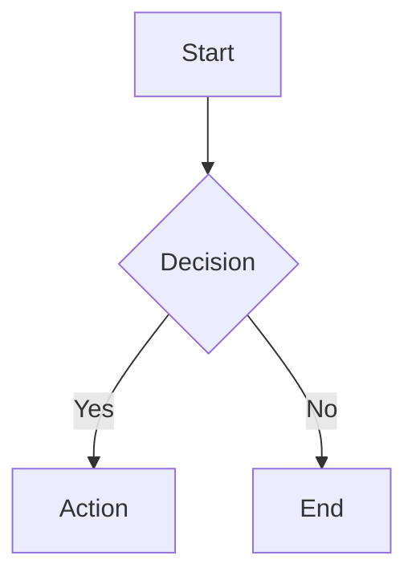

# Knowledge Centre

## Overview

The Knowledge Centre is a comprehensive documentation system built into Looplly, providing searchable, versioned documentation with role-based access.

## Features

### For All Users

**Search & Browse:**
- Full-text search across all documents
- Category-based browsing
- Tag filtering
- Recently viewed documents

**Document Viewing:**
- Markdown rendering with syntax highlighting
- Table of contents (auto-generated)
- Breadcrumb navigation
- Related documents
- Print-friendly view

### For Admins

**Content Management:**
- Create/edit/delete documents
- Version control (automatic)
- Publish/unpublish
- SEO optimization
- Scheduled publishing

**Organization:**
- Category management
- Tag system
- Document ordering
- Document linking

**Analytics:**
- View counts
- Search terms
- Popular documents
- User feedback

## Accessing the Knowledge Centre

### For Users

Navigate to **Dashboard → Help** or click the **"?"** icon in the navigation.

**Homepage:**
- Search bar
- Featured documents
- Popular categories
- Recently updated

### For Admins

Navigate to **Admin → Knowledge Centre**

**Admin View:**
- All documents (including unpublished)
- Quick edit buttons
- Version history
- Analytics dashboard

## Document Structure

### Front Matter

Every document has metadata:

```markdown
---
title: "Profile System Architecture"
slug: "profile-system-architecture"
category: "technical"
tags: ["profiles", "database", "architecture"]
author: "admin"
version: 2
status: "published"
seo_title: "Understanding Looplly Profile System | Technical Docs"
seo_description: "Complete technical guide to the Looplly profile system architecture, database schema, and implementation."
last_updated: "2024-01-15"
---

# Profile System Architecture

## Overview
...
```

### Content Sections

**Standard Structure:**
1. Overview
2. Key concepts
3. Step-by-step instructions
4. Examples
5. Best practices
6. Troubleshooting
7. Related documentation

## Creating Documents

### Via Admin Portal

1. Navigate to **Admin → Knowledge Centre**
2. Click **"Create Document"**
3. Fill in details:
   - Title
   - Slug (URL-friendly)
   - Category
   - Tags
   - Content (Markdown)
4. Preview
5. Save as draft or publish

### Via File System

Documents can also be created as `.md` files in the `docs/` directory and seeded into the database:

```bash
# Create document
touch docs/MY_NEW_DOCUMENT.md

# Add to documentationIndex.ts
{
  id: 'my-new-document',
  title: 'My New Document',
  category: 'guides',
  path: '/docs/my-new-document',
  filePath: 'docs/MY_NEW_DOCUMENT.md'
}

# Seed to database
# Call seed-documentation edge function
```

## Editing Documents

### Web Editor

**Rich Markdown Editor:**
- Syntax highlighting
- Live preview
- Image upload
- Link insertion
- Table builder

**Editor Features:**
- Auto-save (every 30 seconds)
- Revision history
- Undo/redo
- Keyboard shortcuts

### Version Control

Every edit creates a new version:

**Version Metadata:**
- Version number (auto-incremented)
- Author
- Timestamp
- Change summary
- Full content snapshot

**Restoring Versions:**
1. Open document
2. Click **"Version History"**
3. View previous versions
4. Click **"Restore"** on desired version
5. Confirm restoration

### Collaborative Editing

**Conflict Prevention:**
- Lock document while editing (30-min timeout)
- Show "being edited by" warning
- Request unlock from active editor

## Publishing Workflow

### Draft → Review → Publish

**States:**
- **Draft**: Work in progress, not visible to users
- **Review**: Ready for review, visible to admins
- **Published**: Live, visible to all users
- **Archived**: No longer active, hidden from search

**Publishing:**
1. Complete document
2. Click **"Ready for Review"**
3. Reviewer checks content
4. Click **"Publish"**
5. Document goes live immediately

**Scheduled Publishing:**
- Set publish date/time
- Document auto-publishes at scheduled time
- Notification sent to author

## Search Functionality

### User Search

**Search Bar:**
- Global search (header)
- In-page search (Knowledge Centre)

**Search Features:**
- Full-text search
- Fuzzy matching (typo tolerance)
- Highlighted results
- Category filtering
- Sort by relevance/date

**Implementation:**

```typescript
// src/hooks/useDocumentationSearch.ts

export function useDocumentationSearch(query: string) {
  return useQuery({
    queryKey: ['docs-search', query],
    queryFn: async () => {
      const { data, error } = await supabase
        .from('documentation')
        .select('*')
        .textSearch('fts', query, {
          type: 'websearch',
          config: 'english'
        })
        .eq('status', 'published')
        .order('relevance', { ascending: false })
        .limit(20);
      
      if (error) throw error;
      return data;
    },
    enabled: query.length >= 3
  });
}
```

### Search Analytics

Track popular search terms:

```sql
CREATE TABLE documentation_search_log (
  id UUID PRIMARY KEY DEFAULT gen_random_uuid(),
  user_id UUID REFERENCES profiles(user_id),
  search_query TEXT NOT NULL,
  results_count INTEGER,
  clicked_document_id UUID,
  created_at TIMESTAMP DEFAULT NOW()
);

-- Popular search terms
SELECT 
  search_query,
  COUNT(*) as search_count,
  AVG(results_count) as avg_results
FROM documentation_search_log
WHERE created_at > NOW() - INTERVAL '30 days'
GROUP BY search_query
ORDER BY search_count DESC
LIMIT 20;
```

## Categories

### Predefined Categories

| Category | Description | Icon |
|----------|-------------|------|
| Getting Started | Onboarding & basics | 🚀 |
| Guides | Step-by-step tutorials | 📖 |
| Features | Feature documentation | ⭐ |
| Profiling | Profile system docs | 👤 |
| Technical | Technical architecture | 🔧 |
| Admin | Admin portal guides | 👨‍💼 |
| Support | Support resources | 💬 |

### Custom Categories

Admins can create custom categories:

1. Navigate to **Admin → Knowledge Centre → Categories**
2. Click **"Add Category"**
3. Enter:
   - Name
   - Slug
   - Description
   - Icon (emoji or icon name)
   - Display order
4. Save

## Tags

### Tag System

**Purpose:**
- Cross-reference related documents
- Filter by topic
- Improve search relevance

**Example Tags:**
- `authentication`
- `database`
- `mobile`
- `surveys`
- `reputation`

**Tag Cloud:**
Display popular tags:

```typescript
SELECT 
  tag,
  COUNT(*) as doc_count
FROM (
  SELECT unnest(tags) as tag
  FROM documentation
  WHERE status = 'published'
) sub
GROUP BY tag
ORDER BY doc_count DESC
LIMIT 30;
```

## SEO Optimization

### Meta Tags

Each document can have custom SEO fields:

**Fields:**
- SEO Title (max 60 chars)
- SEO Description (max 160 chars)
- SEO Keywords
- Open Graph image

**Implementation:**

```typescript
// src/components/seo/SEOHead.tsx

export function SEOHead({ document }: { document: Documentation }) {
  return (
    <Helmet>
      <title>{document.seo_title || document.title}</title>
      <meta 
        name="description" 
        content={document.seo_description || document.summary} 
      />
      <meta name="keywords" content={document.tags?.join(', ')} />
      
      {/* Open Graph */}
      <meta property="og:title" content={document.seo_title} />
      <meta property="og:description" content={document.seo_description} />
      <meta property="og:type" content="article" />
    </Helmet>
  );
}
```

## Analytics

### Document Metrics

Track document performance:

```sql
CREATE TABLE documentation_views (
  id UUID PRIMARY KEY DEFAULT gen_random_uuid(),
  document_id UUID REFERENCES documentation(id),
  user_id UUID REFERENCES profiles(user_id),
  view_duration INTEGER, -- seconds
  created_at TIMESTAMP DEFAULT NOW()
);

-- Most viewed documents
SELECT 
  d.title,
  COUNT(dv.id) as view_count,
  AVG(dv.view_duration) as avg_duration
FROM documentation d
JOIN documentation_views dv ON dv.document_id = d.id
WHERE dv.created_at > NOW() - INTERVAL '30 days'
GROUP BY d.id, d.title
ORDER BY view_count DESC
LIMIT 10;
```

### User Engagement

**Metrics:**
- Page views
- Average time on page
- Bounce rate
- Scroll depth
- Feedback (helpful/not helpful)

**Feedback Collection:**

```typescript
// After reading, show feedback prompt
<div className="feedback">
  <p>Was this document helpful?</p>
  <Button onClick={() => submitFeedback('yes')}>👍 Yes</Button>
  <Button onClick={() => submitFeedback('no')}>👎 No</Button>
</div>
```

## Markdown Features

### Supported Syntax

**Basic:**
- Headers (H1-H6)
- Bold, italic, strikethrough
- Lists (ordered/unordered)
- Links
- Images
- Blockquotes

**Advanced:**
- Code blocks with syntax highlighting
- Tables
- Footnotes
- Task lists
- Mermaid diagrams

### Code Blocks

```typescript
// Syntax highlighted code
function example() {
  console.log('Hello, World!');
}
```

### Tables

| Column 1 | Column 2 | Column 3 |
|----------|----------|----------|
| Data 1   | Data 2   | Data 3   |

### Diagrams



## Database Schema

### Documentation Table

```sql
CREATE TABLE documentation (
  id UUID PRIMARY KEY DEFAULT gen_random_uuid(),
  title TEXT NOT NULL,
  slug TEXT UNIQUE NOT NULL,
  category TEXT NOT NULL,
  tags TEXT[],
  content TEXT NOT NULL,
  summary TEXT,
  author_id UUID REFERENCES profiles(user_id),
  version INTEGER DEFAULT 1,
  status TEXT CHECK (status IN ('draft', 'review', 'published', 'archived')),
  seo_title TEXT,
  seo_description TEXT,
  view_count INTEGER DEFAULT 0,
  helpful_count INTEGER DEFAULT 0,
  not_helpful_count INTEGER DEFAULT 0,
  published_at TIMESTAMP,
  created_at TIMESTAMP DEFAULT NOW(),
  updated_at TIMESTAMP DEFAULT NOW()
);

-- Full-text search index
CREATE INDEX idx_documentation_fts 
ON documentation 
USING GIN (to_tsvector('english', title || ' ' || content));
```

### Version History

```sql
CREATE TABLE documentation_versions (
  id UUID PRIMARY KEY DEFAULT gen_random_uuid(),
  document_id UUID REFERENCES documentation(id),
  version INTEGER NOT NULL,
  content TEXT NOT NULL,
  changed_by UUID REFERENCES profiles(user_id),
  change_summary TEXT,
  created_at TIMESTAMP DEFAULT NOW(),
  UNIQUE(document_id, version)
);
```

## Backup & Export

### Automatic Backups

- Database backups (daily)
- Version control (automatic)
- File system backups (daily)

### Manual Export

Export all documentation:

```typescript
// Admin function
async function exportAllDocumentation() {
  const { data: docs } = await supabase
    .from('documentation')
    .select('*')
    .eq('status', 'published');
  
  // Convert to JSON
  const json = JSON.stringify(docs, null, 2);
  
  // Download
  const blob = new Blob([json], { type: 'application/json' });
  const url = URL.createObjectURL(blob);
  const a = document.createElement('a');
  a.href = url;
  a.download = `documentation-export-${Date.now()}.json`;
  a.click();
}
```

## Best Practices

### Writing Documentation

1. **Clear titles** - Descriptive and searchable
2. **Structured content** - Use headings, lists, tables
3. **Examples** - Show, don't just tell
4. **Up-to-date** - Review quarterly
5. **Cross-linking** - Reference related docs
6. **Screenshots** - Visual aids help understanding

### SEO Optimization

1. **Keywords** - Use relevant terms naturally
2. **Meta descriptions** - Compelling summaries
3. **Internal linking** - Link to related docs
4. **Regular updates** - Fresh content ranks better
5. **Mobile-friendly** - Responsive design

## Related Documentation

- [Admin Guide](WARREN_ADMIN_GUIDE.md)
- [Documentation Version Control](DOCUMENTATION_VERSION_CONTROL.md)
- [Content Management Best Practices](docs/CONTENT_BEST_PRACTICES.md)
