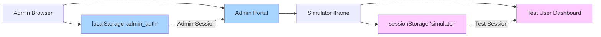

# Testing Simulator Guide

## Overview

The **Simulator** is a powerful testing tool that allows admin users to experience the platform exactly as users do, at any stage of their journey, without affecting production data or disrupting their own admin session.

## Purpose & Use Cases

### Why Use the Simulator?

**Problem:** How do admins test user experiences without:
- Creating real test accounts that pollute production data
- Logging out of their admin session
- Manually progressing through all journey stages

**Solution:** The Simulator provides:
- ✅ **Isolated test sessions** - Test without affecting admin session
- ✅ **Journey stage control** - Jump to any point in user journey
- ✅ **Real-time experience** - See exactly what users see
- ✅ **Quick iteration** - Reset and retry flows instantly
- ✅ **Safe environment** - Test data separate from production

### Common Use Cases

**1. Testing User Flows**
- Registration → Profile completion → Earning
- Level 1 → Level 2 → Mobile verification flow
- Survey matching logic
- Redemption process

**2. QA & Bug Testing**
- Reproduce user-reported issues
- Test new features before release
- Verify profile question logic
- Check mobile responsiveness

**3. Feature Validation**
- New profile questions
- Updated UI/UX
- Earning activities
- Badge systems

**4. Training & Demos**
- Train new team members
- Demo platform to stakeholders
- Document user journeys
- Create marketing materials

## Authentication Model

### Session Isolation

The simulator uses a **dual-client architecture** to keep admin and test sessions completely separate:



**Key Points:**
- **Admin session** stays in `localStorage['admin_auth']` (parent window)
- **Test session** isolated in `sessionStorage['simulator']` (iframe only)
- **No overlap** - Completely separate authentication namespaces
- **Safe testing** - Refreshing simulator doesn't log out admin

### How Authentication Works

**Step 1: Admin Initiates Simulation**
```typescript
// Admin clicks "Start Simulation" button
// POST /functions/v1/create-simulator-session
{
  user_id: "test-user-uuid",
  stage: "registered_level_1_complete"
}
```

**Step 2: Backend Creates Test Session**
```typescript
// Edge function generates JWT token for test user
const jwt = sign(
  { 
    sub: testUser.id, 
    user_type: 'looplly_user',
    is_test_account: true,
    stage: stage
  },
  SECRET,
  { expiresIn: '1h' }
);

// Return session data
return {
  session: { access_token: jwt, ... },
  user: testUser,
  stage: stage
};
```

**Step 3: Iframe Receives Session**
```typescript
// SimulatorSession component parses URL params
const sessionData = parseSessionFromURL();

// Set session in simulatorClient (sessionStorage)
await simulatorClient.auth.setSession(sessionData);

// Now authenticated as test user in iframe only
```

**Result:** Admin remains logged in, test user session active in iframe.

## Journey Stages

The simulator supports 6 journey stages, each representing a different point in the user lifecycle.

### Stage 1: Fresh Signup

**Description:** Brand new account with no data

**User State:**
- Account exists in `auth.users`
- Profile record created but empty
- No demographic data
- Not verified

**Database State:**
```sql
-- profiles table
profile_level: 1
profile_complete: false
level_2_complete: false
is_verified: false
date_of_birth: NULL
gender: NULL
address: NULL
```

**What User Sees:**
- Registration form at `/simulator/register`
- Empty form fields
- "Complete Level 1" prompt

**Use Case:**
- Test registration form validation
- Test mobile number input
- Test date of birth age validation
- Test password requirements

---

### Stage 2: Registered (Level 1 Complete)

**Description:** Registration complete, ready for Level 2

**User State:**
- First name, last name, DOB, mobile captured
- Account activated
- Level 2 modal appears on dashboard
- Still not verified

**Database State:**
```sql
-- profiles table
profile_level: 1
profile_complete: false
level_2_complete: false
is_verified: false
first_name: "Test"
last_name: "User"
date_of_birth: "1990-01-15"
mobile: "+27712345678"

-- profile_answers table
(empty - no Level 2 questions answered)
```

**What User Sees:**
- Dashboard with Level 2 modal overlay
- "Complete your profile" banner
- Progress bar: "0 of 6 required questions"
- Earn tab locked

**Use Case:**
- Test Level 2 modal behavior
- Test profile question rendering
- Test answer submission
- Test GPS toggle functionality

---

### Stage 3: Full Profile (Level 2 Complete)

**Description:** All demographics captured, ready to verify mobile

**User State:**
- All 6 required Level 2 questions answered
- Profile completeness: 100%
- Mobile verification modal appears
- Still cannot earn

**Database State:**
```sql
-- profiles table
profile_level: 2
profile_complete: true
level_2_complete: true
is_verified: false
last_profile_update: NOW()

-- profile_answers table
gender: "male"
address: "123 Test Street, Johannesburg"
ethnicity: "mixed"
household_income: "100000-200000"
personal_income: "60000-120000"
sec: "C1"
```

**What User Sees:**
- Dashboard without Level 2 modal
- Mobile verification modal overlay
- "Verify your mobile number" prompt
- Earn tab still locked

**Use Case:**
- Test mobile verification UI
- Test OTP input (currently stub: `12345`)
- Test verification success flow
- Test error handling

---

### Stage 4: Mobile Verified (First Survey Ready)

**Description:** Fully onboarded, can now earn

**User State:**
- Mobile number verified
- All gates passed
- Earning unlocked
- No activities yet

**Database State:**
```sql
-- profiles table
is_verified: true

-- earning_activities table
(empty - no surveys yet)

-- user_reputation table
score: 0
level: "Bronze Novice"
tier: "Bronze"

-- user_balances table
balance: 0
lifetime_earnings: 0
```

**What User Sees:**
- Clean dashboard (no blocking modals)
- Earn tab accessible with surveys
- Profile shows 100% complete
- All tabs unlocked

**Use Case:**
- Test survey display logic
- Test survey matching
- Test earning flow (would need to complete survey)
- Test UI with no earning history

---

### Stage 5: First Survey Complete

**Description:** User has completed their first earning activity

**User State:**
- 1 survey completed
- First earnings received
- Reputation points awarded
- Transaction history started

**Database State:**
```sql
-- earning_activities table
INSERT: survey, "First Test Survey", $5.00, completed

-- user_reputation table
score: 150
level: "Bronze Elite"
tier: "Bronze"

-- user_balances table
balance: 5.00
lifetime_earnings: 5.00

-- transactions table
INSERT: credit, $5.00, "Survey completion"
```

**What User Sees:**
- Earn tab with 1 completed survey
- Wallet shows $5.00 balance
- Rep tab shows 150 points (Bronze Elite)
- Transaction history with 1 entry

**Use Case:**
- Test earning activity display
- Test wallet UI with balance
- Test reputation progression
- Test transaction history

---

### Stage 6: Established User

**Description:** Active user with multiple activities

**User State:**
- 5 surveys completed
- Significant earnings
- Higher reputation tier
- Active user status

**Database State:**
```sql
-- earning_activities table
5 surveys completed

-- user_reputation table
score: 850
level: "Silver Elite"
tier: "Silver"

-- user_balances table
balance: 50.00
lifetime_earnings: 50.00
```

**What User Sees:**
- Earn tab with activity history
- Wallet showing $50.00
- Rep tab showing Silver Elite tier
- Full feature access

**Use Case:**
- Test user experience at scale
- Test leaderboard positioning
- Test streak systems
- Test established user features

## Testing Workflows

### Basic Testing Workflow

**1. Access Simulator**
```
1. Log in to Admin Portal
2. Navigate to Admin → Simulator
3. Select a test user from dropdown
4. Choose desired journey stage
5. Click "Start Simulation"
```

**2. Test in Simulator**
```
1. Iframe opens with test user session
2. Interact with UI as user would
3. Complete forms, click buttons, navigate
4. Verify expected behavior
```

**3. Reset & Retry**
```
1. Click "Reset" button in admin controls
2. Select different stage if needed
3. Re-test the flow
4. Iterate until satisfied
```

**4. Exit Simulator**
```
1. Close simulator or click "Stop Simulation"
2. Admin session remains intact
3. Return to admin dashboard
```

### Advanced Testing Scenarios

**Testing Registration Flow:**
```
1. Reset to "Fresh Signup" stage
2. Open simulator
3. Fill registration form
4. Verify validation errors
5. Submit valid form
6. Verify redirect to dashboard
7. Verify Level 2 modal appears
```

**Testing Profile Completion:**
```
1. Reset to "Registered" stage
2. Open simulator
3. Complete Level 2 questions
4. Verify progress tracking
5. Submit all 6 required questions
6. Verify modal closes
7. Verify mobile verification appears
```

**Testing Mobile Verification:**
```
1. Reset to "Full Profile" stage
2. Open simulator
3. Enter OTP code (12345 in dev)
4. Verify success message
5. Verify earning unlocked
6. Verify surveys appear
```

**Testing Earning Flow:**
```
1. Reset to "Mobile Verified" stage
2. Open simulator
3. View available surveys
4. Click survey (stub - doesn't actually complete)
5. Verify survey displays
6. Verify earning logic (would need integration)
```

## Troubleshooting

### Common Issues

**Issue: Admin Gets Logged Out**

**Symptoms:**
- Admin portal shows "Please login" after starting simulation
- Admin session disappears

**Cause:**
- Incorrect client being used in simulator path
- Storage key collision

**Fix:**
1. Check browser DevTools → Application → Storage
2. Verify `localStorage['admin_auth']` still exists
3. Verify `sessionStorage['simulator']` exists in iframe
4. Check console for `[activeClient]` logs
5. Ensure hooks use `activeClient`, not `supabase` directly

**Prevention:**
- Don't modify `activeClient.ts` logic
- Always import from `activeClient` in shared hooks

---

**Issue: Test User Shows Wrong Data**

**Symptoms:**
- Simulator shows admin data instead of test user
- Profile answers belong to wrong user

**Cause:**
- Client routing incorrect
- RLS policy issues

**Fix:**
1. Check which client is being used: `console.log(getSupabaseClient())`
2. Verify path starts with `/simulator`
3. Check `is_test_account = true` in database
4. Verify RLS policies filter by `auth.uid()`

**Prevention:**
- Always use `activeClient` in data-fetching hooks
- Test RLS policies separately

---

**Issue: Simulator Session Expires**

**Symptoms:**
- Simulator logs out after some time
- "Session expired" error

**Cause:**
- JWT tokens expire after 1 hour
- sessionStorage cleared

**Fix:**
1. Restart simulation (click "Start Simulation" again)
2. Check JWT expiration in session data
3. Verify edge function returns valid tokens

**Prevention:**
- Restart simulation for long testing sessions
- Consider extending JWT expiration in dev

---

**Issue: Changes Don't Appear in Simulator**

**Symptoms:**
- Code changes not reflected in simulator
- Still seeing old UI

**Cause:**
- Browser caching
- React not reloading iframe

**Fix:**
1. Hard refresh simulator iframe (right-click → Reload Frame)
2. Clear browser cache
3. Restart dev server if needed
4. Close and reopen simulator

**Prevention:**
- Use hard refresh (Cmd/Ctrl + Shift + R) frequently
- Disable cache in DevTools during development

---

**Issue: "Stuck on Gate" - Can't Progress**

**Symptoms:**
- Level 2 modal won't close after completing questions
- Mobile verification won't accept OTP
- Earning stays locked

**Cause:**
- Database not updating flags
- Frontend state not syncing

**Fix:**
1. Check database directly:
   ```sql
   SELECT 
     profile_level,
     level_2_complete,
     is_verified
   FROM profiles 
   WHERE user_id = 'test-user-id';
   ```
2. Manually update if needed (admin can do this)
3. Check console for API errors
4. Verify RPC functions executed successfully

**Prevention:**
- Test each gate individually
- Verify flags update after each stage
- Monitor network tab for failed requests

## Best Practices

### Do's ✅

**1. Start Fresh**
- Always reset to appropriate stage before testing
- Don't carry over state from previous tests

**2. Test Incrementally**
- Test one flow at a time
- Verify each step before moving forward

**3. Use Multiple Test Users**
- Different test users for different scenarios
- Prevents data contamination between tests

**4. Check Database**
- Verify data changes in database
- Don't rely only on UI feedback

**5. Document Issues**
- Take screenshots of bugs
- Note exact reproduction steps
- Record browser console errors

**6. Test Across Devices**
- Use browser DevTools device emulation
- Test on actual mobile devices when possible

### Don'ts ❌

**1. Don't Mix Production & Test**
- Never test with real user accounts
- Always use simulator test accounts

**2. Don't Skip Stages**
- Test complete flows, not just end states
- Verify each intermediate step

**3. Don't Ignore Errors**
- Console errors matter
- Network errors indicate problems

**4. Don't Test in Production**
- Always use staging/dev environments
- Simulator is for testing, not training real users

**5. Don't Modify activeClient.ts**
- Session isolation depends on this file
- Changes can break admin session

**6. Don't Share Test Accounts**
- Each tester should have their own test users
- Prevents conflicting test data

### Testing Checklist

**Before Each Test:**
- [ ] Admin logged in successfully
- [ ] Correct test user selected
- [ ] Appropriate stage chosen
- [ ] Simulator loaded without errors
- [ ] Browser DevTools open (for debugging)

**During Test:**
- [ ] Expected UI elements present
- [ ] Forms validate correctly
- [ ] Navigation works as expected
- [ ] Data saves to database
- [ ] No console errors
- [ ] Responsive on mobile view

**After Test:**
- [ ] Verify database changes
- [ ] Document any issues found
- [ ] Reset simulator if needed
- [ ] Admin session still active
- [ ] Ready for next test

## Related Documentation

- [Simulator Architecture](SIMULATOR_ARCHITECTURE.md) - Technical implementation details
- [Authentication Architecture](AUTHENTICATION_ARCHITECTURE.md) - Session isolation explained
- [User Classification](USER_CLASSIFICATION.md) - Test user vs regular user differences
- [Registration Flow](REGISTRATION_FLOW.md) - Understanding user journey stages
- [Warren Admin Guide](WARREN_ADMIN_GUIDE.md) - General admin portal usage
